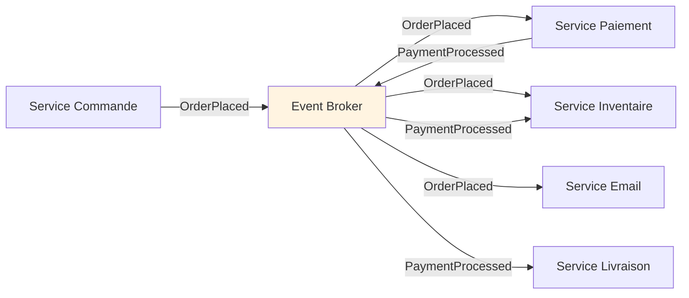
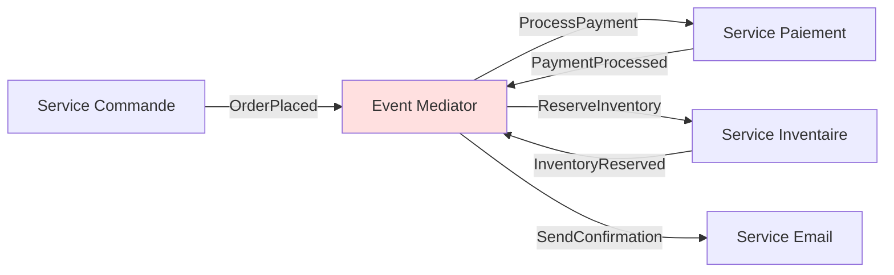
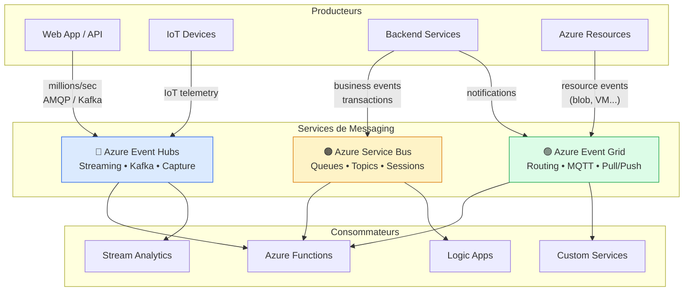
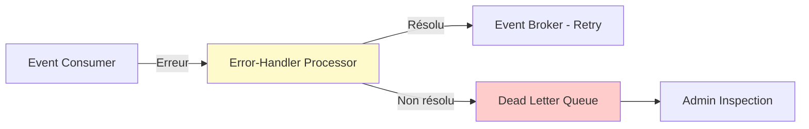
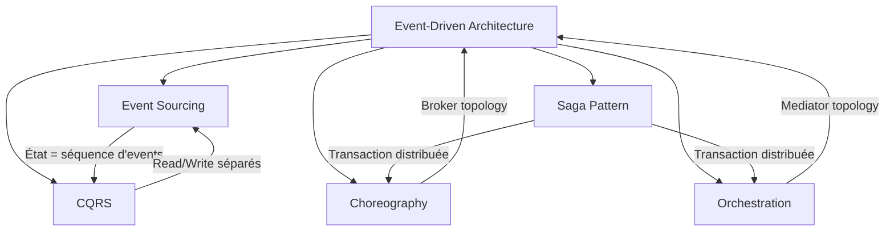
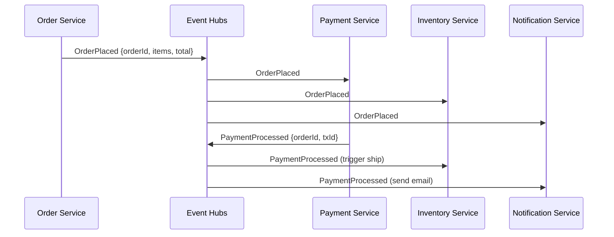

# Module 0 : Introduction à l'Architecture Event-Driven

## 🎯 Objectifs

Dans ce module, vous allez :
- Comprendre les concepts fondamentaux et la définition rigoureuse d'un événement
- Distinguer les deux grandes topologies (Broker vs Mediator)
- Maîtriser les quatre modèles de traitement d'événements
- Analyser les stratégies de payload et leurs implications
- Identifier précisément quand utiliser (et ne pas utiliser) l'EDA
- Anticiper les défis techniques réels : ordering, idempotence, schema evolution, observabilité

---

## 📖 Qu'est-ce que l'Architecture Event-Driven ?

Une **Event-Driven Architecture (EDA)** est constituée de trois éléments fondamentaux :

```
Event Producers ──> Event Ingestion (Broker) ──> Event Consumers
```

Les événements sont délivrés **en quasi-temps réel**. Les producteurs sont **découplés** des consommateurs : un producteur ne sait pas qui l'écoute. Les consommateurs sont également découplés entre eux — dans un modèle pub/sub, chaque consommateur voit **tous** les événements.

### Définition rigoureuse d'un Événement

Un événement est un **fait immuable** : il représente quelque chose qui s'est produit dans le passé. Il ne peut pas être modifié ni annulé — seulement compensé par un autre événement.

```
✅ Exemples d'événements bien nommés (passé composé) :
   OrderPlaced       → commande passée
   PaymentProcessed  → paiement traité
   InventoryReserved → stock réservé
   FileUploaded      → fichier uploadé

❌ Anti-patterns (impératifs = commandes, pas des événements) :
   PlaceOrder    → c'est une commande
   ProcessPayment → c'est une instruction
```

> **Règle d'or :** Un événement décrit ce qui *s'est passé*, jamais ce qui *doit se passer*.

### Les 4 types d'événements selon Martin Fowler

| Type | Description | Exemple |
|------|-------------|---------|
| **Event Notification** | Signal minimal, consommateur doit fetcher les données | `{ "type": "OrderPlaced", "orderId": "123" }` |
| **Event-Carried State Transfer** | Toutes les données embarquées | `{ "type": "OrderPlaced", "order": { ... } }` |
| **Domain Event** | Événement métier significatif dans un Bounded Context | `CustomerBecamePremium` |
| **Event Sourcing Event** | Mutation de l'état agrégé, source de vérité | Séquence immuable de changements |

---

## 🏗️ Architecture Traditionnelle vs Event-Driven

### Architecture Traditionnelle (Request/Response)

```
Client ──[HTTP]──> Service A ──[HTTP]──> Service B ──[HTTP]──> Service C
   │                                                              │
   └──────────────────────[Attente synchrone]────────────────────┘

Latence totale = latence(A) + latence(B) + latence(C)
```

**Problèmes structurels :**
- ❌ **Couplage temporel** : si B est down, A échoue même si B n'est pas critique
- ❌ **Latence cumulée** : chaque hop ajoute de la latence
- ❌ **Cascade de pannes** : un service lent dégrade toute la chaîne
- ❌ **Scalabilité contrainte** : impossible de scaler B sans affecter A

### Architecture Event-Driven

```
Service A ──[Event]──> Message Broker ──[Event]──> Service B
                            │
                            └──────────[Event]──> Service C
                            │
                            └──────────[Event]──> Service N (futur)
```

**Avantages structurels :**
- ✅ **Découplage spatial** : A ne connaît pas B ni C
- ✅ **Découplage temporel** : B peut être offline, l'événement l'attend
- ✅ **Extensibilité** : ajout de N sans modifier A
- ✅ **Scalabilité indépendante** : chaque service scale selon ses propres besoins

---

## 🗂️ Les Deux Topologies Fondamentales

### Topology 1 : Broker (Choreography)



**Caractéristiques :**
- Pas de coordinateur central — chaque service réagit aux événements qu'il connaît
- **Hautement découplé** : aucun service n'est conscient du flow global
- **Dynamique** : ajout de nouveaux consommateurs sans refactoring
- **Scalable et fault-tolerant** : pas de single point of failure

**⚠️ Inconvénient majeur :** Aucun composant ne possède la vue d'ensemble d'une transaction business multi-steps. Les transactions distribuées sont risquées car il n'y a pas de mécanisme natif de restart/replay. L'error handling et la cohérence des données requièrent une attention particulière.

### Topology 2 : Mediator (Orchestration)



**Caractéristiques :**
- Le médiateur gère **l'état** et **l'ordre** des étapes
- **Meilleure gestion des erreurs distribuées** : possibilité de retry, replay, compensation
- **Cohérence des données** améliorée
- **Plus de contrôle** sur le flow business

**⚠️ Inconvénient majeur :** Couplage plus fort entre les composants. Le médiateur peut devenir un **goulot d'étranglement** ou un **single point of failure**. Complexité accrue.

> **Quand choisir quoi ?**
> - **Broker** → flows simples, scalabilité prioritaire, équipe mature en EDA
> - **Mediator** → transactions complexes multi-steps, fort besoin de cohérence, error recovery critique

---

## 🔄 Les 4 Modèles de Traitement d'Événements

### 1. Simple Event Processing

L'événement déclenche **immédiatement** une action dans le consommateur.

```
OrderPlaced ──> Azure Function (trigger) ──> Envoi email de confirmation
```

**Usage Azure :** Azure Functions avec trigger Event Grid ou Service Bus.

### 2. Basic Event Correlation

Un consommateur traite quelques événements métier discrets, les **corrèle par un identifiant**, et persiste des informations des événements précédents pour les utiliser lors du traitement des événements suivants.

```
OrderPlaced (orderId: 123)    ──> Persister état
PaymentProcessed (orderId: 123) ──> Charger état + agréger
InventoryReserved (orderId: 123) ──> Compléter la saga
```

**Usage Azure :** Durable Functions (Orchestrator), NServiceBus Sagas, MassTransit Sagas.

### 3. Complex Event Processing (CEP)

Un consommateur **analyse une série d'événements** pour identifier des **patterns** dans les données. Par exemple, agréger des lectures d'un device sur une fenêtre temporelle et générer une alerte si la moyenne mobile dépasse un seuil.

```
Sensor readings (stream) ──> Azure Stream Analytics ──> Aggregation (5min window)
                                                    ──> Alert if avg > threshold
```

**Usage Azure :** Azure Stream Analytics, Azure Databricks.

### 4. Event Stream Processing

Utiliser une plateforme de data streaming comme pipeline pour ingérer des événements et les alimenter vers des stream processors. Plusieurs stream processors peuvent exister pour différents sous-systèmes.

```
IoT Devices ──> IoT Hub / Event Hubs ──> Stream Processor A (real-time dashboard)
                                    ├──> Stream Processor B (anomaly detection)
                                    └──> Stream Processor C (cold storage)
```

**Usage Azure :** Azure IoT Hub, Event Hubs, Event Hubs for Apache Kafka.

---

## 📦 Stratégies de Payload d'Événements

C'est une décision d'architecture critique avec des implications profondes sur la cohérence, les performances et l'évolutivité.

### Stratégie 1 : Fat Event (Payload complet)

```json
{
  "eventType": "OrderPlaced",
  "eventId": "evt-uuid-123",
  "timestamp": "2026-04-25T10:30:00Z",
  "data": {
    "orderId": "order-456",
    "customerId": "cust-789",
    "items": [
      { "sku": "ITEM-001", "quantity": 2, "price": 29.99 }
    ],
    "total": 59.98,
    "shippingAddress": { ... }
  }
}
```

**Avantages :** Consommateurs autonomes, pas de requête externe nécessaire, résilience accrue.

**Inconvénients :**
- ❌ Coût de transport et bande passante élevés
- ❌ **Problèmes de cohérence** : si la commande est modifiée après l'émission, les consommateurs ont des données périmées (plusieurs systems of record)
- ❌ Versioning et contract management complexes

### Stratégie 2 : Thin Event (Référence uniquement)

```json
{
  "eventType": "OrderPlaced",
  "eventId": "evt-uuid-123",
  "timestamp": "2026-04-25T10:30:00Z",
  "data": {
    "orderId": "order-456"
  }
}
```

Le consommateur fetch les données nécessaires via API/DB.

**Avantages :** Source de vérité unique, meilleure cohérence des données, payloads légers, contrats simples.

**Inconvénients :**
- ❌ Performance dégradée (requêtes additionnelles)
- ❌ Couplage sur la disponibilité de la source de données
- ❌ Race condition possible : fetch avant que la DB soit à jour

> **Recommandation :** Préférer le **Thin Event** par défaut pour la cohérence. Utiliser le Fat Event quand les consommateurs ont besoin d'une snapshot immuable de l'état au moment de l'événement (ex : audit logs, event sourcing).

---

## 🏗️ Les Services de Messaging Azure

Azure propose trois services de messagerie complémentaires couvrant l'ensemble du spectre event-driven : streaming haute volumétrie, messagerie d'entreprise fiable, et routage réactif d'événements.



---

### 🔵 Azure Event Hubs — Big Data Streaming

**Event Hubs** est la plateforme de **streaming de données à très haute volumétrie** d'Azure. Conçue pour ingérer des millions d'événements par seconde, elle constitue la porte d'entrée des pipelines de données temps réel.

**Caractéristiques clés :**
- 📦 **Partitionnement** : les événements sont distribués sur N partitions, garantissant ordre et parallélisme
- ⏱️ **Rétention configurable** : de 1 à 90 jours (Standard/Premium), replay possible
- 🐘 **Compatible Apache Kafka** : les applications Kafka existantes se connectent sans modification de code
- 📸 **Event Hubs Capture** : archivage automatique vers Azure Blob Storage ou ADLS Gen2 (Avro/Parquet)
- 🔌 **Protocol** : AMQP 1.0, Apache Kafka, HTTPS

**Modèle de consommation :**
```
[Producers] ──> [Event Hubs Namespace]
                       │
              ┌────────┴────────┐
         Partition 0      Partition N
              │                │
    [Consumer Group A]   [Consumer Group B]
    (Stream Analytics)  (Azure Functions)
```

**Quand l'utiliser :**
- ✅ Télémétrie IoT, logs applicatifs, clickstream
- ✅ Pipelines de données temps réel (ML, analytics)
- ✅ Migration depuis Apache Kafka
- ✅ Ingestion de données >100K événements/sec

**Quand ne PAS l'utiliser :**
- ❌ Messages nécessitant une confirmation de traitement individuel
- ❌ Workflows transactionnels avec dead-letter queue
- ❌ Communication point-à-point entre microservices

---

### 🟠 Azure Service Bus — Enterprise Messaging

**Service Bus** est le **message broker d'entreprise** d'Azure. Il garantit la livraison fiable des messages avec support des transactions, sessions, et patterns avancés de messagerie — même en cas de panne consommateur.

**Caractéristiques clés :**
- 📬 **Queues** : communication point-à-point, un consommateur à la fois
- 📣 **Topics & Subscriptions** : pub/sub avec filtres, un message vers N abonnés
- 🔒 **Sessions** : ordre strict garanti pour un groupe de messages (ex: commandes d'un même client)
- ⚰️ **Dead Letter Queue (DLQ)** : isolation automatique des messages en erreur pour analyse
- 🔁 **Retry policy** : redelivery automatique configurable
- ✅ **Transactions** : regrouper plusieurs opérations en une seule unité atomique
- 🕐 **Scheduled Messages** : envoi différé

**Modèles supportés :**
```
Queue (point-à-point) :
Producer ──> [Queue] ──> Consumer (un seul à la fois)

Topic (pub/sub avec filtres) :
Publisher ──> [Topic] ──┬──> Subscription A (filtre: région=EU) ──> Consumer A
                        ├──> Subscription B (filtre: montant>1000) ──> Consumer B
                        └──> Subscription C (tous) ──> Consumer C
```

**Quand l'utiliser :**
- ✅ Commandes e-commerce, traitement de paiements
- ✅ Workflows inter-microservices avec garanties transactionnelles
- ✅ Intégration de systèmes legacy (SAP, ERP)
- ✅ Messages nécessitant un ordre strict ou une DLQ
- ✅ Saga pattern, compensation de transactions distribuées

**Quand ne PAS l'utiliser :**
- ❌ Très haut débit (>100K msgs/sec) → préférer Event Hubs
- ❌ Événements éphémères sans garanties → préférer Event Grid
- ❌ Rétention longue durée (>14 jours)

---

### 🟢 Azure Event Grid — Reactive Event Routing

**Event Grid** est le service de **routage d'événements réactif** d'Azure. Il connecte les sources d'événements aux handlers avec un modèle push ou pull, et supporte nativement les événements de ressources Azure.

**Caractéristiques clés :**
- ⚡ **Intégration native Azure** : les ressources Azure (Blob Storage, Resource Groups, VMs...) publient automatiquement leurs événements
- 🔀 **Filtrage avancé** : routage par type d'événement, sujet, propriétés custom
- 📡 **MQTT Broker** (v2) : support du protocole MQTT 3.1.1 et 5.0 pour l'IoT
- 🔄 **Pull & Push delivery** : le consommateur peut tirer les événements (pull) ou les recevoir en push
- 📊 **Namespaces** : isolation multi-tenant avec topics et subscriptions propres
- 🌐 **CloudEvents** : standard CNCF supporté nativement

**Sources d'événements natives :**
```
Azure Blob Storage  ──┐
Azure Resource Groups ─┤
Azure Container Reg.  ─┤──> [Event Grid] ──> Azure Functions
Azure Service Bus     ─┤                ──> Logic Apps
Azure SignalR         ─┤                ──> Webhooks
Custom Topics         ─┘                ──> Event Hubs
```

**Quand l'utiliser :**
- ✅ Réagir aux changements d'état des ressources Azure
- ✅ Déclencher des traitements sur upload de fichier (Blob → Function)
- ✅ Notifications et webhooks
- ✅ Architecture IoT avec MQTT
- ✅ Fan-out léger d'événements vers plusieurs handlers

**Quand ne PAS l'utiliser :**
- ❌ Streaming haute volumétrie et continu → préférer Event Hubs
- ❌ Messages business avec transactions → préférer Service Bus
- ❌ Rétention des événements requise

---

### 🎯 Choisir le Bon Service

| Critère | Event Hubs | Service Bus | Event Grid |
|---------|-----------|-------------|------------|
| **Type** | Streaming | Messaging | Routing |
| **Throughput** | Millions/s | ~1M msgs/s | Tens of millions/day |
| **Rétention** | 1–90 jours | 14 jours max | 24h |
| **Delivery** | At-least-once, replayable | At-least-once / Exactly-once | At-least-once |
| **Ordre** | Par partition | Par session (optionnel) | Non garanti |
| **DLQ** | ❌ | ✅ | ✅ |
| **Transactions** | ❌ | ✅ | ❌ |
| **Protocol** | AMQP, Kafka, HTTPS | AMQP, HTTPS | HTTPS, MQTT |
| **Sources Azure natives** | ❌ | ❌ | ✅ |
| **Idéal pour** | IoT, logs, analytics | Commandes, workflows | Notifications, triggers |

> **Règle pratique :** Event Hubs pour *ingérer* des volumes massifs, Service Bus pour *traiter* des messages métier fiables, Event Grid pour *réagir* aux événements d'infrastructure ou déclencher des workflows.

---

## ⚖️ Quand Utiliser l'Architecture Event-Driven ?

### ✅ Utiliser EDA quand :

- **Plusieurs sous-systèmes** doivent traiter les mêmes événements
- **Traitement en temps réel** avec latence minimale requise
- **Complex event processing** : pattern matching, agrégation sur fenêtres temporelles
- **Volume et vélocité élevés** des données (IoT, clickstream, transactions financières)
- Besoin de **découpler producteurs et consommateurs** pour des objectifs de scalabilité et fiabilité indépendants

### ❌ Ne PAS utiliser EDA quand :

- Le workflow est **simple request-response** et les appels synchrones répondent aux exigences de latence et throughput — la surcharge opérationnelle d'un event broker ne se justifie pas
- Les transactions business requièrent une **forte cohérence** entre services. Si la fenêtre où différentes parties du système ont des vues divergentes est inacceptable, l'eventual consistency de l'EDA joue contre vous
- **L'équipe n'a pas l'expérience** des systèmes distribués asynchrones. Les patterns de debugging, monitoring et error-recovery de l'EDA sont fondamentalement différents des architectures synchrones

> **Rappel critique :** L'EDA n'est pas une solution universelle. Le coût opérationnel réel (observabilité, error handling, schema versioning) doit être justifié par les bénéfices attendus.

---

## 🔥 Défis Techniques en Profondeur

### 1. Guaranteed Delivery

Dans certains systèmes (IoT, finance), il est crucial de **garantir** que chaque événement est délivré. Les stratégies :

| Niveau | Mécanisme | Trade-off |
|--------|-----------|-----------|
| **At-most-once** | Fire and forget | Perte possible, latence minimale |
| **At-least-once** | ACK + retry | Duplication possible → idempotence obligatoire |
| **Exactly-once** | Transactions + idempotence | Coût de performance élevé |

### 2. Eventual Consistency

Parce que producteurs et consommateurs sont découplés via des canaux asynchrones, **les données entre services ne sont pas immédiatement cohérentes** après la publication d'un événement. Il y a une fenêtre mesurable entre le moment où un producteur émet un changement d'état et le moment où tous les consommateurs le reflètent.

```
t=0  Producer: OrderPlaced
t=1  Service Paiement: voit la commande ✅
t=2  Service Inventaire: voit la commande ✅
t=5  Service Analytics: voit la commande ✅  ← lag de 5s acceptable
     ⚠️ Entre t=0 et t=5, Analytics a une vue périmée
```

**Ce n'est pas un bug, c'est un choix d'architecture conscient.** Les architectes doivent :
- Designer les consommateurs et les lectures downstream pour **tolérer des données partiellement mises à jour**
- Documenter clairement quels workflows sont en eventual consistency vs strong consistency
- Implémenter des mécanismes de **read-your-own-writes** si nécessaire pour l'UX

### 3. Ordering & Idempotence

L'exécution de **plusieurs instances d'un consommateur** (pour la résilience et la scalabilité) crée des défis si :
- Les événements doivent être traités **dans l'ordre** au sein d'un type de consommateur
- La logique de traitement idempotent n'est pas implémentée

```
❌ Scénario problématique :
   Event 1: OrderStatus → CONFIRMED
   Event 2: OrderStatus → SHIPPED
   Event 2 traité avant Event 1 → état incohérent

✅ Solution :
   Partition key = orderId → tous les events d'une commande
   vont sur la même partition, traitée séquentiellement
```

**Idempotence** : concevoir les handlers pour qu'un event traité deux fois donne le même résultat qu'une fois.

```python
# Pattern idempotent
def handle_payment_processed(event):
    if order.status == "PAID":
        return  # Already processed, skip
    order.mark_as_paid(event.payment_id)
    order.save()
```

### 4. Error Handling : le Pattern Error-Handler Processor



Quand un consommateur rencontre une erreur, il envoie **immédiatement et de manière asynchrone** l'événement problématique à l'error-handler processor et **continue de traiter les autres événements**. L'error-handler tente de résoudre le problème. Si succès → réinjection dans le canal original. Si échec → Dead Letter Queue (DLQ) pour inspection administrative.

> **⚠️ Attention :** Les événements réinjectés sont traités **hors séquence**. Concevoir les handlers pour gérer ce cas.

### 5. Data Loss : Client Acknowledge Mode

Si un composant crash avant de transmettre l'événement au composant suivant, l'événement est perdu. Solution :

- **Persister les événements en transit**
- Ne dépiler/acquitter l'événement que **quand le composant suivant confirme la réception**
- Connu sous : *client acknowledge mode* et *last participant support*

```
Consumer reçoit event
    │
    ├─> Traite l'événement
    │
    ├─> Confirme au broker (ACK)  ← seulement ici l'event est retiré de la queue
    │
    └─> Si crash avant ACK → broker re-deliver
```

### 6. Observabilité : Correlation IDs

Dans une architecture synchrone, on peut tracer une requête via la call stack. En EDA, **une transaction business peut traverser plusieurs producteurs, canaux, et consommateurs** qui s'exécutent indépendamment et de manière asynchrone.

**Solution : Correlation ID systématique**

```json
{
  "eventType": "OrderPlaced",
  "correlationId": "corr-abc-123",  ← propagé à TOUS les events dérivés
  "causationId": "evt-xyz-456",      ← ID de l'event parent
  "timestamp": "2026-04-25T10:30:00Z",
  "data": { ... }
}
```

Chaque event dérivé propage le même `correlationId`. Cela permet de **reconstruire le flow complet** d'une transaction dans les logs (Azure Monitor, Application Insights).

> **Planifier l'observabilité dès le départ.** Retrofitter la corrélation dans un système découplé est significativement plus difficile que de la construire dès le début.

### 7. Schema Evolution & Versioning

Les producteurs et consommateurs sont déployés indépendamment — on **ne peut pas les mettre à jour simultanément**. Quand un producteur change la structure d'un événement, les consommateurs qui ne comprennent pas le nouveau schéma peuvent casser.

**Stratégies :**

```
Option A : Versioning explicite dans le type d'événement
  OrderPlaced.v1 → consommateurs v1 uniquement
  OrderPlaced.v2 → consommateurs v2 uniquement
  (coexistence pendant la migration)

Option B : Backward-compatible evolution (Avro / Protobuf)
  Ajout uniquement de champs optionnels
  Jamais de suppression ni renommage

Option C : Schema Registry (Azure Schema Registry)
  Validation centralisée des schémas
  Gestion des versions et compatibility rules
```

> **Définir une stratégie de versioning AVANT de produire le premier event en production.**

### 8. Sécurité : Assume Breach Mindset

Contrairement aux requêtes synchrones (visibles uniquement du service appelé), **les événements sont souvent visibles par plusieurs composants**, même ceux qui ne sont pas censés les consommer.

```
⚠️ Risques :
   - Données sensibles dans le payload (PII, données financières)
   - Consommateur non autorisé qui écoute un topic
   - Replay malveillant d'événements

✅ Bonnes pratiques :
   - Principe du moindre privilège sur les topics/subscriptions
   - Chiffrement des données sensibles dans le payload
   - Éviter d'embarquer des données PII directement → préférer Thin Event + API sécurisée
   - Audit log de qui consomme quoi
```

---

## 🔄 Modèles de Communication

### Pub/Sub (Publish/Subscribe)

Un producteur publie un événement, plusieurs consommateurs peuvent le recevoir. L'infrastructure track les subscriptions. **Après réception, l'événement n'est pas stocké dans un log durable** → les nouveaux subscribers ne voient pas les événements passés.

```
Publisher ──> Topic ──┬──> Subscriber A
                      ├──> Subscriber B
                      └──> Subscriber C

Outil Azure recommandé : Azure Event Grid
```

### Event Streaming

Les événements sont écrits dans un **log durable**. Les clients ne s'abonnent pas au stream — ils lisent depuis n'importe quelle position dans le log. Le client est responsable d'avancer sa position (offset). Cela supporte :
- **Recovery scenarios** : replay depuis un point de défaillance
- **Late-arriving consumers** : un consommateur peut rejoindre à n'importe quel moment
- **Bug fix reprocessing** : retraitement complet après correction

```
Producer ──> Partition 0 ──> [event1][event2][event3][event4]
                                        ↑               ↑
                              Consumer A (offset 1)   Consumer B (offset 3, late join)

Outil Azure recommandé : Azure Event Hubs
```

### Competing Consumers Pattern

Différent du Pub/Sub : plusieurs consommateurs **compétent** pour traiter les messages d'une queue. Chaque message est traité **une seule fois** (par le premier consommateur qui le prend).

```
Producer ──> Queue ──> Consumer 1 (prend message 1, 4, 7...)
                  └──> Consumer 2 (prend message 2, 5, 8...)
                  └──> Consumer 3 (prend message 3, 6, 9...)

Outil Azure recommandé : Azure Service Bus (Queue)
```

---

## 🎓 Patterns Avancés : Vue d'Ensemble

Ces patterns seront détaillés dans les modules suivants. Voici une map pour comprendre comment ils s'articulent :



| Pattern | En une phrase |
|---------|---------------|
| **Event Sourcing** | L'état d'un agrégat est la somme de ses événements passés |
| **CQRS** | Modèle d'écriture séparé du modèle de lecture |
| **Saga Pattern** | Transaction distribuée via séquence d'events + compensations |
| **Choreography** | Coordination décentralisée — chaque service sait quoi faire |
| **Orchestration** | Coordinateur central qui dirige les services |

---

## 📊 Cas d'Usage Concrets

### E-Commerce : Traitement de Commande



### Streaming IoT Industriel

```
10,000 capteurs ──> IoT Hub ──> Event Hubs (partitions: 32)
                                    │
                          ┌─────────┼──────────┐
                          ↓         ↓          ↓
                     Stream       Anomaly    Cold
                    Analytics    Detection  Storage
                   (dashboard)  (ML model) (Data Lake)
```

### Finance : Détection de Fraude

```
Transaction ──> Event Hub ──> Stream Analytics (CEP)
                              Window: 5 minutes
                              Rule: > 3 transactions > 1000€
                              └──> Alert: FraudSuspected
```

---

## ✅ Quiz Rapide

1. **Quelle est la différence principale entre une architecture event-driven et request/response ?**
   <details>
   <summary>Réponse</summary>
   Event-driven est asynchrone et découplé temporellement et spatialement. Request/response est synchrone : l'appelant attend la réponse et dépend de la disponibilité du service appelé.
   </details>

2. **Un événement doit-il contenir toutes les données ou juste une référence ?**
   <details>
   <summary>Réponse</summary>
   Les deux approches existent : Fat Event (toutes les données, cohérence problématique) vs Thin Event (référence uniquement, cohérence forte mais requêtes additionnelles). Préférer Thin Event par défaut pour la cohérence, Fat Event pour les snapshots immuables (event sourcing, audit).
   </details>

3. **Comment gérer l'ordre des événements dans un système distribué ?**
   <details>
   <summary>Réponse</summary>
   Utiliser le partitionnement avec une clé métier (partition key = orderId, userId...) pour garantir l'ordre au sein d'une partition. Les events d'une même entité sont toujours sur la même partition, traitée séquentiellement.
   </details>

4. **Quelle est la différence entre Broker topology et Mediator topology ?**
   <details>
   <summary>Réponse</summary>
   Broker : pas de coordinateur central, chaque service réagit indépendamment — hautement découplé mais difficile à gérer pour les transactions complexes. Mediator : un orchestrateur central gère l'état et les erreurs — plus de contrôle mais couplage accru et risque de bottleneck.
   </details>

5. **Pourquoi le Correlation ID est-il critique en EDA ?**
   <details>
   <summary>Réponse</summary>
   En EDA, une transaction business traverse plusieurs services asynchrones sans call stack partagée. Sans Correlation ID propagé dans chaque event dérivé, il est impossible de reconstruire le flow complet d'une transaction dans les logs pour débugger.
   </details>

---

## 📚 Ressources

### Documentation Officielle Microsoft

- 📘 **[Event-Driven Architecture Style - Azure Architecture Center](https://learn.microsoft.com/en-us/azure/architecture/guide/architecture-styles/event-driven)** (⭐ SOURCE PRINCIPALE DE CE MODULE)
- 📘 **[Asynchronous messaging options on Azure](https://learn.microsoft.com/en-us/azure/architecture/guide/technology-choices/messaging)**
- 📘 **[Publisher-Subscriber pattern](https://learn.microsoft.com/en-us/azure/architecture/patterns/publisher-subscriber)**
- 📘 **[Competing Consumers pattern](https://learn.microsoft.com/en-us/azure/architecture/patterns/competing-consumers)**
- 📘 **[Event Sourcing pattern](https://learn.microsoft.com/en-us/azure/architecture/patterns/event-sourcing)**
- 📘 **[Choreography pattern](https://learn.microsoft.com/en-us/azure/architecture/patterns/choreography)**
- 📘 **[Saga distributed transactions](https://learn.microsoft.com/en-us/azure/architecture/reference-architectures/saga/saga)**
- 📘 **[Compensating Transaction pattern](https://learn.microsoft.com/en-us/azure/architecture/patterns/compensating-transaction)**

### Articles Experts

- [Martin Fowler - What do you mean by "Event-Driven"?](https://martinfowler.com/articles/201701-event-driven.html)
- [Martin Fowler - Event Sourcing](https://martinfowler.com/eaaDev/EventSourcing.html)
- [Putting your events on a diet (Thin Events)](https://particular.net/blog/putting-your-events-on-a-diet)
- [NServiceBus Sagas](https://docs.particular.net/tutorials/nservicebus-sagas/1-saga-basics/)

---

## ➡️ Prochaine Étape

Vous maîtrisez maintenant les fondamentaux et les défis techniques de l'EDA. Passons à la découverte concrète des services Azure qui implémentent ces patterns !

**[Module 1 : Services Azure pour l'Event-Driven →](./01-azure-event-services.md)**

---

[← Retour au sommaire](./workshop.md)
