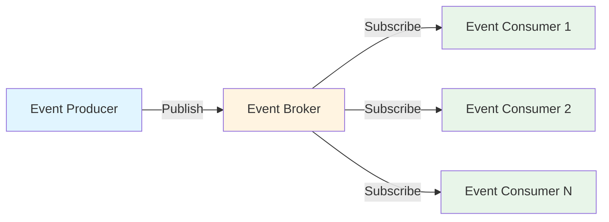

# Module 0 : Introduction à l'Architecture Event-Driven

## 🎯 Objectifs

Dans ce module, vous allez :
- Comprendre les concepts fondamentaux de l'architecture event-driven
- Identifier les avantages et cas d'usage
- Découvrir les différences avec les architectures traditionnelles

## 📖 Qu'est-ce que l'Architecture Event-Driven ?

L'architecture event-driven (pilotée par les événements) est un paradigme de conception où les composants d'un système communiquent en produisant et en consommant des **événements**.

### Définition d'un Événement

Un événement est un **changement d'état significatif** dans le système :
- ✅ Une commande a été passée
- ✅ Un paiement a été effectué
- ✅ Un fichier a été uploadé
- ✅ Un utilisateur s'est inscrit

### Architecture Traditionnelle vs Event-Driven

#### Architecture Traditionnelle (Request/Response)

```
Client ──[HTTP]──> Service A ──[HTTP]──> Service B ──[HTTP]──> Service C
   │                                                              │
   └──────────────────[Attente synchrone]────────────────────────┘
```

**Problèmes :**
- ❌ Couplage fort entre les services
- ❌ Latence accumulée
- ❌ Cascade de pannes (si un service tombe)
- ❌ Difficulté à scaler

#### Architecture Event-Driven

```
Service A ──[Event]──> Message Broker ──[Event]──> Service B
                            │
                            └──────[Event]──> Service C
```

**Avantages :**
- ✅ Découplage des composants
- ✅ Traitement asynchrone
- ✅ Scalabilité horizontale
- ✅ Résilience améliorée

## 🌟 Principes Clés

### 1. **Découplage**
Les producteurs et consommateurs d'événements ne se connaissent pas directement.

### 2. **Asynchronisme**
Les événements sont traités de manière asynchrone, permettant un meilleur throughput.

### 3. **Scalabilité**
Chaque composant peut scaler indépendamment selon sa charge.

### 4. **Résilience**
Un composant en panne n'affecte pas les autres ; les événements peuvent être rejoués.

## 📊 Cas d'Usage

### E-Commerce
```
Commande créée → 
  ├─> Service Paiement (traite le paiement)
  ├─> Service Inventaire (réserve les articles)
  ├─> Service Email (envoie confirmation)
  └─> Service Analytics (enregistre les métriques)
```

### Événements Métier à Grande Échelle
- Millions d'événements en temps réel (commandes, transactions, interactions)
- Détection d'anomalies et traitement en temps réel
- Archivage et analytics à long terme

### Microservices
- Communication inter-services découplée
- Choreography vs Orchestration
- Event Sourcing & CQRS

## ⚖️ Avantages et Défis

### Avantages

| Avantage | Description |
|----------|-------------|
| 🚀 **Performance** | Traitement asynchrone, pas d'attente bloquante |
| 📈 **Scalabilité** | Scale horizontal facile, ajout de consommateurs |
| 🔄 **Flexibilité** | Ajout de nouveaux consommateurs sans modifier les producteurs |
| 🛡️ **Résilience** | Tolérance aux pannes, retry automatique |
| 📝 **Auditabilité** | Historique complet des événements |

### Défis

| Défi | Solution |
|------|----------|
| 🔍 **Complexité** | Monitoring distribué (Azure Monitor, Application Insights) |
| 🔁 **Idempotence** | Conception de handlers idempotents |
| 📦 **Ordre des événements** | Partitionnement, sessions Service Bus |
| 🐛 **Debugging** | Correlation IDs, distributed tracing |
| 💾 **Cohérence** | Eventual consistency, Saga pattern |

## 🏗️ Composants d'une Architecture Event-Driven



### 1. **Event Producers (Producteurs)**
Génèrent et publient des événements quand quelque chose se passe.

### 2. **Event Broker (Courtier)**
Infrastructure qui reçoit, stocke et route les événements.
- Azure Event Hubs
- Azure Service Bus
- Azure Event Grid

### 3. **Event Consumers (Consommateurs)**
S'abonnent aux événements et réagissent en conséquence.

## 🔄 Modèles de Communication

### Pub/Sub (Publish/Subscribe)
Un producteur publie un événement, plusieurs consommateurs peuvent le recevoir.

```
Publisher ──> Topic ──┬──> Subscriber A
                      ├──> Subscriber B
                      └──> Subscriber C
```

### Queue (File d'attente)
Messages traités par **un seul** consommateur (competing consumers).

```
Producer ──> Queue ──> Consumer (first available)
```

### Event Streaming
Flux continu d'événements, lecture parallèle via partitions.

```
Producer ──> Partition 0 ──> Consumer Group A
         ├─> Partition 1 ──> Consumer Group B
         └─> Partition 2
```

## 🎓 Concepts Avancés (Aperçu)

Ces concepts seront détaillés dans les modules suivants :

- **Event Sourcing** : Stocker les changements d'état comme une séquence d'événements
- **CQRS** : Séparer les modèles de lecture et d'écriture
- **Saga Pattern** : Gérer les transactions distribuées
- **Choreography** : Coordination décentralisée entre services
- **Orchestration** : Coordination centralisée avec un orchestrateur

## ✅ Quiz Rapide

1. **Quelle est la différence principale entre une architecture event-driven et request/response ?**
   <details>
   <summary>Réponse</summary>
   Event-driven est asynchrone et découplé, tandis que request/response est synchrone avec attente d'une réponse.
   </details>

2. **Un événement doit-il contenir toutes les données ou juste une référence ?**
   <details>
   <summary>Réponse</summary>
   Les deux approches existent : Event Notification (référence) vs Event-Carried State Transfer (données complètes). Le choix dépend du contexte.
   </details>

3. **Comment gérer l'ordre des événements dans un système distribué ?**
   <details>
   <summary>Réponse</summary>
   Utiliser le partitionnement avec une clé (partition key) pour garantir l'ordre au sein d'une partition.
   </details>

## 📚 Ressources

### Documentation Officielle Microsoft

- 📘 **[Event-Driven Architecture Style - Azure Architecture Center](https://learn.microsoft.com/en-us/azure/architecture/guide/architecture-styles/event-driven)** (⭐ LECTURE RECOMMANDÉE)
  - Guide complet sur l'architecture event-driven
  - Quand l'utiliser, bénéfices et challenges
  - Patterns : Pub/Sub, Event Streaming, Choreography, Saga
  - Topologies : Broker vs Mediator

### Articles Experts

- [Martin Fowler - What do you mean by "Event-Driven"?](https://martinfowler.com/articles/201701-event-driven.html)
- [Martin Fowler - Event Sourcing](https://martinfowler.com/eaaDev/EventSourcing.html)

## ➡️ Prochaine Étape

Maintenant que vous comprenez les fondamentaux, passons à la découverte des services Azure pour l'event-driven !

**[Module 1 : Services Azure pour l'Event-Driven →](./01-azure-event-services.md)**

---

[← Retour au sommaire](./workshop.md)
