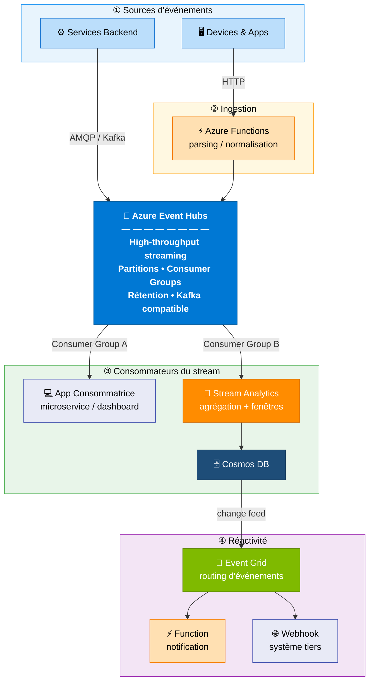

# Module 1 : Services Azure pour le Streaming Event-Driven

## 🎯 Objectifs

Dans ce module, vous allez :
- Découvrir une architecture de référence event-driven complète sur Azure
- Comprendre le rôle de chaque service dans le pipeline
- Choisir les bons services selon votre cas d'usage et votre budget
- Maîtriser Event Hubs et Event Grid en profondeur

---

## 🏗️ Architecture de Référence : Système Observable Event-Driven

> Architecture 100% services Azure natifs à la consommation ou free tier.



### Flux de données

1. **Ingestion** — Deux chemins vers Event Hubs : les services backend publient directement en AMQP/Kafka, les apps clients passent par une Azure Function qui normalise les données avant de les envoyer.
2. **Consommateurs du stream** — Event Hubs expose plusieurs **Consumer Groups** indépendants : une app consommatrice lit le stream en temps réel (Group A), Stream Analytics agrège et persiste dans Cosmos DB (Group B).
3. **Réactivité** — Le **change feed** de Cosmos DB déclenche Event Grid dès qu'une donnée est écrite. Event Grid route l'événement vers les handlers concernés (notification, système tiers) — sans que les consommateurs du stream n'aient à s'en préoccuper.

---

## 🧩 Rôle de chaque composant

### ⚙️ Services Backend & Devices & Apps — Les Producteurs

Ce sont les **sources d'événements** : applications métier, microservices, appareils IoT, applications mobiles. Leur seule responsabilité est de **publier un événement quand quelque chose se passe** — ils ne savent pas, et ne doivent pas savoir, ce qu'il advient ensuite.

- Les **services backend** publient directement dans Event Hubs via AMQP ou le protocole Kafka — connexion native, haut débit.
- Les **devices et apps** envoient des requêtes HTTP à une Azure Function qui normalise avant d'envoyer dans Event Hubs.

> Principe EDA : le producteur est **fire-and-forget**. Il publie et passe à autre chose.

---

### ⚡ Azure Functions — La Porte d'Entrée HTTP

Azure Functions joue ici un rôle d'**adaptateur d'ingestion** : elle expose un endpoint HTTP, valide les données entrantes, les normalise dans un format commun, puis les publie dans Event Hubs.

**Pourquoi ne pas publier directement dans Event Hubs depuis le client ?**
- Le client ne doit pas avoir accès aux credentials Event Hubs
- La Function applique une validation et un enrichissement (timestamp, corrélation ID, version de schéma)
- Elle isole Event Hubs derrière une surface API maîtrisée

C'est le pattern **Anti-Corruption Layer** : on contrôle ce qui entre dans le pipeline.

---

### 🚀 Azure Event Hubs — Le Cœur du Pipeline

Event Hubs est le **bus de streaming central** de l'architecture. Tous les événements y transitent, tous les consommateurs en lisent.

| Concept | Rôle dans cette architecture |
|--------|------------------------------|
| **Partitions** | Distribuent la charge et garantissent l'ordre au sein d'une partition |
| **Consumer Groups** | Permettent à plusieurs consommateurs de lire le même stream indépendamment |
| **Rétention** | Conserve les événements (1 à 90 jours) — replay possible, pas de perte en cas de panne |
| **Kafka compatible** | Les producteurs Kafka existants se connectent sans modification de code |

> C'est le seul point de couplage de l'architecture. Tout le reste est découplé grâce à lui.

---

### 💻 App Consommatrice — Traitement Temps Réel

Un microservice ou dashboard qui lit le stream en temps réel via le **Consumer Group A**. Il maintient sa propre position de lecture (offset) et traite chaque événement à son propre rythme.

**Exemples concrets :** dashboard de ventes en live, détection de fraude en temps réel, mise à jour d'un état applicatif au fil des événements.

La clé : si cette app tombe, elle reprend exactement là où elle s'était arrêtée — **aucun événement perdu**.

---

### 🔧 Azure Stream Analytics — Le Cerveau Analytique

Stream Analytics consomme le stream via le **Consumer Group B** et applique des **requêtes SQL sur des fenêtres temporelles** (tumbling, hopping, sliding).

**Ce qu'il fait dans cette architecture :**
- Agrège les événements par fenêtre de temps (ex: volume de transactions par minute)
- Filtre et enrichit les données avant persistance
- Peut détecter des patterns complexes (anomalies, seuils)

Il écrit le résultat dans Cosmos DB — les données brutes restent dans Event Hubs, seuls les **agrégats utiles** sont persistés.

---

### 🗄️ Cosmos DB — La Persistance Analytique

Cosmos DB stocke les **agrégats produits par Stream Analytics**. Son rôle n'est pas de stocker tous les événements bruts (c'est Event Hubs qui le fait) mais les données **prêtes à être consommées** par des APIs ou des dashboards.

**Atout clé dans cette architecture :** le **Change Feed** — chaque écriture dans Cosmos DB émet automatiquement un événement. C'est le mécanisme qui déclenche la couche de réactivité sans aucun couplage direct.

---

### 🔀 Azure Event Grid — La Réactivité Découplée

Event Grid reçoit les événements du **change feed de Cosmos DB** et les route vers les handlers appropriés selon des règles de filtrage.

**Pourquoi Event Grid et pas un appel direct depuis Stream Analytics ?**

Sans Event Grid :
```
Stream Analytics ──> appelle directement ──> Système de notification
                                         ──> ERP
                                         ──> Autre service
```
→ Stream Analytics doit connaître tous les systèmes aval. Chaque ajout nécessite de modifier le job.

Avec Event Grid :
```
Stream Analytics ──> Cosmos DB ──> Event Grid ──> [N handlers découplés]
```
→ On ajoute ou retire des handlers sans toucher au pipeline. C'est l'**Open/Closed Principle** appliqué à l'architecture.

---

### ⚡ Function Notification & 🌐 Webhook — Les Handlers

Les **handlers Event Grid** sont les destinataires finaux des événements de réactivité. Chacun a une responsabilité unique et est totalement indépendant des autres.

- **Azure Function** : logique de notification (email, SMS, Teams) — serverless, pay-per-execution
- **Webhook** : intégration avec un système tiers (ERP, CRM, outil legacy) sans modifier ce système

Ils peuvent être ajoutés, supprimés ou remplacés **sans impacter une seule ligne du reste de l'architecture**.

---

### 🔍 Pourquoi c'est une architecture Event-Driven

Cette architecture repose sur **quatre principes fondamentaux** de l'EDA :

#### 1. Les producteurs ne connaissent pas les consommateurs

Un service backend publie ses événements dans Event Hubs **sans savoir** qui les lit. Aujourd'hui une app consommatrice et Stream Analytics. Demain on peut brancher un troisième Consumer Group (ML, audit log, replay...) **sans toucher au producteur**. C'est le découplage fort.

> En architecture traditionnelle, le service backend appellerait directement l'app consommatrice et le pipeline analytique — deux appels synchrones, deux dépendances, deux points de panne.

#### 2. Le stream est une source de vérité persistante

Event Hubs conserve tous les événements pendant la durée de rétention configurée. Si un consommateur plante, il reprend là où il s'était arrêté. Si on déploie un nouveau service, il peut rejouer le passé. **Les données ne sont pas perdues entre producteur et consommateur** — c'est fondamentalement différent d'une API REST.

#### 3. Les Consumer Groups permettent la lecture parallèle et indépendante

```
Event Hubs
    │
    ├── Consumer Group A → App Consommatrice  (lecture temps réel, offset propre)
    └── Consumer Group B → Stream Analytics   (lecture agrégation, offset propre)
```

Chaque groupe maintient sa propre position de lecture (**offset**). Le Group A peut être en retard sur le Group B — aucun n'impacte l'autre. C'est le pattern **Competing Consumers** appliqué à du streaming.

#### 4. La réactivité est découplée du traitement principal

Stream Analytics écrit dans Cosmos DB. Cosmos DB émet un **change feed** (événement). Event Grid reçoit cet événement et notifie les systèmes concernés.

Ni Event Hubs, ni Stream Analytics, ni Cosmos DB ne savent qu'un système de notification existe. Le système de notification peut être ajouté, retiré, remplacé **sans modifier une seule ligne du pipeline principal**. C'est le pattern **Event Notification** de Martin Fowler.

---

### 🎭 Scénario concret : une transaction e-commerce

Pour rendre l'architecture tangible, voici comment elle se comporte sur un événement réel :

```
1. [Client mobile] passe une commande
       │
       ▼
2. [Azure Function] reçoit l'appel HTTP, valide et normalise
   → publie { "type": "OrderPlaced", "orderId": "xyz", "amount": 149.90, "ts": "..." }
       │
       ▼
3. [Event Hubs] stocke l'événement sur la partition hash("xyz")
       │
       ├── Consumer Group A → [App Consommatrice]
       │       → met à jour le dashboard des ventes en temps réel
       │
       └── Consumer Group B → [Stream Analytics]
               → agrège les ventes par heure
               → détecte si le volume dépasse un seuil
               → écrit l'agrégat dans Cosmos DB
                       │
                       ▼
               [Cosmos DB change feed]
                       │
                       ▼
               [Event Grid] route l'événement
                       ├── [Function] → envoie un email de confirmation au client
                       └── [Webhook] → notifie le système ERP legacy
```

**Ce qui ne se passe pas :** la Function d'ingestion n'appelle jamais l'ERP. Le dashboard ne bloque pas si l'ERP est down. L'ERP peut être remplacé sans toucher au pipeline.

---

## ➡️ Prochaine Étape

Plongeons dans Event Hubs avec un lab pratique !

**[Module 2 : Azure Event Hubs - Fondamentaux →](./02-event-hubs.md)**

---

[← Module précédent](./00-introduction.md) | [Retour au sommaire](./workshop.md)
