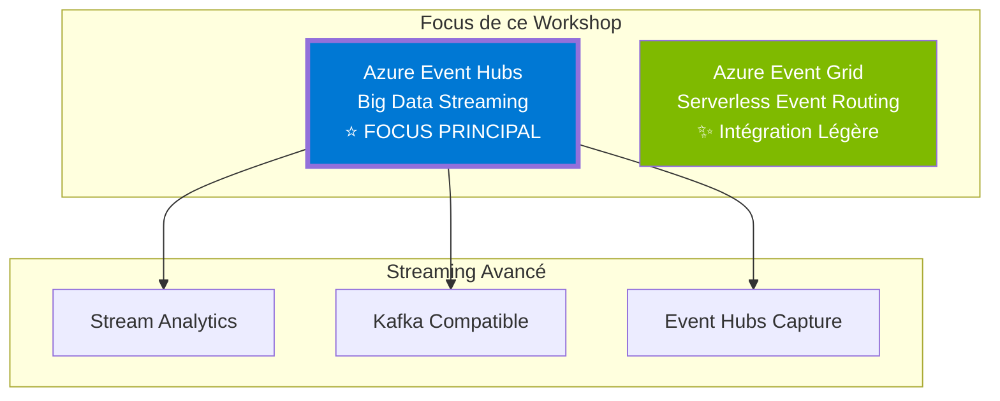
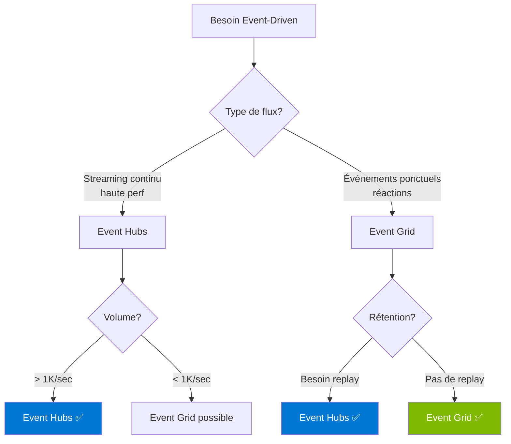

# Module 1 : Services Azure pour le Streaming Event-Driven


## 🎯 Objectifs

Dans ce module, vous allez :
- Découvrir Azure Event Hubs pour le streaming haute performance
- Comprendre Azure Event Grid pour l'intégration événementielle
- Apprendre à choisir entre les deux selon votre cas d'usage

## 🌐 Azure Event-Driven : Focus Streaming

Ce workshop se concentre sur les **services de streaming et d'événements** Azure :



## 📊 Comparaison des Services

| Critère | Event Hubs | Event Grid |
|---------|------------|------------|
| **Type** | Streaming | Event Routing |
| **Débit** | ⭐⭐⭐⭐⭐ Millions/sec | ⭐⭐⭐⭐ Millions d'events |
| **Taille message** | 1 MB (256 KB batch) | 1 MB |
| **Rétention** | 1-90 jours | 24 heures |
| **Protocole** | AMQP, Kafka, HTTPS | HTTP/HTTPS |
| **Ordre garanti** | ✅ Par partition | ❌ Non |
| **Use Case** | Streaming, événements métier, logs | Réactions, notifications, webhooks |
| **Prix** | 💰💰💰 | 💰 |
| **Replay** | ✅ Oui (rétention) | ❌ Non |

## 🔵 Azure Event Hubs - Le Cœur du Workshop

### Qu'est-ce que c'est ?

**Event Hubs** est la **plateforme de streaming big data** d'Azure, capable de recevoir et traiter des millions d'événements par seconde avec une latence faible.

### Caractéristiques Clés

- 📈 **Haute performance** : Millions d'événements/seconde
- 🔄 **Compatible Kafka** : Endpoint Kafka natif, migration facile
- 📦 **Partitionnement** : Distribution automatique de la charge
- 💾 **Rétention configurable** : 1 à 90 jours (tier Premium/Dedicated)
- 🔌 **Capture automatique** : Vers Blob Storage ou Data Lake (Parquet/Avro)
- 🌍 **Geo-replication** : Disaster recovery
- ⚖️ **Auto-inflate** : Scaling automatique des throughput units

### Cas d'Usage Event Hubs

```
✅ Événements métier à haute fréquence (commandes, transactions, interactions)
✅ Logs d'applications à grande échelle
✅ Analytics en temps réel (Stream Analytics)
✅ Clickstream d'un site web
✅ Ingestion de données pour ML/AI
✅ Surveillance et monitoring distribué
✅ Migration depuis Apache Kafka
✅ Time-series data (données de marché financier)
```

### Exemple de Flux Event Hubs

```
[Applications] ──> [Event Hubs] ──> [Stream Analytics] ──> [Power BI]
   100K/sec       Partitions x16      Aggregation          Dashboard
                  Retention 7j         Windowing          Real-time
                                      Filtering
```

### Quand utiliser Event Hubs ?

- ✅ Besoin de très haut débit (> 1K msgs/sec)
- ✅ Streaming de données en temps réel
- ✅ Rétention pour replay et analytics
- ✅ Compatible Kafka souhaité
- ✅ Événements métier et logs à grande échelle
- ✅ Time-series data
- ✅ Traitement de flux (windowing, aggregation)

### Quand ne PAS utiliser Event Hubs ?

- ❌ Besoin de transactions ACID
- ❌ Messages < 100/sec (over-engineering)
- ❌ Ordre strict requis entre TOUS les messages (utiliser partition key)
- ❌ Besoin de dead-letter queue sophistiquée
- ❌ Budget très limité pour faible volume

## 🟢 Azure Service Bus

### Qu'est-ce que c'est ?

**Service Bus** est un **message broker d'entreprise** avec support des transactions, sessions, et patterns avancés de messagerie.

### Caractéristiques Clés

- 💼 **Enterprise-grade** : Transactions, sessions, duplicate detection
- 📬 **Queues & Topics** : Point-à-point ou pub/sub
- 🔒 **Sessions** : Ordre garanti pour un groupe de messages
- ⚰️ **Dead Letter Queue** : Gestion automatique des messages en erreur
- 🔁 **Scheduled Messages** : Envoi différé

### Concepts Principaux

#### Queues (Files d'attente)
Communication **point-à-point** entre un producteur et un consommateur.

```
Producer ──> [Queue] ──> Consumer
                ↓
        (autres consumers en attente)
```

#### Topics & Subscriptions
Communication **publish/subscribe** : un message vers plusieurs consommateurs.

```
Publisher ──> [Topic] ──┬──> Subscription A ──> Consumer A
                        ├──> Subscription B ──> Consumer B
                        └──> Subscription C ──> Consumer C
```

### Cas d'Usage

```
✅ Commandes e-commerce (avec transactions)
✅ Workflow de traitement de documents
✅ Communication inter-microservices
✅ Intégration de systèmes legacy
✅ Messages nécessitant un ordre strict
```

### Exemple de Flux

```
[Web App] ──> [Service Bus Topic] ──┬──> [Email Service]
   Order           "OrderCreated"    ├──> [Inventory Service]
                                     ├──> [Payment Service]
                                     └──> [Analytics Service]
```

### Quand l'utiliser ?

- ✅ Besoin de transactions
- ✅ Ordre strict requis (sessions)
- ✅ Dead-letter queue nécessaire
- ✅ Duplicate detection importante
- ✅ Messages de commande/instruction
- ✅ Intégration entre microservices

### Quand ne PAS l'utiliser ?

- ❌ Très haut débit (> 100K msgs/sec)
- ❌ Événements simples sans garanties
- ❌ Rétention longue (> 14 jours)
- ❌ Budget très limité

## 🟣 Azure Event Grid - Intégration Légère

### Qu'est-ce que c'est ?

**Event Grid** est un service de **routage d'événements serverless** pour construire des applications réactives basées sur les événements Azure ou custom.

### Caractéristiques Clés

- ⚡ **Serverless & Pay-per-event** : Pas de provisioning
- 🔌 **100+ Sources natives** : Blob Storage, SQL Database, Resource Groups, etc.
- 🎯 **Filtrage avancé** : Route les événements selon des règles
- 🔄 **Retry automatique** : Avec backoff exponentiel (24h max)
- 📊 **Très bas coût** : $0.60 par million d'opérations
- 🌐 **Push model** : Déclenche des actions immédiatement

### Architecture Event Grid

```
[Event Sources] ──> [Event Grid] ──> [Event Handlers]
                         │
                    [Filter Rules]
                    [Routing Logic]
```

### Sources d'Événements Natives Azure

- 📦 **Azure Blob Storage** : Fichier créé/supprimé
- 🖥️ **Azure Resource Manager** : VM créée, RG supprimé
- 🔑 **Azure Key Vault** : Secret expire
- 📊 **Azure Resources** : Resource state changed
- 🗃️ **Custom Topics** : Vos propres événements applicatifs
- 🔐 **Azure AD** : User created
- 📊 **Azure Monitor** : Alerts

### Destinations (Handlers)

- ⚡ Azure Functions
- 🔗 Logic Apps
- 🌐 Webhooks
- 🚀 Event Hubs (bridging)
- 📬 Service Bus Queue/Topic

### Cas d'Usage Event Grid

```
✅ Réaction aux événements Azure (blob uploadé, VM créée)
✅ Notifications en temps réel légères
✅ Serverless event-driven apps
✅ Intégration entre services Azure
✅ Webhooks pour applications externes
✅ Automation et orchestration simple
```

### Exemple de Flux Event Grid

```
[User uploads image] ──> [Blob Storage] ──> [Event Grid]
                                                  │
                                                  ├──> [Function: Resize]
                                                  ├──> [Function: OCR]
                                                  └──> [Webhook: Notify Admin]
```

### Quand utiliser Event Grid ?

- ✅ Réaction à des événements Azure natifs
- ✅ Architecture serverless avec peu de logique métier
- ✅ Notifications simples et webhooks
- ✅ Budget très limité
- ✅ Pas besoin de rétention
- ✅ Intégration rapide entre services

### Quand ne PAS utiliser Event Grid ?

- ❌ Besoin de rétention > 24h
- ❌ Volume très élevé nécessitant replay
- ❌ Ordre strict requis
- ❌ Traitement batch complexe
- ❌ Need for consumer groups et partitionnement

## 🤔 Event Hubs vs Event Grid : Comment Choisir ?

### Arbre de Décision



### Guide Rapide de Décision

| Critère | Event Hubs | Event Grid |
|---------|:----------:|:----------:|
| **Débit > 1K/sec** | ✅ | ⚠️ |
| **Streaming continu** | ✅ | ❌ |
| **Rétention > 24h** | ✅ | ❌ |
| **Replay événements** | ✅ | ❌ |
| **Ordre garanti** | ✅ (partition) | ❌ |
| **Kafka compatibility** | ✅ | ❌ |
| **Serverless total** | ❌ | ✅ |
| **Budget limité** | ❌ | ✅ |
| **Intégration Azure native** | ⚠️ | ✅ |
| **Traitement temps réel** | ✅ | ⚠️ |

### Cas d'Usage par Service

| Si vous avez besoin de... | Utilisez... |
|---------------------------|-------------|
| 🚀 Millions d'événements/sec | **Event Hubs** |
| 📊 Streaming analytics en temps réel | **Event Hubs + Stream Analytics** |
| 📈 Rétention longue (> 1 jour) | **Event Hubs** |
| 🔄 Replay d'événements | **Event Hubs** |
| ⚡ Réagir à un upload Blob Storage | **Event Grid** |
| 🔔 Notifications légères | **Event Grid** |
| 💰 Très petit budget | **Event Grid** |
| 🎯 Webhook simple | **Event Grid** |
| 📊 Événements métier haute fréquence | **Event Hubs** |
| 🔌 Migration Kafka | **Event Hubs** |

## 🔗 Utilisation Combinée

Event Hubs et Event Grid peuvent être complémentaires !

### Exemple : Pipeline Event-Driven Complet

```
[Applications] ──> [Event Hubs] ──> [Stream Analytics] ──> [Cosmos DB]
                      │                                        │
                      │                                        │
                 [Anomaly detected]                      [Critical data]
                      │                                        │
                      ▼                                        ▼
                [Event Grid] ──> [Alert Function]       [Event Grid]
                                                              │
                                                              ▼
                                                      [Notification]
```

- **Event Hubs** : Flux principal d'événements métier
- **Event Grid** : Alertes et notifications ponctuelles

## ✅ Quiz

1. **Vous devez ingérer les logs de 10,000 serveurs en temps réel. Quel service ?**
   <details>
   <summary>Réponse</summary>
   <strong>Event Hubs</strong> - Conçu pour le streaming haute performance avec millions d'événements/seconde.
   </details>

2. **Vous voulez déclencher une Azure Function quand un fichier est uploadé dans Blob Storage. Quel service ?**
   <details>
   <summary>Réponse</summary>
   <strong>Event Grid</strong> - Intégration native avec Blob Storage et serverless.
   </details>

3. **Vous devez conserver 30 jours d'événements pour analytics. Quel service ?**
   <details>
   <summary>Réponse</summary>
   <strong>Event Hubs</strong> - Rétention jusqu'à 90 jours (Premium/Dedicated).
   </details>

4. **Budget limité, 100 événements/jour pour notifications. Quel service ?**
   <details>
   <summary>Réponse</summary>
   <strong>Event Grid</strong> - Modèle pay-per-event, très économique pour faibles volumes.
   </details>

## 📚 Ressources

- 📘 **[Event-Driven Architecture Style](https://learn.microsoft.com/en-us/azure/architecture/guide/architecture-styles/event-driven)** - Guide Microsoft officiel
- [Choisir entre les services de messagerie Azure](https://docs.microsoft.com/azure/event-grid/compare-messaging-services)
- [Azure Event Hubs Documentation](https://docs.microsoft.com/azure/event-hubs/)
- [Azure Event Grid Documentation](https://docs.microsoft.com/azure/event-grid/)

## ➡️ Prochaine Étape

Plongeons dans Event Hubs avec un lab pratique !

**[Module 2 : Azure Event Hubs - Fondamentaux →](./02-event-hubs.md)**

---

[← Module précédent](./00-introduction.md) | [Retour au sommaire](./workshop.md)
