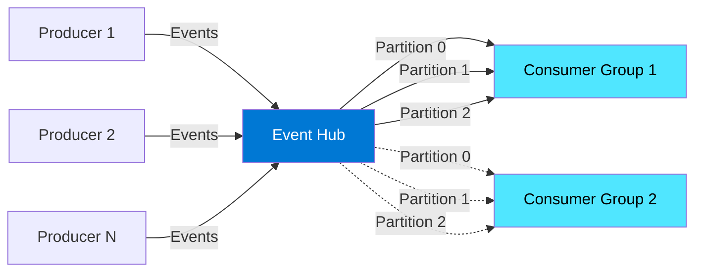

# Module 2 : Azure Event Hubs - Lab Pratique

## 🎯 Objectifs

Dans ce module, vous allez :
- Créer un Event Hub namespace et un Event Hub
- Implémenter un producteur d'événements
- Implémenter un consommateur d'événements
- Comprendre les partitions et consumer groups
- Monitorer votre Event Hub

## 📚 Rappel : Qu'est-ce qu'Event Hubs ?

Azure Event Hubs est une plateforme de **streaming big data** et un service d'**ingestion d'événements** capable de recevoir et traiter des millions d'événements par seconde.

### Architecture Event Hubs



### Concepts Clés

#### 1. **Partitions**
- Division logique des données
- Parallélisation du traitement
- Ordre garanti **au sein d'une partition**
- Généralement 2 à 32 partitions

#### 2. **Consumer Groups**
- Vue indépendante du stream
- Plusieurs applications peuvent lire le même stream
- Par défaut : `$Default`

#### 3. **Event Data**
- Payload : Vos données (JSON, Avro, etc.)
- Metadata : Offset, sequence number, enqueue time
- Partition Key : Pour router vers une partition spécifique

## 🛠️ Lab 1 : Créer l'Infrastructure

### Étape 1 : Créer le Resource Group

```bash
# Variables
RESOURCE_GROUP="rg-eventhubs-workshop"
LOCATION="francecentral"
NAMESPACE_NAME="evhns-workshop-$RANDOM"
EVENTHUB_NAME="business-events"

# Créer le resource group
az group create \
  --name $RESOURCE_GROUP \
  --location $LOCATION
```

### Étape 2 : Créer l'Event Hub Namespace

```bash
# Créer le namespace (Standard tier pour ce workshop)
az eventhubs namespace create \
  --name $NAMESPACE_NAME \
  --resource-group $RESOURCE_GROUP \
  --location $LOCATION \
  --sku Standard \
  --capacity 1 \
  --enable-auto-inflate false

# Vérifier la création
az eventhubs namespace show \
  --name $NAMESPACE_NAME \
  --resource-group $RESOURCE_GROUP \
  --query "{Name:name, Status:status, ServiceBusEndpoint:serviceBusEndpoint}"
```

**Tiers disponibles :**
- **Basic** : 1 consumer group, rétention 1 jour
- **Standard** : 20 consumer groups, rétention 7 jours, Kafka
- **Premium** : Isolation, rétention 90 jours, 100 consumer groups
- **Dedicated** : Clusters dédiés

### Étape 3 : Créer l'Event Hub

```bash
# Créer l'Event Hub avec 4 partitions
az eventhubs eventhub create \
  --name $EVENTHUB_NAME \
  --namespace-name $NAMESPACE_NAME \
  --resource-group $RESOURCE_GROUP \
  --partition-count 4 \
  --message-retention 1

# Lister les Event Hubs
az eventhubs eventhub list \
  --namespace-name $NAMESPACE_NAME \
  --resource-group $RESOURCE_GROUP \
  --output table
```

### Étape 4 : Obtenir la Connection String

```bash
# Obtenir la connection string
CONNECTION_STRING=$(az eventhubs namespace authorization-rule keys list \
  --namespace-name $NAMESPACE_NAME \
  --resource-group $RESOURCE_GROUP \
  --name RootManageSharedAccessKey \
  --query primaryConnectionString \
  --output tsv)

echo "Connection String: $CONNECTION_STRING"

# Sauvegarder dans un fichier .env
cat > .env << EOF
EVENT_HUB_CONNECTION_STRING="$CONNECTION_STRING"
EVENT_HUB_NAME="$EVENTHUB_NAME"
EOF
```

> ⚠️ **Sécurité** : En production, utilisez Azure Key Vault et Managed Identity !

> 📘 **Pour aller plus loin** : Consultez le [PRODUCTION_GUIDE.md](./PRODUCTION_GUIDE.md) pour comprendre **pourquoi** utiliser Managed Identity, comment implémenter Key Vault, Private Endpoints, et toutes les best practices de sécurité.

## 💻 Lab 2 : Implémenter un Producteur

### Installation

Créez un projet Maven :

```bash
mvn archetype:generate \
  -DgroupId=com.example.eventhubs \
  -DartifactId=event-hub-producer \
  -DarchetypeArtifactId=maven-archetype-quickstart \
  -DinteractiveMode=false

cd event-hub-producer
```

Ajoutez les dépendances dans `pom.xml` :

```xml
<dependencies>
    <!-- Azure Event Hubs SDK -->
    <dependency>
        <groupId>com.azure</groupId>
        <artifactId>azure-messaging-eventhubs</artifactId>
        <version>5.18.0</version>
    </dependency>
    
    <!-- JSON -->
    <dependency>
        <groupId>com.google.code.gson</groupId>
        <artifactId>gson</artifactId>
        <version>2.10.1</version>
    </dependency>
    
    <!-- Environment variables -->
    <dependency>
        <groupId>io.github.cdimascio</groupId>
        <artifactId>dotenv-java</artifactId>
        <version>3.0.0</version>
    </dependency>
</dependencies>
```

#### Code : `src/main/java/com/example/eventhubs/EventHubProducer.java`

```java
package com.example.eventhubs;

import com.azure.messaging.eventhubs.*;
import com.google.gson.Gson;
import io.github.cdimascio.dotenv.Dotenv;

import java.time.Instant;
import java.util.*;
import java.util.concurrent.ThreadLocalRandom;

public class EventHubProducer {
    
    private static final String[] SOURCES = {
        "source-app-001", "source-app-002", "source-app-003", "source-app-004"
    };
    
    public static void main(String[] args) throws Exception {
        // Charger les variables d'environnement
        Dotenv dotenv = Dotenv.configure().directory("..").load();
        String connectionString = dotenv.get("EVENT_HUB_CONNECTION_STRING");
        String eventHubName = dotenv.get("EVENT_HUB_NAME");
        
        // Créer le producer client
        EventHubProducerClient producer = new EventHubClientBuilder()
            .connectionString(connectionString, eventHubName)
            .buildProducerClient();
        
        System.out.println("📤 Producer connecté à Event Hub: " + eventHubName);
        System.out.println("Envoi d'événements métier...\n");
        
        Gson gson = new Gson();
        Random random = ThreadLocalRandom.current();
        
        try {
            for (int i = 0; i < 50; i++) {
                // Créer un batch d'événements
                EventDataBatch batch = producer.createBatch();
                
                // Ajouter plusieurs événements au batch
                for (int j = 0; j < 5; j++) {
                    BusinessEvent event = new BusinessEvent(
                        SOURCES[random.nextInt(SOURCES.length)],
                        "EVENT_TYPE_" + random.nextInt(5),
                        "ENTITY-" + random.nextInt(100),
                        random.nextDouble() > 0.05 ? "SUCCESS" : "FAILED",
                        Instant.now().toString(),
                        UUID.randomUUID().toString()
                    );
                    
                    EventData eventData = new EventData(gson.toJson(event));
                    
                    // Ajouter partition key pour garantir l'ordre par source
                    eventData.getProperties().put("SourceId", event.sourceId);
                    
                    if (!batch.tryAdd(eventData)) {
                        throw new IllegalStateException("Event is too large for the batch!");
                    }
                }
                
                // Envoyer le batch
                producer.send(batch);
                System.out.printf("✅ Batch %d envoyé : %d événements%n", i + 1, batch.getCount());
                
                Thread.sleep(1000); // Attendre 1 seconde
            }
            
            System.out.println("\n🎉 Envoi terminé !");
            
        } finally {
            producer.close();
        }
    }
    
    // Classe pour les événements métier
    static class BusinessEvent {
        String sourceId;
        String eventType;
        String entityId;
        String status;
        String timestamp;
        String eventId;
        
        BusinessEvent(String sourceId, String eventType, String entityId,
                     String status, String timestamp, String eventId) {
            this.sourceId = sourceId;
            this.eventType = eventType;
            this.entityId = entityId;
            this.status = status;
            this.timestamp = timestamp;
            this.eventId = eventId;
        }
    }
}
```

#### Exécution

```bash
# Compiler
mvn clean package

# Exécuter
mvn exec:java -Dexec.mainClass="com.example.eventhubs.EventHubProducer"

# Ou directement
java -cp target/event-hub-producer-1.0-SNAPSHOT.jar:~/.m2/repository/**/*.jar \
  com.example.eventhubs.EventHubProducer
```

---

## 📥 Lab 3 : Implémenter un Consommateur

### Installation

Créez un projet Maven pour le consommateur :

```bash
mvn archetype:generate \
  -DgroupId=com.example.eventhubs \
  -DartifactId=event-hub-consumer \
  -DarchetypeArtifactId=maven-archetype-quickstart \
  -DinteractiveMode=false

cd event-hub-consumer
```

Ajoutez les dépendances dans `pom.xml` :

```xml
<dependencies>
    <!-- Azure Event Hubs SDK -->
    <dependency>
        <groupId>com.azure</groupId>
        <artifactId>azure-messaging-eventhubs</artifactId>
        <version>5.18.0</version>
    </dependency>
    
    <!-- Event Processor (avec checkpointing) -->
    <dependency>
        <groupId>com.azure</groupId>
        <artifactId>azure-messaging-eventhubs-checkpointstore-blob</artifactId>
        <version>1.19.0</version>
    </dependency>
    
    <!-- Azure Storage Blobs -->
    <dependency>
        <groupId>com.azure</groupId>
        <artifactId>azure-storage-blob</artifactId>
        <version>12.25.0</version>
    </dependency>
    
    <!-- JSON -->
    <dependency>
        <groupId>com.google.code.gson</groupId>
        <artifactId>gson</artifactId>
        <version>2.10.1</version>
    </dependency>
    
    <!-- Environment variables -->
    <dependency>
        <groupId>io.github.cdimascio</groupId>
        <artifactId>dotenv-java</artifactId>
        <version>3.0.0</version>
    </dependency>
</dependencies>
```

### Code : `src/main/java/com/example/eventhubs/EventHubConsumer.java`

```java
package com.example.eventhubs;

import com.azure.messaging.eventhubs.*;
import com.azure.messaging.eventhubs.checkpointstore.blob.BlobCheckpointStore;
import com.azure.messaging.eventhubs.models.*;
import com.azure.storage.blob.BlobContainerAsyncClient;
import com.azure.storage.blob.BlobContainerClientBuilder;
import com.google.gson.Gson;
import io.github.cdimascio.dotenv.Dotenv;

import java.util.concurrent.TimeUnit;
import java.util.function.Consumer;

public class EventHubConsumer {
    
    public static void main(String[] args) throws Exception {
        // Charger les variables d'environnement
        Dotenv dotenv = Dotenv.configure().directory("..").load();
        String connectionString = dotenv.get("EVENT_HUB_CONNECTION_STRING");
        String eventHubName = dotenv.get("EVENT_HUB_NAME");
        String storageConnectionString = dotenv.get("STORAGE_CONNECTION_STRING");
        String containerName = "eventhub-checkpoints";
        
        Gson gson = new Gson();
        
        // Option 1: Consumer simple (sans checkpoint)
        if (storageConnectionString == null || storageConnectionString.isEmpty()) {
            simpleConsumer(connectionString, eventHubName, gson);
        } else {
            // Option 2: Event Processor avec checkpoint (recommandé)
            eventProcessorConsumer(connectionString, eventHubName, 
                                   storageConnectionString, containerName, gson);
        }
    }
    
    // Option 1: Consumer simple (démonstration seulement)
    private static void simpleConsumer(String connectionString, String eventHubName, Gson gson) {
        System.out.println("📥 Consumer simple connecté à Event Hub: " + eventHubName);
        System.out.println("En attente d'événements... (Ctrl+C pour arrêter)\n");
        
        // Créer le consumer client
        EventHubConsumerAsyncClient consumer = new EventHubClientBuilder()
            .connectionString(connectionString, eventHubName)
            .consumerGroup(EventHubClientBuilder.DEFAULT_CONSUMER_GROUP_NAME)
            .buildAsyncConsumerClient();
        
        // Lire les événements de toutes les partitions
        consumer.receiveFromPartition("0", EventPosition.latest())
            .subscribe(
                partitionEvent -> {
                    String body = partitionEvent.getData().getBodyAsString();
                    System.out.printf("📨 Partition %s: %s%n", 
                        partitionEvent.getPartitionContext().getPartitionId(), body);
                },
                error -> System.err.println("❌ Erreur: " + error.getMessage()),
                () -> System.out.println("✅ Stream terminé")
            );
        
        // Garder le consumer actif
        try {
            System.in.read();
        } catch (Exception e) {
            e.printStackTrace();
        } finally {
            consumer.close();
        }
    }
    
    // Option 2: Event Processor avec checkpoint (recommandé en production)
    private static void eventProcessorConsumer(String connectionString, 
                                               String eventHubName, 
                                               String storageConnectionString,
                                               String containerName,
                                               Gson gson) throws InterruptedException {
        
        // Créer le Blob container pour les checkpoints
        BlobContainerAsyncClient blobContainerAsyncClient = 
            new BlobContainerClientBuilder()
                .connectionString(storageConnectionString)
                .containerName(containerName)
                .buildAsyncClient();
        
        // Créer le checkpoint store
        BlobCheckpointStore checkpointStore = new BlobCheckpointStore(blobContainerAsyncClient);
        
        // Créer l'Event Processor
        EventProcessorClient eventProcessorClient = new EventProcessorClientBuilder()
            .connectionString(connectionString, eventHubName)
            .consumerGroup(EventHubClientBuilder.DEFAULT_CONSUMER_GROUP_NAME)
            .checkpointStore(checkpointStore)
            .processEvent(eventContext -> {
                // Traiter chaque événement
                EventData eventData = eventContext.getEventData();
                String body = eventData.getBodyAsString();
                
                System.out.printf("📨 Partition %s (offset %d): %s%n",
                    eventContext.getPartitionContext().getPartitionId(),
                    eventData.getOffset(),
                    body);
                
                // Checkpoint (sauvegarde de la position)
                eventContext.updateCheckpoint();
            })
            .processError(errorContext -> {
                System.err.printf("❌ Erreur sur partition %s: %s%n",
                    errorContext.getPartitionContext().getPartitionId(),
                    errorContext.getThrowable().getMessage());
            })
            .buildEventProcessorClient();
        
        System.out.println("📥 Event Processor connecté à Event Hub: " + eventHubName);
        System.out.println("En attente d'événements... (Ctrl+C pour arrêter)\n");
        
        // Démarrer le processor
        eventProcessorClient.start();
        
        // Garder le processor actif
        System.out.println("Appuyez sur Entrée pour arrêter...");
        System.in.read();
        
        // Arrêter proprement
        eventProcessorClient.stop();
        TimeUnit.SECONDS.sleep(2);
        
        System.out.println("\n🛑 Event Processor arrêté.");
    }
}
```

### Exécution

```bash
# Pour le consumer simple (sans checkpoint)
mvn exec:java -Dexec.mainClass="com.example.eventhubs.EventHubConsumer"

# Pour tester avec checkpoint, créez d'abord un Storage Account et ajoutez dans .env :
# STORAGE_CONNECTION_STRING="DefaultEndpointsProtocol=https;AccountName=..."

# Créer le container pour les checkpoints
az storage container create \
  --name eventhub-checkpoints \
  --account-name <STORAGE_ACCOUNT_NAME> \
  --auth-mode login
```

---

## 🔍 Lab 4 : Monitoring et Observabilité

### Métriques dans le Portail Azure

1. Allez dans le portail Azure
2. Naviguez vers votre Event Hub namespace
3. Section **Metrics**

**Métriques importantes :**
- **Incoming Messages** : Événements entrants
- **Outgoing Messages** : Événements consommés
- **Throttled Requests** : Requêtes limitées (quota atteint)
- **Server Errors** : Erreurs côté serveur
- **User Errors** : Erreurs côté client

### Monitoring via Azure CLI

```bash
# Voir les métriques des 5 dernières minutes
az monitor metrics list \
  --resource $(az eventhubs namespace show \
    --name $NAMESPACE_NAME \
    --resource-group $RESOURCE_GROUP \
    --query id -o tsv) \
  --metric IncomingMessages \
  --interval PT1M

# Voir les consumer groups
az eventhubs eventhub consumer-group list \
  --namespace-name $NAMESPACE_NAME \
  --eventhub-name $EVENTHUB_NAME \
  --resource-group $RESOURCE_GROUP \
  --output table
```

## 🎯 Exercice : Partition Key

**Objectif :** Comprendre l'impact de la partition key sur l'ordre des événements.

### Défi

Modifiez votre producteur pour :
1. Envoyer des événements **sans** partition key
2. Envoyer des événements **avec** partition key (basée sur SourceId)
3. Observer la différence dans l'ordre de réception

**Question :** Pourquoi l'ordre est-il important pour certains cas d'usage ?

<details>
<summary>💡 Indice</summary>
L'ordre est crucial pour les données de séries temporelles (IoT, logs) où la séquence des événements a du sens.
</details>

## 🧹 Nettoyage

```bash
# Supprimer toutes les ressources
az group delete \
  --name $RESOURCE_GROUP \
  --yes \
  --no-wait
```

## 📚 Points Clés à Retenir

✅ **Event Hubs = Streaming haute performance**
- Millions d'événements/seconde
- Rétention jusqu'à 90 jours
- Compatible Kafka

✅ **Partitions = Parallélisation**
- Ordre garanti au sein d'une partition
- Utiliser une partition key pour router intelligemment

✅ **Consumer Groups = Vues indépendantes**
- Plusieurs applications peuvent lire le même stream
- Chaque consumer group a son propre offset

✅ **Checkpoint = Reprise après panne**
- Sauvegarde régulière de la position
- Nécessite Azure Blob Storage

## ➡️ Prochaine Étape

Passons maintenant à Azure Service Bus pour explorer la messagerie d'entreprise !

**[Module 3 : Azure Service Bus →](./03-service-bus.md)**

---

[← Module précédent](./01-azure-event-services.md) | [Retour au sommaire](./workshop.md)
