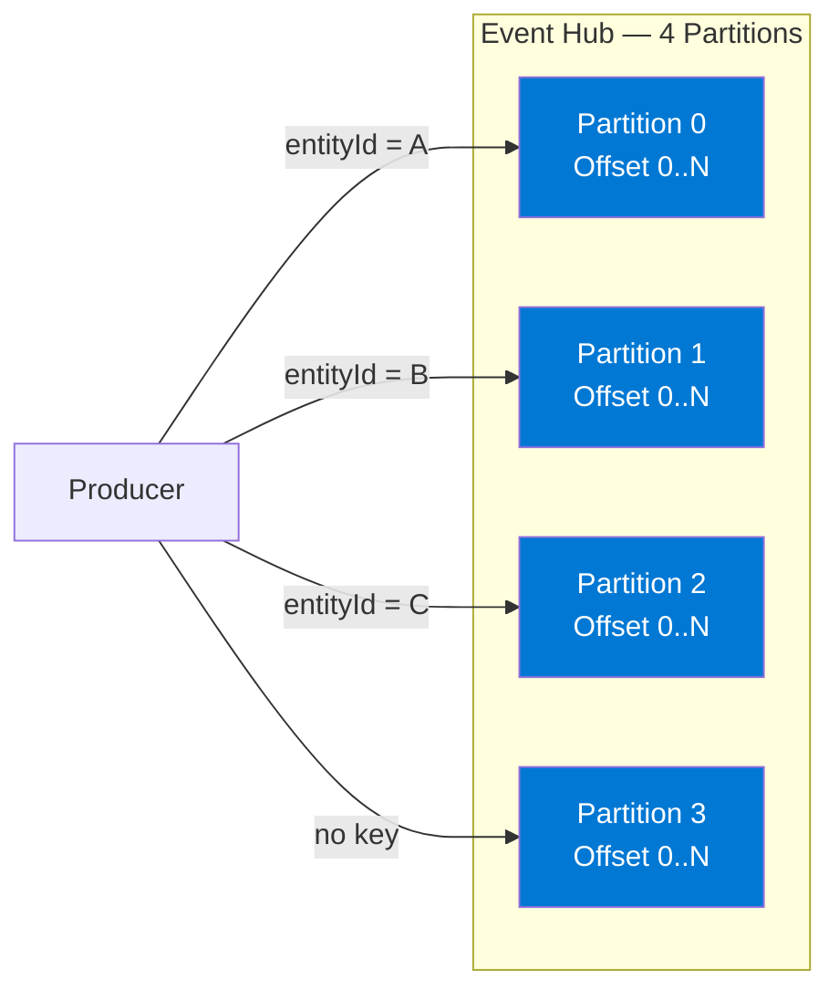
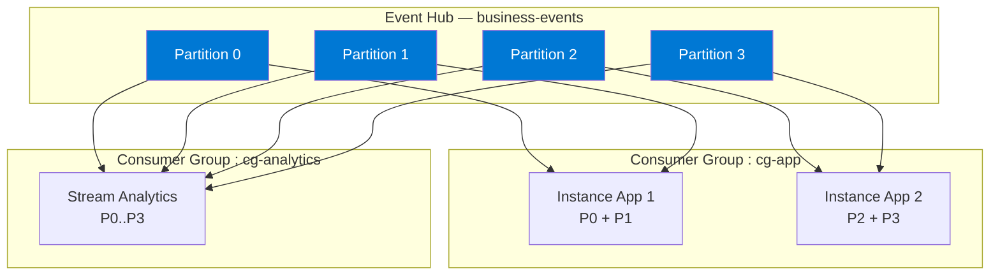
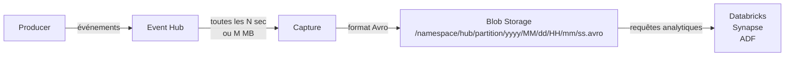

# Module 3 : Azure Event Hubs — Guide Complet Java

## 🎯 Objectifs

Dans ce module, vous allez :
- Maîtriser le modèle de partitionnement et son impact sur l'ordre et le débit
- Implémenter producteur et consommateur en Java avec le SDK officiel Azure
- Comprendre et configurer le checkpointing pour la résilience
- Utiliser Event Hubs comme endpoint Kafka (sans changer votre code Kafka)
- Configurer Event Hubs Capture pour l'archivage automatique
- Monitorer et optimiser les performances

---

## 📦 Dépendances Maven

Ajoutez dans votre `pom.xml` :

```xml
<dependencies>
  <!-- SDK Event Hubs -->
  <dependency>
    <groupId>com.azure</groupId>
    <artifactId>azure-messaging-eventhubs</artifactId>
    <version>5.18.0</version>
  </dependency>

  <!-- Checkpoint store (Blob Storage) -->
  <dependency>
    <groupId>com.azure</groupId>
    <artifactId>azure-messaging-eventhubs-checkpointstore-blob</artifactId>
    <version>1.20.0</version>
  </dependency>

  <!-- Pour les cas Kafka -->
  <dependency>
    <groupId>org.apache.kafka</groupId>
    <artifactId>kafka-clients</artifactId>
    <version>3.7.0</version>
  </dependency>

  <!-- Jackson pour JSON -->
  <dependency>
    <groupId>com.fasterxml.jackson.core</groupId>
    <artifactId>jackson-databind</artifactId>
    <version>2.17.0</version>
  </dependency>
</dependencies>
```

---

## ① Partitionnement en Profondeur

### Concept clé

Un Event Hub est divisé en **partitions** — des flux ordonnés et indépendants. Chaque message est écrit dans **une seule partition**. Les consommateurs lisent une ou plusieurs partitions.



### Règles fondamentales

| Règle | Explication |
|-------|-------------|
| **Ordre garanti par partition** | Tous les messages d'une même partition sont lus dans l'ordre d'écriture |
| **Pas d'ordre cross-partitions** | Entre partitions, l'ordre n'est pas garanti |
| **Partition key → hachage** | La même clé finit toujours sur la même partition |
| **Sans clé → round-robin** | Distribution automatique, débit maximal |
| **Immuable** | Le nombre de partitions ne peut pas être réduit après création |

### Choisir le nombre de partitions

| Partitions | Débit max | Cas d'usage |
|------------|-----------|-------------|
| 2 | ~2 MB/s | Dev / Test |
| 4 | ~4 MB/s | Production standard |
| 8–16 | ~8–16 MB/s | E-commerce, IoT |
| 32+ | Très élevé | Big Data (tier Premium/Dedicated) |

> **Règle pratique** : `partitions = max(consommateurs simultanés attendus, TU × 2)` — mais ne pas sur-provisionner, car chaque partition a un coût en mémoire chez les consommateurs.

---

## ② Producteur Java

### Envoi simple

```java
import com.azure.messaging.eventhubs.*;
import com.fasterxml.jackson.databind.ObjectMapper;

import java.util.Map;

public class SimpleProducer {

    private static final String CONNECTION_STRING = System.getenv("EH_CONNECTION_STRING");
    private static final String EVENTHUB_NAME     = System.getenv("EH_NAME");
    private static final ObjectMapper MAPPER       = new ObjectMapper();

    public static void main(String[] args) throws Exception {

        // Créer le client producteur
        EventHubProducerClient producer = new EventHubClientBuilder()
            .connectionString(CONNECTION_STRING, EVENTHUB_NAME)
            .buildProducerClient();

        // Construire le payload
        Map<String, Object> payload = Map.of(
            "type",     "OrderPlaced",
            "entityId", "order-001",
            "source",   "web-app",
            "amount",   149.90
        );

        // Créer l'EventData
        byte[] body = MAPPER.writeValueAsBytes(payload);
        EventData event = new EventData(body);

        // Ajouter des propriétés custom (headers)
        event.getProperties().put("schema-version", "1.0");
        event.getProperties().put("content-type",   "application/json");

        // Envoyer dans un batch
        EventDataBatch batch = producer.createBatch();
        batch.tryAdd(event);
        producer.send(batch);

        System.out.println("✅ Événement envoyé");
        producer.close();
    }
}
```

### Envoi avec Partition Key (ordre garanti par entité)

```java
import com.azure.messaging.eventhubs.*;

public class PartitionedProducer {

    public static void sendWithPartitionKey(
            EventHubProducerClient producer,
            String entityId,
            byte[] payload) throws Exception {

        // Tous les événements du même entityId → même partition
        // → ordre chronologique garanti par entité
        CreateBatchOptions options = new CreateBatchOptions()
            .setPartitionKey(entityId);

        EventDataBatch batch = producer.createBatch(options);

        EventData event = new EventData(payload);
        if (!batch.tryAdd(event)) {
            throw new IllegalStateException("Événement trop grand pour le batch");
        }

        producer.send(batch);
        System.out.printf("📤 Envoyé sur partition déterminée par key='%s'%n", entityId);
    }
}
```

### Envoi par batch (haut débit)

```java
import com.azure.messaging.eventhubs.*;
import com.fasterxml.jackson.databind.ObjectMapper;

import java.util.*;

public class BatchProducer {

    private static final ObjectMapper MAPPER = new ObjectMapper();

    public static void sendBatch(EventHubProducerClient producer, List<Map<String, Object>> events)
            throws Exception {

        EventDataBatch batch = producer.createBatch();
        int batchCount = 0;

        for (Map<String, Object> event : events) {
            byte[] body  = MAPPER.writeValueAsBytes(event);
            EventData ed = new EventData(body);
            ed.getProperties().put("entityId", event.get("entityId").toString());

            if (!batch.tryAdd(ed)) {
                // Batch plein → envoyer et en créer un nouveau
                if (batch.getCount() > 0) {
                    producer.send(batch);
                    System.out.printf("📤 Batch envoyé : %d événements%n", batch.getCount());
                    batchCount += batch.getCount();
                }
                batch = producer.createBatch();
                batch.tryAdd(ed);
            }
        }

        // Envoyer le dernier batch
        if (batch.getCount() > 0) {
            producer.send(batch);
            batchCount += batch.getCount();
        }

        System.out.printf("✅ Total envoyé : %d événements%n", batchCount);
    }

    public static void main(String[] args) throws Exception {
        EventHubProducerClient producer = new EventHubClientBuilder()
            .connectionString(System.getenv("EH_CONNECTION_STRING"),
                              System.getenv("EH_NAME"))
            .buildProducerClient();

        // Générer 500 événements de test
        List<Map<String, Object>> events = new ArrayList<>();
        Random rnd = new Random();
        for (int i = 0; i < 500; i++) {
            events.add(Map.of(
                "type",     "SensorReading",
                "entityId", "device-" + String.format("%03d", rnd.nextInt(50)),
                "value",    rnd.nextDouble() * 100,
                "ts",       System.currentTimeMillis()
            ));
        }

        sendBatch(producer, events);
        producer.close();
    }
}
```

### Producteur asynchrone (non-bloquant)

```java
import com.azure.messaging.eventhubs.*;
import reactor.core.publisher.Mono;

public class AsyncProducer {

    public static Mono<Void> sendAsync(EventHubProducerAsyncClient producer, byte[] payload) {
        return producer.createBatch()
            .flatMap(batch -> {
                batch.tryAdd(new EventData(payload));
                return producer.send(batch);
            })
            .doOnSuccess(v  -> System.out.println("✅ Envoyé (async)"))
            .doOnError(err  -> System.err.println("❌ Erreur : " + err.getMessage()));
    }

    public static void main(String[] args) throws InterruptedException {
        EventHubProducerAsyncClient producer = new EventHubClientBuilder()
            .connectionString(System.getenv("EH_CONNECTION_STRING"),
                              System.getenv("EH_NAME"))
            .buildAsyncProducerClient();

        for (int i = 0; i < 10; i++) {
            String json = String.format("{\"seq\":%d,\"ts\":%d}", i, System.currentTimeMillis());
            sendAsync(producer, json.getBytes()).subscribe();
        }

        Thread.sleep(3000); // Attendre les acks
        producer.close();
    }
}
```

---

## ③ Consumer Groups

Un **consumer group** est une vue indépendante du flux Event Hubs. Chaque consumer group maintient ses propres offsets — deux groupes consomment le même flux sans interférence.



### Règles consumer groups

| Règle | Détail |
|-------|--------|
| **Indépendance totale** | Chaque groupe a ses propres offsets |
| **Max 5 lecteurs par partition/groupe** (Standard) | Limite du tier Standard |
| **Pas de compétition** | Deux groupes ne "volent" pas les messages |
| **Scalabilité horizontale** | Ajouter des instances dans un groupe = plus de débit |
| **`$Default`** | Consumer group créé automatiquement — réserver pour les tests |

### Équilibrage de charge dans un consumer group

Avec `EventProcessorClient`, Azure gère automatiquement la répartition des partitions entre les instances :

```
3 instances dans cg-app, 4 partitions :
  Instance 1 → P0, P1
  Instance 2 → P2
  Instance 3 → P3

Si Instance 2 crashe :
  Instance 1 → P0, P1, P2  (rééquilibrage automatique)
  Instance 3 → P3
```

---

## ④ Consommateur Java avec Checkpointing

### Concept : checkpointing

Le checkpoint est l'**offset sauvegardé** de la dernière position traitée dans chaque partition. Sans checkpoint, un consommateur redémarre depuis le début — avec checkpoint, il reprend exactement là où il s'est arrêté.

```
SANS checkpoint :
  Lit offsets 0..999 → Crash → Redémarre → Relit 0..999  ❌ doublons

AVEC checkpoint :
  Lit offsets 0..999 → Checkpoint @999 → Crash → Redémarre → Lit 1000..  ✅
```

Le checkpoint est stocké dans **Azure Blob Storage** (un blob par partition).

### EventProcessorClient — implémentation complète

```java
import com.azure.messaging.eventhubs.*;
import com.azure.messaging.eventhubs.checkpointstore.blob.BlobCheckpointStore;
import com.azure.messaging.eventhubs.models.*;
import com.azure.storage.blob.*;
import com.fasterxml.jackson.databind.ObjectMapper;

import java.util.concurrent.atomic.AtomicInteger;

public class ResilientConsumer {

    private static final String EH_CONNECTION_STRING      = System.getenv("EH_CONNECTION_STRING");
    private static final String EH_NAME                   = System.getenv("EH_NAME");
    private static final String STORAGE_CONNECTION_STRING = System.getenv("STORAGE_CONNECTION_STRING");
    private static final String CHECKPOINT_CONTAINER      = "eh-checkpoints";
    private static final String CONSUMER_GROUP            = "cg-app";

    private static final ObjectMapper MAPPER   = new ObjectMapper();
    private static final AtomicInteger COUNTER = new AtomicInteger(0);

    public static void main(String[] args) throws Exception {

        // ① Blob Storage pour les checkpoints
        BlobContainerAsyncClient blobClient = new BlobContainerClientBuilder()
            .connectionString(STORAGE_CONNECTION_STRING)
            .containerName(CHECKPOINT_CONTAINER)
            .buildAsyncClient();

        // ② EventProcessorClient
        EventProcessorClient processor = new EventProcessorClientBuilder()
            .connectionString(EH_CONNECTION_STRING, EH_NAME)
            .consumerGroup(CONSUMER_GROUP)
            .checkpointStore(new BlobCheckpointStore(blobClient))
            .processEvent(ResilientConsumer::processEvent)
            .processError(ResilientConsumer::processError)
            .processPartitionInitialization(ResilientConsumer::onPartitionOpen)
            .processPartitionClose(ResilientConsumer::onPartitionClose)
            .buildEventProcessorClient();

        System.out.println("▶️  Démarrage du consommateur...");
        processor.start();

        Runtime.getRuntime().addShutdownHook(new Thread(() -> {
            System.out.println("⏹️  Arrêt en cours...");
            processor.stop();
        }));

        Thread.currentThread().join();
    }

    // ─── Handler principal ────────────────────────────────────────────

    private static void processEvent(EventContext ctx) {
        EventData event = ctx.getEventData();

        try {
            var payload = MAPPER.readValue(event.getBody(), Object.class);

            System.out.printf(
                "[P%s | offset=%d] %s%n",
                ctx.getPartitionContext().getPartitionId(),
                event.getSequenceNumber(),
                payload
            );

            handleBusinessEvent(event);

            // Checkpoint toutes les 100 événements
            if (COUNTER.incrementAndGet() % 100 == 0) {
                ctx.updateCheckpoint();
                System.out.printf("✅ Checkpoint @ offset %d%n", event.getSequenceNumber());
            }

        } catch (Exception ex) {
            // Ne PAS checker en cas d'erreur → relecture au redémarrage
            System.err.printf("❌ Erreur offset %d : %s%n",
                event.getSequenceNumber(), ex.getMessage());
        }
    }

    private static void handleBusinessEvent(EventData event) {
        String eventType = (String) event.getProperties().get("event-type");
        if (eventType == null) return;

        switch (eventType) {
            case "OrderPlaced"   -> System.out.println("📦 Commande reçue");
            case "OrderShipped"  -> System.out.println("🚚 Expédition");
            case "PaymentFailed" -> System.out.println("💳 Paiement échoué — alerte");
            default              -> System.out.println("ℹ️  Événement : " + eventType);
        }
    }

    // ─── Lifecycle handlers ───────────────────────────────────────────

    private static void onPartitionOpen(InitializationContext ctx) {
        System.out.printf("🔓 Partition %s ouverte%n",
            ctx.getPartitionContext().getPartitionId());
    }

    private static void onPartitionClose(CloseContext ctx) {
        System.out.printf("🔒 Partition %s fermée — raison : %s%n",
            ctx.getPartitionContext().getPartitionId(),
            ctx.getCloseReason());
    }

    private static void processError(ErrorContext ctx) {
        System.err.printf("⚠️  Erreur partition %s : %s%n",
            ctx.getPartitionContext().getPartitionId(),
            ctx.getThrowable().getMessage());
    }
}
```

### Stratégies de checkpointing

```java
// ─── Stratégie 1 : après chaque événement ─────────────────────────
// Sûr mais coûteux en I/O — pour les événements critiques
ctx.updateCheckpoint();

// ─── Stratégie 2 : tous les N événements ──────────────────────────
// Bon équilibre performance / résilience
if (counter.incrementAndGet() % 100 == 0) {
    ctx.updateCheckpoint();
}

// ─── Stratégie 3 : par temps ──────────────────────────────────────
// Utile pour les flux continus à débit variable
private Instant lastCheckpoint = Instant.now();

if (Duration.between(lastCheckpoint, Instant.now()).getSeconds() >= 10) {
    ctx.updateCheckpoint();
    lastCheckpoint = Instant.now();
}

// ─── Stratégie 4 : batch + checkpoint atomique ────────────────────
// Traiter N events, puis checker une seule fois
processBatch(batch);       // Traitement complet d'abord
ctx.updateCheckpoint();    // Checkpoint après succès du batch
```

> **Règle d'or** : ne jamais checker si le traitement a échoué. Un message relu est acceptable, un message perdu ne l'est pas.

### Position de départ

```java
EventProcessorClientBuilder builder = new EventProcessorClientBuilder()
    // Depuis le début de la rétention (replay complet)
    .initialPartitionEventPosition(
        partitionId -> EventPosition.earliest()
    );

    // Depuis maintenant (ignorer l'historique)
    .initialPartitionEventPosition(
        partitionId -> EventPosition.latest()
    );

    // Depuis un offset précis
    .initialPartitionEventPosition(
        partitionId -> EventPosition.fromOffset(42000L)
    );

    // Depuis un timestamp (ex : relire les 2 dernières heures)
    .initialPartitionEventPosition(
        partitionId -> EventPosition.fromEnqueuedTime(
            Instant.now().minus(Duration.ofHours(2))
        )
    );
```

---

## ⑤ Replay et Rétention

Event Hubs conserve les messages pendant la durée de rétention configurée (1 à 90 jours selon le tier). Cette caractéristique permet le **replay** — relire des événements passés.

### Cas d'usage du replay

| Scénario | Action |
|----------|--------|
| Bug en production détecté à J+1 | Relire depuis J pour recalculer |
| Nouveau service déployé | Lire depuis le début pour se synchroniser |
| Audit / investigation | Relire une fenêtre temporelle précise |
| Backfill analytics | Alimenter un nouveau store depuis l'historique |

### Replay ciblé par partition

```java
import com.azure.messaging.eventhubs.*;
import com.azure.messaging.eventhubs.models.*;

import java.time.Duration;
import java.time.Instant;

public class ReplayConsumer {

    public static void replayWindow(
            String connectionString,
            String eventHubName,
            String consumerGroup,
            Instant from,
            Instant to) throws Exception {

        EventHubConsumerAsyncClient client = new EventHubClientBuilder()
            .connectionString(connectionString, eventHubName)
            .consumerGroup(consumerGroup)
            .buildAsyncConsumerClient();

        // Rejouer sur toutes les partitions
        client.getPartitionIds().collectList().block().forEach(partitionId -> {
            EventPosition startPosition = EventPosition.fromEnqueuedTime(from);

            client.receiveFromPartition(partitionId, startPosition)
                .takeWhile(event -> event.getData().getEnqueuedTime().isBefore(to))
                .doOnNext(event -> System.out.printf(
                    "[P%s | %s] %s%n",
                    partitionId,
                    event.getData().getEnqueuedTime(),
                    new String(event.getData().getBody())
                ))
                .subscribe();
        });

        Thread.sleep(30_000);
        client.close();
    }

    public static void main(String[] args) throws Exception {
        // Relire les 6 dernières heures
        replayWindow(
            System.getenv("EH_CONNECTION_STRING"),
            System.getenv("EH_NAME"),
            "$Default",
            Instant.now().minus(Duration.ofHours(6)),
            Instant.now()
        );
    }
}
```

---

## ⑥ Event Hubs comme Endpoint Kafka

Event Hubs expose un endpoint Kafka natif — votre code Kafka existant fonctionne **sans modification**, en changeant uniquement la configuration de connexion.

### Correspondance des concepts

| Kafka | Event Hubs |
|-------|-----------|
| Broker | Namespace |
| Topic | Event Hub |
| Partition | Partition |
| Consumer Group | Consumer Group |
| Offset | Offset |

### Configuration Java

```java
import org.apache.kafka.clients.producer.*;
import org.apache.kafka.clients.consumer.*;
import java.util.Properties;

public class KafkaConfigFactory {

    private static final String NAMESPACE         = System.getenv("EH_NAMESPACE");
    private static final String CONNECTION_STRING = System.getenv("EH_CONNECTION_STRING");

    public static Properties producerConfig() {
        Properties props = new Properties();
        props.put("bootstrap.servers",  NAMESPACE + ".servicebus.windows.net:9093");
        props.put("security.protocol",  "SASL_SSL");
        props.put("sasl.mechanism",     "PLAIN");
        props.put("sasl.jaas.config",
            "org.apache.kafka.common.security.plain.PlainLoginModule required " +
            "username=\"$ConnectionString\" " +
            "password=\"" + CONNECTION_STRING + "\";");

        props.put("key.serializer",   "org.apache.kafka.common.serialization.StringSerializer");
        props.put("value.serializer", "org.apache.kafka.common.serialization.StringSerializer");

        // Performance
        props.put("batch.size",       "16384");
        props.put("linger.ms",        "5");
        props.put("compression.type", "snappy");
        props.put("acks",             "all");

        return props;
    }

    public static Properties consumerConfig(String groupId) {
        Properties props = new Properties();
        props.put("bootstrap.servers",  NAMESPACE + ".servicebus.windows.net:9093");
        props.put("security.protocol",  "SASL_SSL");
        props.put("sasl.mechanism",     "PLAIN");
        props.put("sasl.jaas.config",
            "org.apache.kafka.common.security.plain.PlainLoginModule required " +
            "username=\"$ConnectionString\" " +
            "password=\"" + CONNECTION_STRING + "\";");

        props.put("group.id",           groupId);
        props.put("auto.offset.reset",  "earliest");
        props.put("enable.auto.commit", "false");

        props.put("key.deserializer",   "org.apache.kafka.common.serialization.StringDeserializer");
        props.put("value.deserializer", "org.apache.kafka.common.serialization.StringDeserializer");

        return props;
    }
}
```

### Producteur Kafka Java

```java
import org.apache.kafka.clients.producer.*;
import com.fasterxml.jackson.databind.ObjectMapper;

import java.util.Map;

public class KafkaEventProducer {

    private static final String TOPIC  = System.getenv("EH_NAME");
    private static final ObjectMapper MAPPER = new ObjectMapper();

    public static void main(String[] args) throws Exception {
        KafkaProducer<String, String> producer =
            new KafkaProducer<>(KafkaConfigFactory.producerConfig());

        for (int i = 0; i < 100; i++) {
            String entityId = "device-" + String.format("%03d", i % 20);
            String payload  = MAPPER.writeValueAsString(Map.of(
                "entityId", entityId,
                "type",     "SensorReading",
                "value",    Math.random() * 100,
                "ts",       System.currentTimeMillis()
            ));

            // key = entityId → même partition pour la même entité
            ProducerRecord<String, String> record =
                new ProducerRecord<>(TOPIC, entityId, payload);

            producer.send(record, (meta, ex) -> {
                if (ex != null) {
                    System.err.println("❌ Erreur : " + ex.getMessage());
                } else {
                    System.out.printf("✅ Partition %d | Offset %d%n",
                        meta.partition(), meta.offset());
                }
            });
        }

        producer.flush();
        producer.close();
    }
}
```

### Consommateur Kafka avec commit manuel

```java
import org.apache.kafka.clients.consumer.*;
import java.time.Duration;
import java.util.*;

public class KafkaEventConsumer {

    private static final String TOPIC          = System.getenv("EH_NAME");
    private static final String CONSUMER_GROUP = "cg-kafka-java";

    public static void main(String[] args) {
        KafkaConsumer<String, String> consumer =
            new KafkaConsumer<>(KafkaConfigFactory.consumerConfig(CONSUMER_GROUP));

        consumer.subscribe(Collections.singletonList(TOPIC));

        Map<TopicPartition, OffsetAndMetadata> offsetsToCommit = new HashMap<>();
        int batchSize = 0;

        System.out.println("▶️  Consommateur Kafka démarré");

        try {
            while (true) {
                ConsumerRecords<String, String> records =
                    consumer.poll(Duration.ofMillis(500));

                for (ConsumerRecord<String, String> record : records) {
                    System.out.printf(
                        "[P%d | offset=%d | key=%s] %s%n",
                        record.partition(), record.offset(),
                        record.key(), record.value()
                    );

                    processRecord(record);

                    // offset + 1 = prochain message à lire au redémarrage
                    offsetsToCommit.put(
                        new TopicPartition(record.topic(), record.partition()),
                        new OffsetAndMetadata(record.offset() + 1)
                    );
                    batchSize++;
                }

                // Commit tous les 50 messages
                if (batchSize >= 50 && !offsetsToCommit.isEmpty()) {
                    consumer.commitSync(offsetsToCommit);
                    System.out.printf("✅ Commit manuel : %d messages%n", batchSize);
                    offsetsToCommit.clear();
                    batchSize = 0;
                }
            }
        } finally {
            if (!offsetsToCommit.isEmpty()) {
                consumer.commitSync(offsetsToCommit);
            }
            consumer.close();
        }
    }

    private static void processRecord(ConsumerRecord<String, String> record) {
        System.out.printf("  → Traitement de l'entité : %s%n", record.key());
    }
}
```

---

## ⑦ Event Hubs Capture — Archivage Automatique

Capture écrit automatiquement chaque événement dans **Azure Blob Storage ou Data Lake** au format **Avro**, sans consommateur supplémentaire.



### Activer Capture via CLI

```bash
STORAGE_ACCOUNT="stcaptureworkshop"
CONTAINER="eh-capture"

az storage account create \
  --name $STORAGE_ACCOUNT \
  --resource-group $RG \
  --location $LOCATION \
  --sku Standard_LRS

az storage container create \
  --name $CONTAINER \
  --account-name $STORAGE_ACCOUNT

az eventhubs eventhub update \
  --name $EH_NAME \
  --namespace-name $EH_NAMESPACE \
  --resource-group $RG \
  --enable-capture true \
  --capture-interval 300 \
  --capture-size-limit 314572800 \
  --destination-name EventHubArchive.AzureBlockBlob \
  --storage-account $STORAGE_ACCOUNT \
  --blob-container $CONTAINER \
  --archive-name-format "{Namespace}/{EventHub}/{PartitionId}/{Year}/{Month}/{Day}/{Hour}/{Minute}/{Second}"
```

### Paramètres clés

| Paramètre | Valeur par défaut | Explication |
|-----------|------------------|-------------|
| `capture-interval` | 300 s | Écriture au moins toutes les N secondes |
| `capture-size-limit` | 300 MB | Écriture dès que le buffer atteint cette taille |
| Format | Avro | Binaire compact, schéma intégré |

> Capture déclenche l'écriture dès que **l'une ou l'autre** des conditions (temps OU taille) est atteinte.

### Lire les fichiers Avro capturés (Java)

```xml
<!-- Dépendance supplémentaire pour lire Avro -->
<dependency>
  <groupId>org.apache.avro</groupId>
  <artifactId>avro</artifactId>
  <version>1.11.3</version>
</dependency>
```

```java
import com.azure.storage.blob.*;
import org.apache.avro.file.DataFileReader;
import org.apache.avro.file.SeekableByteArrayInput;
import org.apache.avro.generic.*;

import java.io.IOException;
import java.nio.ByteBuffer;

public class CaptureReader {

    public static void readCapturedEvents(
            String storageConnectionString,
            String containerName,
            String prefix) throws IOException {

        BlobContainerClient container = new BlobContainerClientBuilder()
            .connectionString(storageConnectionString)
            .containerName(containerName)
            .buildClient();

        container.listBlobs(
                new com.azure.storage.blob.models.ListBlobsOptions().setPrefix(prefix), null)
            .forEach(blob -> {
                if (!blob.getName().endsWith(".avro")) return;

                try {
                    byte[] data = container.getBlobClient(blob.getName())
                        .downloadContent().toBytes();

                    GenericDatumReader<GenericRecord> datumReader = new GenericDatumReader<>();
                    DataFileReader<GenericRecord> fileReader =
                        new DataFileReader<>(new SeekableByteArrayInput(data), datumReader);

                    while (fileReader.hasNext()) {
                        GenericRecord record = fileReader.next();
                        byte[] body = ((ByteBuffer) record.get("Body")).array();
                        String json = new String(body);

                        System.out.printf(
                            "[Seq=%s | Time=%s]%n  %s%n",
                            record.get("SequenceNumber"),
                            record.get("EnqueuedTimeUtc"),
                            json
                        );
                    }

                    fileReader.close();
                } catch (IOException ex) {
                    System.err.println("Erreur : " + blob.getName() + " — " + ex.getMessage());
                }
            });
    }

    public static void main(String[] args) throws IOException {
        readCapturedEvents(
            System.getenv("STORAGE_CONNECTION_STRING"),
            "eh-capture",
            "my-namespace/business-events/0/2026/04/25/"
        );
    }
}
```

---

## ⑧ Monitoring et Métriques

### Métriques clés à surveiller

| Métrique | Signal | Seuil d'alerte |
|----------|--------|----------------|
| `IncomingMessages` | Débit entrant | < baseline → problème producteur |
| `OutgoingMessages` | Débit sortant | Chute → consommateur en retard |
| `ThrottledRequests` | Throttling | > 0 → augmenter les Throughput Units |
| `ActiveConnections` | Connexions actives | Trop élevé → vérifier les fuites |
| `CapturedMessages` | Messages capturés | Doit suivre IncomingMessages |

### Requêtes KQL (Azure Monitor)

```kql
// ─── Débit entrant par heure ─────────────────────────────────────
AzureMetrics
| where ResourceProvider == "MICROSOFT.EVENTHUB"
| where MetricName == "IncomingMessages"
| summarize Total = sum(Total) by bin(TimeGenerated, 1h)
| render timechart

// ─── Requêtes throttlées (manque de TU) ─────────────────────────
AzureMetrics
| where MetricName == "ThrottledRequests"
| where Total > 0
| summarize Count = sum(Total) by bin(TimeGenerated, 5m)
| render timechart

// ─── Taille des messages ─────────────────────────────────────────
AzureMetrics
| where MetricName == "IncomingBytes"
| summarize AvgKB = avg(Average) / 1024, MaxKB = max(Maximum) / 1024
  by bin(TimeGenerated, 15m)
| render timechart
```

### Alerte Azure Monitor sur le throttling

```bash
az monitor metrics alert create \
  --name "EH-ThrottledRequests" \
  --resource-group $RG \
  --scopes $(az eventhubs namespace show \
    --name $EH_NAMESPACE \
    --resource-group $RG \
    --query id --output tsv) \
  --condition "avg ThrottledRequests > 0" \
  --window-size 5m \
  --evaluation-frequency 1m \
  --severity 2 \
  --description "Throttling détecté — augmenter les Throughput Units"
```

---

## ⑨ Scaling et Performance

### Throughput Units (TU) — tier Standard

| TUs | Ingress | Egress |
|-----|---------|--------|
| 1 | 1 MB/s ou 1 000 events/s | 2 MB/s |
| 5 | 5 MB/s ou 5 000 events/s | 10 MB/s |
| 20 | 20 MB/s | 40 MB/s |

```bash
# Mise à l'échelle manuelle
az eventhubs namespace update \
  --name $EH_NAMESPACE \
  --resource-group $RG \
  --capacity 5

# Auto-inflate : monte automatiquement jusqu'à N TU si nécessaire
az eventhubs namespace update \
  --name $EH_NAMESPACE \
  --resource-group $RG \
  --enable-auto-inflate true \
  --maximum-throughput-units 10
```

### Scaling côté consommateurs Java

La règle : **1 instance consommatrice par partition** est l'optimum. Au-delà, les instances supplémentaires restent en standby pour le failover.

```
4 partitions, 4 instances → chaque instance traite 1 partition  ✅ optimal
4 partitions, 2 instances → chaque instance traite 2 partitions  ✅ fonctionne
4 partitions, 6 instances → 4 actives, 2 en standby             ✅ failover rapide
4 partitions, 1 instance  → traite les 4 partitions seule        ⚠️ bottleneck
```

---

## ⑩ Best Practices

### Producteur

| ✅ À faire | ❌ À éviter |
|------------|-------------|
| Envoyer en batch | Envoyer message par message |
| Réutiliser `EventHubProducerClient` | Créer un client par message |
| Partition key stable (entityId) | UUID aléatoire comme partition key |
| Retry avec backoff exponentiel | Retry immédiat en boucle |
| Fermer le client proprement (`close()`) | Laisser les connexions ouvertes |

### Consommateur

| ✅ À faire | ❌ À éviter |
|------------|-------------|
| Utiliser `EventProcessorClient` | Gérer les partitions manuellement |
| Checkpoint après traitement réussi | Checkpoint avant traitement |
| Ne pas checker en cas d'erreur | Checker même si le traitement a échoué |
| Un consumer group par cas d'usage | Partager `$Default` en production |
| Implémenter l'idempotence | Supposer qu'un message ne sera traité qu'une fois |

### Architecture

| ✅ À faire | ❌ À éviter |
|------------|-------------|
| Partitions = max consommateurs attendus | Sur-partitionner sans raison |
| Capture pour l'archivage automatique | Consumer custom pour archiver |
| Rétention minimale nécessaire | Rétention maximale par défaut |
| Consumer group dédié par service | Un seul consumer group pour tout |
| Tier Premium pour latence < 100 ms | Standard tier pour des SLA stricts |

---

## ➡️ Prochaine Étape

L'Event Hub est maîtrisé. Dans le module suivant, on explore **Event Grid** : le routage réactif d'événements discrets avec filtrage, retry automatique et dead-lettering.

**[Module 4 : Azure Event Grid →](./04-event-grid.md)**

---

[← Module précédent](./02-event-hubs.md) | [Retour au sommaire](./workshop.md)
