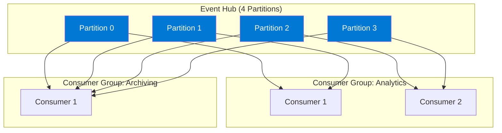

# Module 3 : Azure Event Hubs - Concepts Avancés

## 🎯 Objectifs

Dans ce module, vous allez :
- Maîtriser le partitionnement et les consumer groups
- Implémenter le checkpointing pour la résilience
- Utiliser Event Hubs comme endpoint Kafka
- Configurer Event Hubs Capture
- Optimiser les performances et la scalabilité

## 🔧 Concepts Avancés

### 1. Partitionnement en Profondeur

#### Stratégies de Partition Key

```csharp
// Option 1: Partition par entité (ordre garanti par entité)
var eventData = new EventData(body);
await producer.SendAsync(new[] { eventData }, new SendEventOptions 
{ 
    PartitionKey = entityId  // Tous les events de l'entité dans même partition
});

// Option 2: Partition par heure (pour time-series)
var partitionKey = DateTime.UtcNow.ToString("yyyy-MM-dd-HH");

// Option 3: Round-robin (pas de partition key = distribution automatique)
await producer.SendAsync(new[] { eventData });
```

#### Choisir le Nombre de Partitions

| Partitions | Throughput Max | Use Case |
|------------|----------------|----------|
| 1-2 | Faible | Dev/Test |
| 4-8 | Moyen | Production standard |
| 16-32 | Élevé | E-commerce, Analytics |
| 32+ | Très élevé | Big Data (Premium/Dedicated) |

⚠️ **Important** : Le nombre de partitions ne peut pas être diminué, seulement augmenté !

### 2. Consumer Groups en Détail



#### Créer un Consumer Group

```bash
# Via Azure CLI
az eventhubs eventhub consumer-group create \
  --name analytics-group \
  --eventhub-name business-events \
  --namespace-name $NAMESPACE_NAME \
  --resource-group $RESOURCE_GROUP
```

### 3. Checkpointing - La Clé de la Résilience

> 📘 **Approfondir** : Le [PRODUCTION_GUIDE.md](./PRODUCTION_GUIDE.md) explique **pourquoi** le checkpointing est critique, les stratégies (après chaque event vs batch), et comment implémenter l'idempotence.

Le checkpointing permet de reprendre là où on s'est arrêté en cas de panne.

#### Sans Checkpoint (❌ Problématique)

```
Consumer démarre → Lit 1000 events → Crash → Redémarre → Relit TOUS les events
```

#### Avec Checkpoint (✅ Optimal)

```
Consumer démarre → Lit 1000 events → Checkpoint → Crash → Redémarre → Continue à partir du checkpoint
```

#### Implémentation avec Blob Storage

```csharp
using Azure.Storage.Blobs;
using Azure.Messaging.EventHubs;
using Azure.Messaging.EventHubs.Consumer;
using Azure.Messaging.EventHubs.Processor;

// Configuration du Blob Storage pour les checkpoints
var storageClient = new BlobContainerClient(
    storageConnectionString, 
    "eventhub-checkpoints"
);
await storageClient.CreateIfNotExistsAsync();

// Event Processor avec checkpoint automatique
var processor = new EventProcessorClient(
    storageClient,
    "analytics-group",  // Consumer group
    eventHubConnectionString,
    eventHubName
);

// Handler d'événements
processor.ProcessEventAsync += async (ProcessEventArgs args) =>
{
    try
    {
        // Traiter l'événement
        var body = Encoding.UTF8.GetString(args.Data.EventBody.ToArray());
        await ProcessEventAsync(body);
        
        // ✅ Checkpoint après traitement réussi
        await args.UpdateCheckpointAsync();
    }
    catch (Exception ex)
    {
        // ❌ Ne pas checkpoint en cas d'erreur
        _logger.LogError($"Erreur: {ex.Message}");
    }
};

processor.ProcessErrorAsync += (ProcessErrorEventArgs args) =>
{
    _logger.LogError($"Partition {args.PartitionId}: {args.Exception.Message}");
    return Task.CompletedTask;
};

await processor.StartProcessingAsync();
```

#### Stratégies de Checkpointing

```csharp
// Stratégie 1: Checkpoint après chaque event (sûr mais lent)
await args.UpdateCheckpointAsync();

// Stratégie 2: Checkpoint tous les N events (équilibré)
private int _eventCount = 0;
if (++_eventCount % 100 == 0)
{
    await args.UpdateCheckpointAsync();
}

// Stratégie 3: Checkpoint par temps (ex: toutes les 10 secondes)
private DateTime _lastCheckpoint = DateTime.UtcNow;
if (DateTime.UtcNow - _lastCheckpoint > TimeSpan.FromSeconds(10))
{
    await args.UpdateCheckpointAsync();
    _lastCheckpoint = DateTime.UtcNow;
}

// Stratégie 4: Checkpoint après batch complet
await ProcessBatchAsync(batch);
await args.UpdateCheckpointAsync();
```

## 🐘 Lab : Event Hubs comme Endpoint Kafka

Event Hubs peut être utilisé comme un cluster Kafka sans modifier votre code Kafka existant !

### Configuration Kafka

```bash
# Obtenir la connection string Kafka
KAFKA_CONNECTION_STRING="$NAMESPACE_NAME.servicebus.windows.net:9093"

# Créer un fichier de configuration Kafka
cat > kafka.properties << EOF
bootstrap.servers=$KAFKA_CONNECTION_STRING
security.protocol=SASL_SSL
sasl.mechanism=PLAIN
sasl.jaas.config=org.apache.kafka.common.security.plain.PlainLoginModule required username="\$ConnectionString" password="$EVENT_HUB_CONNECTION_STRING";
group.id=kafka-consumer-group
EOF
```

### Producteur Kafka (Python)

```python
from kafka import KafkaProducer
import json

producer = KafkaProducer(
    bootstrap_servers='YOUR_NAMESPACE.servicebus.windows.net:9093',
    security_protocol='SASL_SSL',
    sasl_mechanism='PLAIN',
    sasl_plain_username='$ConnectionString',
    sasl_plain_password='Endpoint=sb://...',
    value_serializer=lambda v: json.dumps(v).encode('utf-8')
)

# Envoyer des messages (Event Hub Name = Kafka Topic)
for i in range(100):
    message = {
        'event_id': f'evt-{i}',
        'entity_id': f'entity-{i % 10}',
        'event_type': f'TYPE_{i % 5}',
        'timestamp': datetime.now().isoformat()
    }
    
    producer.send('business-events', value=message, key=message['entity_id'].encode())
    print(f"Sent: {message}")

producer.flush()
```

### Consommateur Kafka (Java)

```java
Properties props = new Properties();
props.put("bootstrap.servers", "YOUR_NAMESPACE.servicebus.windows.net:9093");
props.put("group.id", "kafka-consumer-group");
props.put("security.protocol", "SASL_SSL");
props.put("sasl.mechanism", "PLAIN");
props.put("sasl.jaas.config", 
    "org.apache.kafka.common.security.plain.PlainLoginModule required " +
    "username=\"$ConnectionString\" " +
    "password=\"Endpoint=sb://...\";"
);
props.put("key.deserializer", "org.apache.kafka.common.serialization.StringDeserializer");
props.put("value.deserializer", "org.apache.kafka.common.serialization.StringDeserializer");

KafkaConsumer<String, String> consumer = new KafkaConsumer<>(props);
consumer.subscribe(Arrays.asList("business-events"));

while (true) {
    ConsumerRecords<String, String> records = consumer.poll(Duration.ofMillis(100));
    for (ConsumerRecord<String, String> record : records) {
        System.out.printf("Partition=%d, Offset=%d, Key=%s, Value=%s%n",
            record.partition(), record.offset(), record.key(), record.value());
    }
}
```

## 📦 Event Hubs Capture - Archivage Automatique

Capture permet d'archiver automatiquement les événements vers Azure Blob Storage ou Data Lake.

### Configuration de Capture

```bash
# Créer un storage account
STORAGE_ACCOUNT="evcapture$RANDOM"
az storage account create \
  --name $STORAGE_ACCOUNT \
  --resource-group $RESOURCE_GROUP \
  --location $LOCATION \
  --sku Standard_LRS

# Créer un container
az storage container create \
  --name eventhub-capture \
  --account-name $STORAGE_ACCOUNT

# Activer Capture sur l'Event Hub
az eventhubs eventhub update \
  --name $EVENTHUB_NAME \
  --namespace-name $NAMESPACE_NAME \
  --resource-group $RESOURCE_GROUP \
  --enable-capture true \
  --capture-interval 300 \
  --capture-size-limit 314572800 \
  --destination-name EventHubArchive.AzureBlockBlob \
  --storage-account $STORAGE_ACCOUNT \
  --blob-container eventhub-capture \
  --archive-name-format "{Namespace}/{EventHub}/{PartitionId}/{Year}/{Month}/{Day}/{Hour}/{Minute}/{Second}"
```

### Formats de Capture

**Avro (par défaut)** - Format binaire compact
```
{
  "namespace": "Microsoft.EventHub",
  "type": "record",
  "name": "EventData",
  "fields": [
    {"name": "SequenceNumber", "type": "long"},
    {"name": "Offset", "type": "string"},
    {"name": "EnqueuedTimeUtc", "type": "string"},
    {"name": "Body", "type": "bytes"}
  ]
}
```

**Parquet (via Stream Analytics)** - Format columnaire pour analytics

### Lire les Fichiers Capturés

```python
from azure.storage.blob import BlobServiceClient
import avro.datafile
import avro.io
import io

# Lire depuis Blob Storage
blob_service = BlobServiceClient.from_connection_string(storage_conn_string)
container_client = blob_service.get_container_client("eventhub-capture")

for blob in container_client.list_blobs():
    if blob.name.endswith('.avro'):
        blob_client = container_client.get_blob_client(blob.name)
        stream = io.BytesIO(blob_client.download_blob().readall())
        
        # Lire Avro
        reader = avro.datafile.DataFileReader(stream, avro.io.DatumReader())
        for record in reader:
            body = record['Body'].decode('utf-8')
            print(f"Event: {body}")
```

## 🚀 Lab Pratique : Pipeline Event-Driven à Grande Échelle

### Scénario

Construire un pipeline qui :
1. Ingère 10K événements/seconde de multiples sources
2. Utilise le partitionnement par entité
3. Implémente le checkpointing
4. Archive automatiquement vers Data Lake
5. Traite en temps réel avec plusieurs consumers

### Architecture

```
[Simulator: Multi-Sources] ──> [Event Hubs: 16 Partitions]
                                      │
                        ┌─────────────┼─────────────┐
                        ▼             ▼             ▼
                 [Consumer Group:  [Consumer      [Capture]
                  Real-time]       Group:           │
                      │            Analytics]       ▼
                      ▼                │        [Data Lake]
                [Alerts &          [Cosmos DB]
                 Actions]          [Dashboards]
```

### Code du Simulateur

```csharp
using Azure.Messaging.EventHubs;
using Azure.Messaging.EventHubs.Producer;

public class EventSimulator
{
    private readonly EventHubProducerClient _producer;
    private readonly int _entityCount;
    private readonly Random _random = new();

    public EventSimulator(string connectionString, string eventHubName, int entityCount)
    {
        _producer = new EventHubProducerClient(connectionString, eventHubName);
        _entityCount = entityCount;
    }

    public async Task StartAsync(CancellationToken cancellationToken)
    {
        Console.WriteLine($"🚀 Démarrage de la simulation avec {_entityCount} entités");

        while (!cancellationToken.IsCancellationRequested)
        {
            var batch = await _producer.CreateBatchAsync();
            var eventsInBatch = 0;

            // Créer un batch d'événements
            for (int i = 0; i < 100; i++)
            {
                var entityId = $"entity-{_random.Next(_entityCount):D4}";
                var businessEvent = new
                {
                    EntityId = entityId,
                    EventType = $"TYPE_{_random.Next(5)}",
                    Value = 100 + _random.NextDouble() * 900,
                    Status = _random.Next(2) == 0 ? "SUCCESS" : "FAILED",
                    Timestamp = DateTime.UtcNow
                };

                var eventData = new EventData(
                    Encoding.UTF8.GetBytes(JsonSerializer.Serialize(businessEvent))
                );

                // Partition key = EntityId pour garantir l'ordre par entité
                eventData.Properties.Add("EntityId", entityId);

                if (batch.TryAdd(eventData))
                {
                    eventsInBatch++;
                }
                else
                {
                    break;
                }
            }

            // Envoyer le batch
            if (eventsInBatch > 0)
            {
                await _producer.SendAsync(batch);
                Console.WriteLine($"📤 Batch envoyé: {eventsInBatch} événements");
            }

            // Throttle pour atteindre ~10K events/sec
            await Task.Delay(10, cancellationToken);
        }
    }
}
```

### Consumer avec Checkpointing

```csharp
public class EventProcessor
{
    private readonly EventProcessorClient _processor;
    private int _processedCount = 0;
    private DateTime _lastCheckpoint = DateTime.UtcNow;

    public async Task StartAsync()
    {
        _processor.ProcessEventAsync += ProcessEventHandler;
        _processor.ProcessErrorAsync += ProcessErrorHandler;

        Console.WriteLine("📥 Processor démarré");
        await _processor.StartProcessingAsync();
    }

    private async Task ProcessEventHandler(ProcessEventArgs args)
    {
        try
        {
            var businessEvent = JsonSerializer.Deserialize<BusinessEvent>(
                args.Data.EventBody.ToString()
            );

            // Traitement métier
            await ProcessEventAsync(businessEvent);

            _processedCount++;

            // Checkpoint tous les 100 events OU toutes les 10 secondes
            if (_processedCount % 100 == 0 || 
                (DateTime.UtcNow - _lastCheckpoint).TotalSeconds >= 10)
            {
                await args.UpdateCheckpointAsync();
                _lastCheckpoint = DateTime.UtcNow;
                Console.WriteLine($"✅ Checkpoint: {_processedCount} events traités");
            }
        }
        catch (Exception ex)
        {
            Console.WriteLine($"❌ Erreur: {ex.Message}");
            // Ne pas checkpoint en cas d'erreur
        }
    }

    private async Task ProcessEventAsync(BusinessEvent evt)
    {
        // Détection d'anomalies
        if (evt.Status == "FAILED")
        {
            Console.WriteLine($"⚠️ Alerte: {evt.EntityId} - échec détecté");
            // Publier vers Event Grid pour notification
        }

        // Agréger dans Cosmos DB
        await UpdateEntityStatisticsAsync(evt);
    }
}
```

## 📊 Monitoring et Métriques Avancées

### Métriques KQL dans Application Insights

```kql
// Throughput par partition
customMetrics
| where name == "EventHub.IncomingMessages"
| extend PartitionId = tostring(customDimensions.PartitionId)
| summarize EventsPerSecond = sum(value) by bin(timestamp, 1m), PartitionId
| render timechart

// Lag par consumer group
customMetrics
| where name == "EventHub.ConsumerLag"
| extend ConsumerGroup = tostring(customDimensions.ConsumerGroup)
| summarize AvgLag = avg(value), MaxLag = max(value) by ConsumerGroup
| render barchart

// Distribution des événements par partition key
traces
| where message contains "PartitionKey"
| extend PartitionKey = tostring(customDimensions.PartitionKey)
| summarize Count = count() by PartitionKey
| order by Count desc
| take 20
```

## 🎯 Best Practices

### Performance

✅ **Utilisez des batches** - Réduire le nombre d'appels réseau
✅ **Partition key cohérente** - Garantir l'ordre et la distribution
✅ **Consumer groups distincts** - Par cas d'usage
✅ **Checkpoint stratégique** - Pas trop fréquent, pas trop rare
✅ **Connection pooling** - Réutiliser les clients

### Résilience

✅ **Retry policy** - Gérer les erreurs transitoires
✅ **Circuit breaker** - Éviter la cascade de pannes
✅ **Dead-letter** - Via Event Grid ou custom logic
✅ **Monitoring** - Application Insights + Azure Monitor
✅ **Health checks** - Vérifier la connexion

### Coûts

✅ **Auto-inflate** - Seulement si nécessaire
✅ **Capture** - Moins cher que du consumer custom
✅ **Rétention** - Minimum nécessaire
✅ **Tier adapté** - Standard vs Premium vs Dedicated

## 🧹 Nettoyage

```bash
az group delete --name $RESOURCE_GROUP --yes --no-wait
```

## ➡️ Prochaine Étape

Explorons maintenant Event Grid pour l'intégration légère !

**[Module 4 : Azure Event Grid - Lightweight →](./04-event-grid.md)**

---

[← Module précédent](./02-event-hubs.md) | [Retour au sommaire](./workshop.md)
