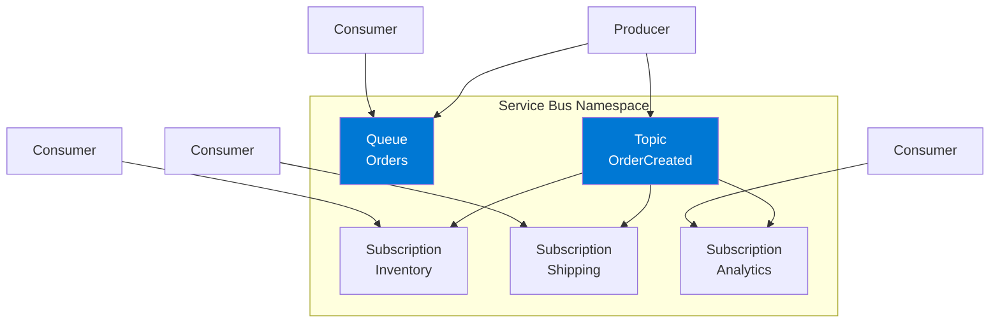

# Module 3 : Azure Service Bus - Lab Pratique

**Durée estimée : 45 minutes**

## 🎯 Objectifs

Dans ce module, vous allez :
- Créer un Service Bus namespace, une queue et un topic
- Implémenter un système de commandes avec transactions
- Utiliser les subscriptions et filtres
- Gérer les dead-letter queues
- Comprendre les sessions pour garantir l'ordre

## 📚 Rappel : Qu'est-ce que Service Bus ?

Azure Service Bus est un **message broker d'entreprise** offrant des fonctionnalités avancées :
- 💼 Transactions ACID
- 🔒 Sessions (ordre garanti)
- ⚰️ Dead-letter queue
- 🔄 Duplicate detection
- ⏰ Scheduled messages

### Architecture Service Bus



## 🛠️ Lab 1 : Créer l'Infrastructure

### Étape 1 : Créer le Service Bus Namespace

```bash
# Variables
RESOURCE_GROUP="rg-servicebus-workshop"
LOCATION="francecentral"
NAMESPACE_NAME="sbns-workshop-$RANDOM"
QUEUE_NAME="order-queue"
TOPIC_NAME="order-events"

# Créer le resource group
az group create \
  --name $RESOURCE_GROUP \
  --location $LOCATION

# Créer le Service Bus namespace (Standard tier)
az servicebus namespace create \
  --name $NAMESPACE_NAME \
  --resource-group $RESOURCE_GROUP \
  --location $LOCATION \
  --sku Standard

# Attendre la création
az servicebus namespace show \
  --name $NAMESPACE_NAME \
  --resource-group $RESOURCE_GROUP \
  --query "{Name:name, Status:status, Endpoint:serviceBusEndpoint}" \
  --output table
```

**Tiers :**
- **Basic** : Queues uniquement (pas de topics)
- **Standard** : Queues + Topics, 256 KB max message
- **Premium** : Isolation, 100 MB max message, geo-recovery

### Étape 2 : Créer une Queue

```bash
# Créer une queue avec options avancées
az servicebus queue create \
  --name $QUEUE_NAME \
  --namespace-name $NAMESPACE_NAME \
  --resource-group $RESOURCE_GROUP \
  --max-delivery-count 5 \
  --lock-duration PT30S \
  --enable-dead-lettering-on-message-expiration true \
  --duplicate-detection-history-time-window PT10M

# Voir les propriétés
az servicebus queue show \
  --name $QUEUE_NAME \
  --namespace-name $NAMESPACE_NAME \
  --resource-group $RESOURCE_GROUP \
  --output table
```

**Options importantes :**
- `max-delivery-count` : Nombre de tentatives avant dead-letter
- `lock-duration` : Durée du lock sur un message
- `enable-dead-lettering` : Activer la dead-letter queue
- `duplicate-detection` : Détecter les doublons

### Étape 3 : Créer un Topic et des Subscriptions

```bash
# Créer le topic
az servicebus topic create \
  --name $TOPIC_NAME \
  --namespace-name $NAMESPACE_NAME \
  --resource-group $RESOURCE_GROUP

# Créer des subscriptions avec filtres
# Subscription 1: Tous les événements
az servicebus topic subscription create \
  --name sub-all \
  --topic-name $TOPIC_NAME \
  --namespace-name $NAMESPACE_NAME \
  --resource-group $RESOURCE_GROUP

# Subscription 2: Seulement les commandes > 1000€
az servicebus topic subscription create \
  --name sub-high-value \
  --topic-name $TOPIC_NAME \
  --namespace-name $NAMESPACE_NAME \
  --resource-group $RESOURCE_GROUP

# Ajouter un filtre SQL sur sub-high-value
az servicebus topic subscription rule create \
  --name HighValueFilter \
  --topic-name $TOPIC_NAME \
  --subscription-name sub-high-value \
  --namespace-name $NAMESPACE_NAME \
  --resource-group $RESOURCE_GROUP \
  --filter-sql-expression "TotalAmount > 1000"

# Supprimer la règle par défaut
az servicebus topic subscription rule delete \
  --name '$Default' \
  --topic-name $TOPIC_NAME \
  --subscription-name sub-high-value \
  --namespace-name $NAMESPACE_NAME \
  --resource-group $RESOURCE_GROUP

# Subscription 3: Seulement les commandes "Express"
az servicebus topic subscription create \
  --name sub-express \
  --topic-name $TOPIC_NAME \
  --namespace-name $NAMESPACE_NAME \
  --resource-group $RESOURCE_GROUP

az servicebus topic subscription rule create \
  --name ExpressFilter \
  --topic-name $TOPIC_NAME \
  --subscription-name sub-express \
  --namespace-name $NAMESPACE_NAME \
  --resource-group $RESOURCE_GROUP \
  --filter-sql-expression "ShippingType = 'Express'"

az servicebus topic subscription rule delete \
  --name '$Default' \
  --topic-name $TOPIC_NAME \
  --subscription-name sub-express \
  --namespace-name $NAMESPACE_NAME \
  --resource-group $RESOURCE_GROUP
```

### Étape 4 : Obtenir la Connection String

```bash
# Obtenir la connection string
CONNECTION_STRING=$(az servicebus namespace authorization-rule keys list \
  --namespace-name $NAMESPACE_NAME \
  --resource-group $RESOURCE_GROUP \
  --name RootManageSharedAccessKey \
  --query primaryConnectionString \
  --output tsv)

echo "Connection String: $CONNECTION_STRING"

# Sauvegarder
cat > .env << EOF
SERVICE_BUS_CONNECTION_STRING="$CONNECTION_STRING"
QUEUE_NAME="$QUEUE_NAME"
TOPIC_NAME="$TOPIC_NAME"
EOF
```

## 💻 Lab 2 : Queue - Producteur & Consommateur

### Scénario : Système de traitement de commandes

**Workflow :**
1. API reçoit une commande → Envoie dans la queue
2. Worker traite la commande de manière asynchrone
3. Si échec : Retry automatique ou dead-letter

---

### Producteur de Commandes (.NET)

#### Installation

```bash
dotnet new console -n ServiceBusQueueProducer
cd ServiceBusQueueProducer
dotnet add package Azure.Messaging.ServiceBus
```

#### Code : `Program.cs`

```csharp
using Azure.Messaging.ServiceBus;
using System.Text.Json;

var connectionString = Environment.GetEnvironmentVariable("SERVICE_BUS_CONNECTION_STRING");
var queueName = Environment.GetEnvironmentVariable("QUEUE_NAME");

await using var client = new ServiceBusClient(connectionString);
await using var sender = client.CreateSender(queueName);

Console.WriteLine($"📤 Envoi de commandes vers la queue: {queueName}\n");

var random = new Random();
var orderIds = new List<string>();

for (int i = 1; i <= 10; i++)
{
    var order = new
    {
        OrderId = $"ORD-{Guid.NewGuid().ToString()[..8]}",
        CustomerId = $"CUST-{random.Next(1, 100):D3}",
        TotalAmount = random.Next(50, 5000),
        Items = random.Next(1, 10),
        Timestamp = DateTime.UtcNow
    };

    var message = new ServiceBusMessage(JsonSerializer.Serialize(order))
    {
        ContentType = "application/json",
        MessageId = order.OrderId,
        Subject = "OrderCreated"
    };

    // Ajouter des propriétés custom
    message.ApplicationProperties.Add("CustomerId", order.CustomerId);
    message.ApplicationProperties.Add("TotalAmount", order.TotalAmount);

    await sender.SendMessageAsync(message);
    Console.WriteLine($"✅ Commande envoyée: {order.OrderId} - {order.TotalAmount}€");
    
    orderIds.Add(order.OrderId);
    await Task.Delay(500);
}

Console.WriteLine($"\n🎉 {orderIds.Count} commandes envoyées avec succès !");
```

---

### Consommateur de Commandes (.NET)

#### Installation

```bash
dotnet new console -n ServiceBusQueueConsumer
cd ServiceBusQueueConsumer
dotnet add package Azure.Messaging.ServiceBus
```

#### Code : `Program.cs`

```csharp
using Azure.Messaging.ServiceBus;
using System.Text.Json;

var connectionString = Environment.GetEnvironmentVariable("SERVICE_BUS_CONNECTION_STRING");
var queueName = Environment.GetEnvironmentVariable("QUEUE_NAME");

await using var client = new ServiceBusClient(connectionString);
await using var processor = client.CreateProcessor(queueName, new ServiceBusProcessorOptions
{
    MaxConcurrentCalls = 2,
    AutoCompleteMessages = false, // On gère manuellement
    PrefetchCount = 5
});

processor.ProcessMessageAsync += MessageHandler;
processor.ProcessErrorAsync += ErrorHandler;

Console.WriteLine($"📥 Consumer démarré sur queue: {queueName}");
Console.WriteLine("En attente de commandes... (Entrer pour arrêter)\n");

await processor.StartProcessingAsync();
Console.ReadLine();
await processor.StopProcessingAsync();

Console.WriteLine("\n🛑 Consumer arrêté.");

async Task MessageHandler(ProcessMessageEventArgs args)
{
    var body = args.Message.Body.ToString();
    var order = JsonSerializer.Deserialize<JsonElement>(body);
    var orderId = order.GetProperty("OrderId").GetString();
    var amount = order.GetProperty("TotalAmount").GetDecimal();

    Console.WriteLine($"📦 Traitement de la commande {orderId} - {amount}€");

    try
    {
        // Simuler le traitement (avec 20% de chance d'échec)
        await Task.Delay(1000);
        
        if (new Random().NextDouble() < 0.2)
        {
            throw new Exception("Erreur simulée lors du traitement");
        }

        // ✅ Succès : Compléter le message
        await args.CompleteMessageAsync(args.Message);
        Console.WriteLine($"✅ Commande {orderId} traitée avec succès\n");
    }
    catch (Exception ex)
    {
        Console.WriteLine($"❌ Erreur sur {orderId}: {ex.Message}");
        
        // Vérifier le nombre de tentatives
        if (args.Message.DeliveryCount >= 3)
        {
            // Après 3 tentatives : Envoyer en dead-letter
            await args.DeadLetterMessageAsync(args.Message, "ProcessingFailed", ex.Message);
            Console.WriteLine($"⚰️  Commande {orderId} envoyée en dead-letter\n");
        }
        else
        {
            // Abandonner pour retry
            await args.AbandonMessageAsync(args.Message);
            Console.WriteLine($"🔄 Commande {orderId} sera retentée\n");
        }
    }
}

Task ErrorHandler(ProcessErrorEventArgs args)
{
    Console.WriteLine($"❌ Erreur: {args.Exception.Message}");
    return Task.CompletedTask;
}
```

---

### Consommateur Python

#### Code : `queue_consumer.py`

```python
import asyncio
import json
import random
from azure.servicebus.aio import ServiceBusClient
from azure.servicebus import ServiceBusMessage
from dotenv import load_dotenv
import os

load_dotenv()

CONNECTION_STRING = os.getenv("SERVICE_BUS_CONNECTION_STRING")
QUEUE_NAME = os.getenv("QUEUE_NAME")

async def process_message(message):
    """Traiter un message de commande"""
    body = str(message)
    order = json.loads(body)
    order_id = order["OrderId"]
    amount = order["TotalAmount"]
    
    print(f"📦 Traitement de la commande {order_id} - {amount}€")
    
    # Simuler le traitement
    await asyncio.sleep(1)
    
    # Simuler 20% d'échecs
    if random.random() < 0.2:
        raise Exception("Erreur simulée lors du traitement")
    
    print(f"✅ Commande {order_id} traitée avec succès\n")

async def main():
    async with ServiceBusClient.from_connection_string(CONNECTION_STRING) as client:
        async with client.get_queue_receiver(QUEUE_NAME) as receiver:
            print(f"📥 Consumer démarré sur queue: {QUEUE_NAME}")
            print("En attente de commandes...\n")
            
            async for message in receiver:
                try:
                    await process_message(message.body)
                    # Compléter le message
                    await receiver.complete_message(message)
                    
                except Exception as e:
                    print(f"❌ Erreur: {e}")
                    
                    # Vérifier le nombre de tentatives
                    if message.delivery_count >= 3:
                        # Dead-letter après 3 tentatives
                        await receiver.dead_letter_message(
                            message,
                            reason="ProcessingFailed",
                            error_description=str(e)
                        )
                        print(f"⚰️  Message envoyé en dead-letter\n")
                    else:
                        # Abandonner pour retry
                        await receiver.abandon_message(message)
                        print(f"🔄 Message sera retenté\n")

if __name__ == "__main__":
    try:
        asyncio.run(main())
    except KeyboardInterrupt:
        print("\n🛑 Consumer arrêté.")
```

---

## 🎯 Lab 3 : Topics & Subscriptions

### Scénario : Pub/Sub pour événements de commandes

**Workflow :**
```
OrderCreatedEvent → Topic → ├─> Subscription "all" → Analytics
                            ├─> Subscription "high-value" → Fraud Detection
                            └─> Subscription "express" → Fast Shipping
```

### Producteur vers Topic (.NET)

#### Code : `TopicProducer.cs`

```csharp
using Azure.Messaging.ServiceBus;
using System.Text.Json;

var connectionString = Environment.GetEnvironmentVariable("SERVICE_BUS_CONNECTION_STRING");
var topicName = Environment.GetEnvironmentVariable("TOPIC_NAME");

await using var client = new ServiceBusClient(connectionString);
await using var sender = client.CreateSender(topicName);

Console.WriteLine($"📤 Publication d'événements vers le topic: {topicName}\n");

var random = new Random();
var shippingTypes = new[] { "Standard", "Express", "Express", "Standard" };

for (int i = 1; i <= 20; i++)
{
    var order = new
    {
        OrderId = $"ORD-{Guid.NewGuid().ToString()[..8]}",
        CustomerId = $"CUST-{random.Next(1, 100):D3}",
        TotalAmount = random.Next(50, 5000),
        ShippingType = shippingTypes[random.Next(shippingTypes.Length)],
        Timestamp = DateTime.UtcNow
    };

    var message = new ServiceBusMessage(JsonSerializer.Serialize(order))
    {
        ContentType = "application/json",
        MessageId = order.OrderId,
        Subject = "OrderCreated"
    };

    // Propriétés pour le filtrage
    message.ApplicationProperties.Add("TotalAmount", order.TotalAmount);
    message.ApplicationProperties.Add("ShippingType", order.ShippingType);

    await sender.SendMessageAsync(message);
    
    var emoji = order.ShippingType == "Express" ? "⚡" : "📦";
    var valueEmoji = order.TotalAmount > 1000 ? "💎" : "💰";
    
    Console.WriteLine($"{emoji} {valueEmoji} Événement publié: {order.OrderId} - {order.TotalAmount}€ ({order.ShippingType})");
    
    await Task.Delay(300);
}

Console.WriteLine($"\n🎉 Tous les événements publiés !");
```

### Consommateur d'une Subscription (.NET)

#### Code : `SubscriptionConsumer.cs`

```csharp
using Azure.Messaging.ServiceBus;
using System.Text.Json;

var connectionString = Environment.GetEnvironmentVariable("SERVICE_BUS_CONNECTION_STRING");
var topicName = Environment.GetEnvironmentVariable("TOPIC_NAME");

// Choisir quelle subscription lire
Console.WriteLine("Choisissez une subscription:");
Console.WriteLine("1. sub-all (tous les événements)");
Console.WriteLine("2. sub-high-value (commandes > 1000€)");
Console.WriteLine("3. sub-express (expédition Express)");
Console.Write("\nVotre choix (1-3): ");
var choice = Console.ReadLine();

var subscriptionName = choice switch
{
    "1" => "sub-all",
    "2" => "sub-high-value",
    "3" => "sub-express",
    _ => "sub-all"
};

await using var client = new ServiceBusClient(connectionString);
await using var processor = client.CreateProcessor(topicName, subscriptionName);

processor.ProcessMessageAsync += async args =>
{
    var body = args.Message.Body.ToString();
    var order = JsonSerializer.Deserialize<JsonElement>(body);
    
    Console.WriteLine($"📨 Reçu: {order.GetProperty("OrderId")} - " +
                     $"{order.GetProperty("TotalAmount")}€ ({order.GetProperty("ShippingType")})");
    
    await args.CompleteMessageAsync(args.Message);
};

processor.ProcessErrorAsync += args =>
{
    Console.WriteLine($"❌ Erreur: {args.Exception.Message}");
    return Task.CompletedTask;
};

Console.WriteLine($"\n📥 Consumer démarré sur: {topicName}/{subscriptionName}");
Console.WriteLine("En attente d'événements... (Entrer pour arrêter)\n");

await processor.StartProcessingAsync();
Console.ReadLine();
await processor.StopProcessingAsync();
```

---

## 🔍 Lab 4 : Gestion des Dead-Letter Queues

### Consulter la Dead-Letter Queue

#### Via Azure CLI

```bash
# Compter les messages dans la dead-letter queue
az servicebus queue show \
  --name $QUEUE_NAME \
  --namespace-name $NAMESPACE_NAME \
  --resource-group $RESOURCE_GROUP \
  --query "countDetails.deadLetterMessageCount"
```

#### Consommateur Dead-Letter (.NET)

```csharp
using Azure.Messaging.ServiceBus;

var connectionString = Environment.GetEnvironmentVariable("SERVICE_BUS_CONNECTION_STRING");
var queueName = Environment.GetEnvironmentVariable("QUEUE_NAME");

await using var client = new ServiceBusClient(connectionString);

// Pour lire la dead-letter queue, ajouter "/$deadletterqueue"
var deadLetterQueuePath = $"{queueName}/$deadletterqueue";
await using var receiver = client.CreateReceiver(deadLetterQueuePath);

Console.WriteLine("⚰️  Lecture de la Dead-Letter Queue...\n");

var messages = await receiver.ReceiveMessagesAsync(maxMessages: 10, maxWaitTime: TimeSpan.FromSeconds(5));

if (!messages.Any())
{
    Console.WriteLine("✅ Aucun message en dead-letter (c'est une bonne chose!)");
}
else
{
    foreach (var message in messages)
    {
        Console.WriteLine($"📄 Message ID: {message.MessageId}");
        Console.WriteLine($"   Raison: {message.DeadLetterReason}");
        Console.WriteLine($"   Description: {message.DeadLetterErrorDescription}");
        Console.WriteLine($"   Delivery Count: {message.DeliveryCount}");
        Console.WriteLine($"   Body: {message.Body}\n");

        // Optionnel: Compléter (supprimer) le message
        // await receiver.CompleteMessageAsync(message);
    }
}
```

### Réprocesser les Messages Dead-Letter

```csharp
// Lire de la dead-letter queue
var dlqReceiver = client.CreateReceiver($"{queueName}/$deadletterqueue");
var dlqMessages = await dlqReceiver.ReceiveMessagesAsync(maxMessages: 10);

// Renvoyer vers la queue principale
var sender = client.CreateSender(queueName);

foreach (var dlqMessage in dlqMessages)
{
    // Créer un nouveau message avec le même contenu
    var newMessage = new ServiceBusMessage(dlqMessage.Body)
    {
        ContentType = dlqMessage.ContentType,
        Subject = dlqMessage.Subject
    };

    // Copier les propriétés
    foreach (var prop in dlqMessage.ApplicationProperties)
    {
        newMessage.ApplicationProperties.Add(prop.Key, prop.Value);
    }

    await sender.SendMessageAsync(newMessage);
    await dlqReceiver.CompleteMessageAsync(dlqMessage);
    
    Console.WriteLine($"♻️  Message {dlqMessage.MessageId} réinjecté");
}
```

---

## 🔒 Lab 5 : Sessions (Ordre Garanti)

### Créer une Queue avec Sessions

```bash
az servicebus queue create \
  --name session-queue \
  --namespace-name $NAMESPACE_NAME \
  --resource-group $RESOURCE_GROUP \
  --enable-session true
```

### Producteur avec Session ID

```csharp
var sender = client.CreateSender("session-queue");

// Tous les messages avec le même SessionId seront traités en ordre
var customerId = "CUST-001";

for (int i = 1; i <= 5; i++)
{
    var message = new ServiceBusMessage($"Action {i} pour client {customerId}")
    {
        SessionId = customerId,  // ⚠️ Important !
        MessageId = Guid.NewGuid().ToString()
    };

    await sender.SendMessageAsync(message);
    Console.WriteLine($"Envoyé: Action {i}");
}
```

### Consommateur de Session

```csharp
await using var sessionReceiver = await client.AcceptNextSessionAsync("session-queue");

Console.WriteLine($"📍 Session ouverte: {sessionReceiver.SessionId}");

await foreach (var message in sessionReceiver.ReceiveMessagesAsync())
{
    Console.WriteLine($"📨 {message.Body}");
    await sessionReceiver.CompleteMessageAsync(message);
}
```

---

## 📊 Monitoring

### Métriques Importantes

```bash
# Messages actifs dans la queue
az servicebus queue show \
  --name $QUEUE_NAME \
  --namespace-name $NAMESPACE_NAME \
  --resource-group $RESOURCE_GROUP \
  --query "countDetails.activeMessageCount"

# Messages en dead-letter
az servicebus queue show \
  --name $QUEUE_NAME \
  --namespace-name $NAMESPACE_NAME \
  --resource-group $RESOURCE_GROUP \
  --query "countDetails.deadLetterMessageCount"
```

## 🧹 Nettoyage

```bash
az group delete --name $RESOURCE_GROUP --yes --no-wait
```

## 📚 Points Clés à Retenir

✅ **Service Bus = Messagerie d'entreprise**
- Transactions ACID
- Ordre garanti (avec sessions)
- Dead-letter queue intégrée

✅ **Queues vs Topics**
- Queue : Point-à-point (un consommateur)
- Topic : Pub/Sub (plusieurs consommateurs via subscriptions)

✅ **Filtres SQL sur Subscriptions**
- Router intelligemment les messages
- Réduire la charge sur les consumers

✅ **Dead-Letter Queue**
- Gestion automatique des messages en erreur
- Permet l'investigation et le retraitement

## ➡️ Prochaine Étape

Découvrons maintenant Azure Event Grid pour le routage serverless !

**[Module 4 : Azure Event Grid →](./04-event-grid.md)**

---

[← Module précédent](./02-event-hubs.md) | [Retour au sommaire](./workshop.md)
