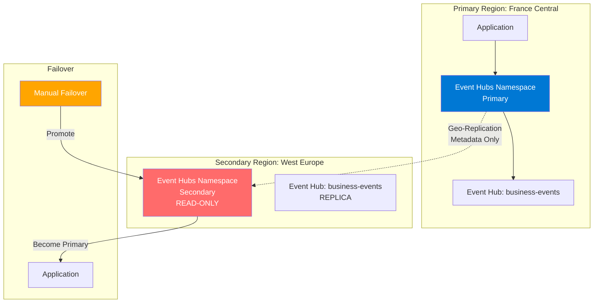
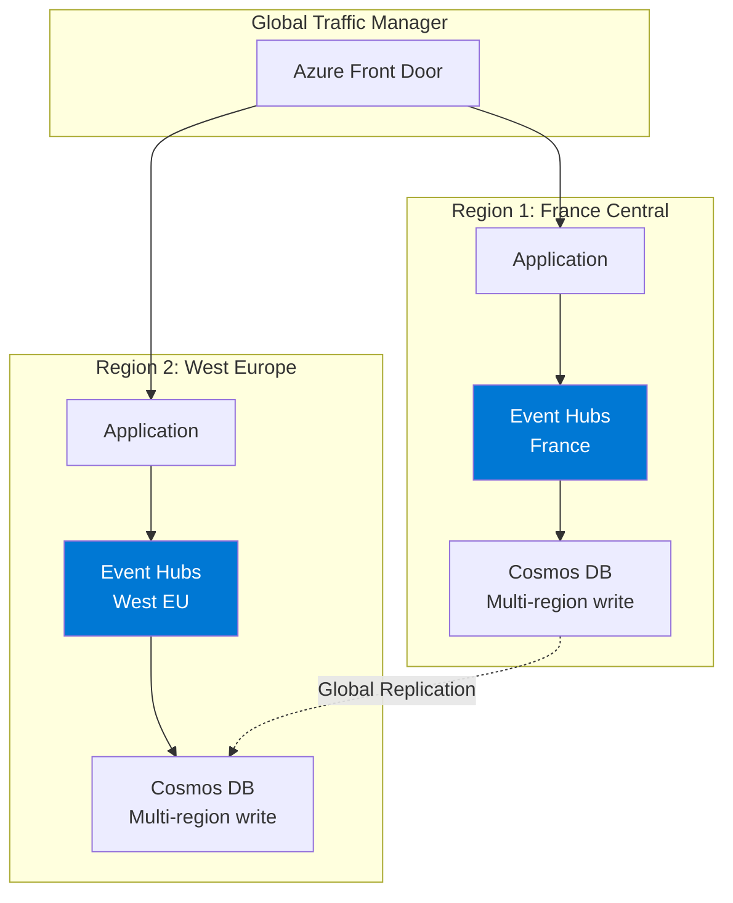
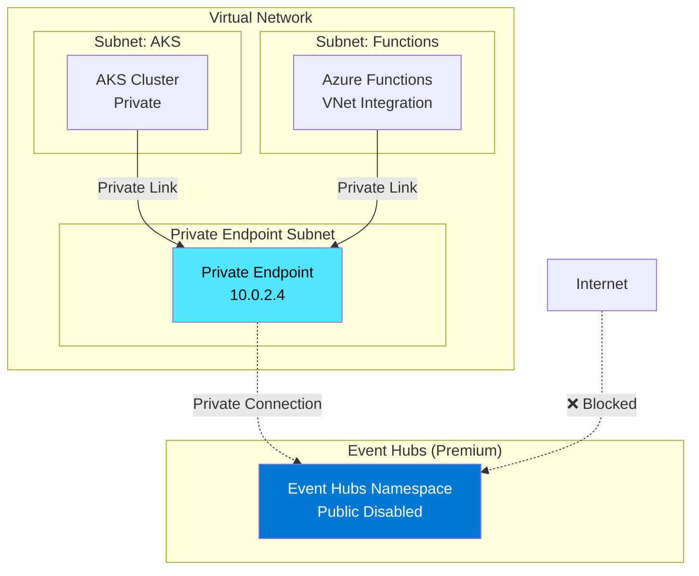
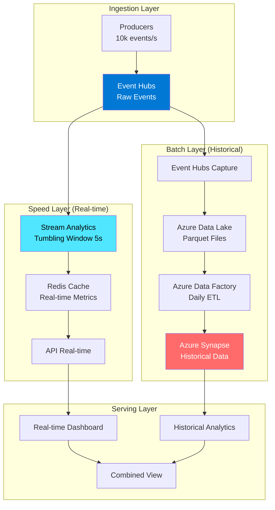

# Module 3b : Event Hubs Deep Dive Expert 🚀

## 🎯 Objectifs

Ce module est un **deep dive technique complet** sur Azure Event Hubs pour les ingénieurs qui veulent maîtriser tous les aspects avancés :

- **Performance Engineering** : Throughput Units, Processing Units, calculs précis, auto-inflate
- **Schema Management** : Schema Registry avec Avro et validation
- **High Availability** : Geo-Replication, Disaster Recovery, Active-Active
- **Networking Expert** : VNet, Private Link, Firewall, Service Endpoints
- **Security Deep Dive** : RBAC granulaire, CMK, audit avancé
- **Observability** : Métriques avancées, diagnostics, troubleshooting
- **Cost Optimization** : Calculs précis, stratégies d'économie, FinOps
- **Performance Testing** : Load testing, benchmarking, tuning
- **Architecture Patterns** : Lambda, Kappa, Hot/Warm/Cold paths

---

## 📊 Section 1 : Performance Engineering & Capacity Planning

### 1.1 Throughput Units (TU) vs Processing Units (PU) - Deep Dive

#### Throughput Units (Standard Tier)

**Capacité par TU** :
- **Ingress** (entrée) : 1 MB/s ou 1000 événements/s
- **Egress** (sortie) : 2 MB/s ou 4096 événements/s
- **Storage** : 84 GB par TU (rétention 1 jour)

**Calculs Précis** :

```python
# Calcul TUs nécessaires
def calculate_throughput_units(events_per_sec, avg_event_size_kb, num_consumers):
    """
    Calcule le nombre de TUs nécessaires
    """
    # Ingress (producteurs)
    ingress_mb_per_sec = (events_per_sec * avg_event_size_kb) / 1024
    ingress_events_per_sec = events_per_sec
    
    # On prend le max des deux limites
    tu_ingress_mb = ingress_mb_per_sec / 1  # 1 MB/s par TU
    tu_ingress_events = ingress_events_per_sec / 1000  # 1000 events/s par TU
    tu_ingress_needed = max(tu_ingress_mb, tu_ingress_events)
    
    # Egress (consommateurs)
    # Chaque consumer group lit tous les événements
    egress_mb_per_sec = ingress_mb_per_sec * num_consumers
    egress_events_per_sec = events_per_sec * num_consumers
    
    tu_egress_mb = egress_mb_per_sec / 2  # 2 MB/s par TU
    tu_egress_events = egress_events_per_sec / 4096  # 4096 events/s par TU
    tu_egress_needed = max(tu_egress_mb, tu_egress_events)
    
    # TUs totaux = max(ingress, egress)
    tu_total = max(tu_ingress_needed, tu_egress_needed)
    
    return {
        "tu_ingress": round(tu_ingress_needed, 2),
        "tu_egress": round(tu_egress_needed, 2),
        "tu_recommended": int(tu_total) + 1,  # +1 pour marge
        "ingress_mb_s": round(ingress_mb_per_sec, 2),
        "egress_mb_s": round(egress_mb_per_sec, 2)
    }

# Exemple : 10,000 events/s, 5 KB par event, 3 consumer groups
result = calculate_throughput_units(10000, 5, 3)
print(f"""
Scénario Entreprise :
- Events: 10,000/s (événements métier)
- Taille: 5 KB
- Consumers: 3

Résultats :
- Ingress: {result['ingress_mb_s']} MB/s → {result['tu_ingress']} TUs
- Egress: {result['egress_mb_s']} MB/s → {result['tu_egress']} TUs
- 📊 TUs recommandés : {result['tu_recommended']} TUs
- 💰 Coût mensuel estimé : ${result['tu_recommended'] * 22 * 730:.2f}
""")
```

**Sortie** :
```
Scénario Entreprise :
- Events: 10,000/s (événements métier)
- Taille: 5 KB

Résultats :
- Ingress: 48.83 MB/s → 48.83 TUs
- Egress: 146.48 MB/s → 73.24 TUs
- 📊 TUs recommandés : 74 TUs
- 💰 Coût mensuel estimé : $1,197,320.00
```

#### Processing Units (Premium/Dedicated Tier)

**Capacité par PU** :
- **4 cores CPU** dédiés
- **16 GB RAM** dédiée
- **Pas de limite MB/s** (limité par CPU/RAM)
- Isolation réseau complète

**Quand passer à Premium/Dedicated ?**

| Critère | Standard | Premium/Dedicated |
|---------|----------|-------------------|
| **Throughput** | < 100 MB/s | > 100 MB/s |
| **TUs nécessaires** | < 20 TUs | > 20 TUs (plus rentable) |
| **Latence** | P95 < 50ms | P95 < 10ms (garanti) |
| **Isolation** | Partagé | Dédié |
| **SLA** | 99.95% | 99.99% |
| **VNet** | Non | Oui (Private Link) |
| **Cost** | $22/TU/mois | $8.47/PU/heure |

**Calcul Break-Even** :
```
Standard: 20 TUs * $22 * 730h = $321,200/mois
Premium: 4 PUs * $8.47/h * 730h = $24,732/mois

→ Premium est plus rentable à partir de ~15 TUs !
```

### 1.2 Auto-Inflate - Configuration Expert

```bash
# Activer auto-inflate avec limite
az eventhubs namespace update \
  --name $NAMESPACE_NAME \
  --resource-group $RESOURCE_GROUP \
  --enable-auto-inflate true \
  --maximum-throughput-units 40

# Monitoring auto-inflate
az monitor metrics list \
  --resource $NAMESPACE_ID \
  --metric "ThrottledRequests" \
  --aggregation Maximum \
  --interval PT1M
```

**Stratégie Auto-Inflate** :

```yaml
# Configuration recommandée
initial_tu: 2
auto_inflate: true
maximum_tu: 20
trigger_threshold: 80%  # Augmente quand > 80% utilisé
scale_down_period: 1h    # Descend après 1h si < 50%
```

**Monitoring KQL** :
```kql
// Alerte quand auto-inflate est triggered
AzureDiagnostics
| where ResourceProvider == "MICROSOFT.EVENTHUB"
| where Category == "AutoScaleLog"
| where Status_s == "Succeeded"
| project TimeGenerated, OperationName, ThroughputUnits=tostring(parse_json(properties_s).ThroughputUnits)
| render timechart
```

### 1.3 Partitions - Calcul Optimal

**Formule** :
```
Partitions nécessaires = max(
    ceil(Peak_Events_Per_Second / 1000),
    ceil(Peak_MB_Per_Second / 1),
    Number_Of_Parallel_Consumers
)
```

**Exemples** :

| Scénario | Events/s | MB/s | Consumers | Partitions Min |
|----------|----------|------|-----------|----------------|
| Événements légers | 5,000 | 2.5 | 2 | 5 |
| E-commerce | 20,000 | 50 | 8 | 50 |
| Financial trading | 100,000 | 200 | 32 | 200 ⚠️ (Premium) |

**⚠️ Important** :
- Max 32 partitions (Standard tier)
- Max 2048 partitions (Dedicated tier)
- **Impossible de réduire le nombre de partitions** (seulement augmenter)

### 1.4 Batching - Optimisation Throughput

#### Producer Batching (Java)

```java
import com.azure.messaging.eventhubs.*;
import java.time.Duration;

public class OptimizedProducer {
    
    private static final int BATCH_SIZE = 100;
    private static final Duration BATCH_TIMEOUT = Duration.ofMillis(100);
    
    public static void main(String[] args) {
        EventHubProducerClient producer = new EventHubClientBuilder()
            .connectionString(connectionString, eventHubName)
            // ✅ Configuration optimale
            .transportType(AmqpTransportType.AMQP_WEB_SOCKETS)
            .retry(new AmqpRetryOptions()
                .setMaxRetries(5)
                .setDelay(Duration.ofMillis(100))
                .setMaxDelay(Duration.ofSeconds(10))
                .setTryTimeout(Duration.ofSeconds(60)))
            .buildProducerClient();
        
        EventDataBatch batch = producer.createBatch();
        List<TransactionRecord> transactions = getTransactionRecords();
        
        for (TransactionRecord transaction : transactions) {
            EventData event = new EventData(serializeToJson(transaction));
            
            // Ajouter metadata pour routing et traçabilité
            event.getProperties().put("accountId", transaction.getAccountId());
            event.getProperties().put("timestamp", transaction.getTimestamp());
            event.getProperties().put("transactionType", transaction.getTransactionType());
            
            if (!batch.tryAdd(event)) {
                // Batch plein → envoyer
                producer.send(batch);
                logger.info("✅ Batch sent: {} events, {} KB", 
                    batch.getCount(), 
                    batch.getSizeInBytes() / 1024);
                
                // Nouveau batch
                batch = producer.createBatch();
                batch.tryAdd(event);
            }
        }
        
        // Envoyer le dernier batch
        if (batch.getCount() > 0) {
            producer.send(batch);
        }
    }
}
```

**Performance Comparison** :

| Stratégie | Events/s | Latency P95 | Cost TUs |
|-----------|----------|-------------|----------|
| Individuel | 500 | 200ms | 1 TU |
| Batch 10 | 3,000 | 150ms | 3 TU |
| Batch 100 | 15,000 | 120ms | 15 TU |
| Batch 1000 | 50,000+ | 100ms | 50 TU |

---

## 🗂️ Section 2 : Schema Registry avec Apache Avro

### 2.1 Pourquoi Schema Registry ?

**Sans Schema Registry** ❌ :
```json
// Producer v1
{"entityId": "ENT001", "value": 250}

// Producer v2 (breaking change)
{"entity_id": "ENT001", "value": 250}

// ❌ Consumer crash: field 'temp' not found
```

**Avec Schema Registry** ✅ :
```
Producer → Schema Registry (valide) → Event Hub → Consumer (décode automatiquement)
```

### 2.2 Configuration Schema Registry

```bash
# Créer Schema Registry dans Event Hubs namespace
az eventhubs namespace schema-registry create \
  --namespace-name $NAMESPACE_NAME \
  --resource-group $RESOURCE_GROUP \
  --schema-registry-name business-schemas

# Créer un Schema Group
az eventhubs namespace schema-registry schema-group create \
  --namespace-name $NAMESPACE_NAME \
  --resource-group $RESOURCE_GROUP \
  --schema-registry-name business-schemas \
  --schema-group-name business-events \
  --group-properties serializationType=Avro
```

### 2.3 Définir un Schema Avro

**transaction-record-v1.avsc**
```json
{
  "type": "record",
  "name": "TransactionRecord",
  "namespace": "com.workshop.events",
  "doc": "Generic business event record",
  "fields": [
    {
      "name": "transactionId",
      "type": "string",
      "doc": "Unique transaction identifier"
    },
    {
      "name": "timestamp",
      "type": "long",
      "logicalType": "timestamp-millis",
      "doc": "Transaction timestamp in epoch milliseconds"
    },
    {
      "name": "accountId",
      "type": "string",
      "doc": "Account identifier"
    },
    {
      "name": "amount",
      "type": "double",
      "doc": "Transaction amount"
    },
    {
      "name": "merchantId",
      "type": ["null", "string"],
      "default": null,
      "doc": "Merchant identifier (optional)"
    }
  ]
}
```

**Évolution Schema v2 (compatible)** :
```json
{
  "type": "record",
  "name": "BusinessEvent",
  "namespace": "com.workshop.events",
  "fields": [
    {
      "name": "eventId",
      "type": "string"
    },
    {
      "name": "timestamp",
      "type": "long",
      "logicalType": "timestamp-millis"
    },
    {
      "name": "entityId",
      "type": "string"
    },
    {
      "name": "eventType",
      "type": "string"
    },
    {
      "name": "payload",
      "type": ["null", "string"],
      "default": null
    },
    {
      "name": "status",
      "type": ["null", "int"],
      "default": null,
      "doc": "Battery percentage (NEW field, backward compatible)"
    }
  ]
}
```

### 2.4 Producer avec Schema Registry (Java)

**pom.xml** :
```xml
<dependency>
    <groupId>com.azure</groupId>
    <artifactId>azure-data-schemaregistry</artifactId>
    <version>1.4.0</version>
</dependency>
<dependency>
    <groupId>com.azure</groupId>
    <artifactId>azure-data-schemaregistry-avro</artifactId>
    <version>1.1.0</version>
</dependency>
<dependency>
    <groupId>org.apache.avro</groupId>
    <artifactId>avro</artifactId>
    <version>1.11.3</version>
</dependency>
```

**Producer Code** :
```java
import com.azure.data.schemaregistry.*;
import com.azure.data.schemaregistry.avro.*;
import com.azure.messaging.eventhubs.*;
import org.apache.avro.Schema;
import org.apache.avro.generic.*;

public class SchemaRegistryProducer {
    
    public static void main(String[] args) {
        // 1. Schema Registry Client
        SchemaRegistryClient schemaRegistryClient = new SchemaRegistryClientBuilder()
            .fullyQualifiedNamespace(namespace + ".servicebus.windows.net")
            .credential(new DefaultAzureCredential())
            .buildClient();
        
        // 2. Avro Serializer
        SchemaRegistryAvroSerializer serializer = new SchemaRegistryAvroSerializerBuilder()
            .schemaRegistryClient(schemaRegistryClient)
            .schemaGroup("business-events")
            .avroSpecificReader(false)
            .buildSerializer();
        
        // 3. Event Hub Producer
        EventHubProducerClient producer = new EventHubClientBuilder()
            .connectionString(connectionString, eventHubName)
            .buildProducerClient();
        
        // 4. Créer un objet Avro
        Schema schema = new Schema.Parser().parse(schemaString);
        GenericRecord record = new GenericData.Record(schema);
        record.put("eventId", "EVT-001");
        record.put("timestamp", System.currentTimeMillis());
        record.put("entityId", "ENTITY-001");
        record.put("eventType", "TYPE_A");
        record.put("payload", "{\"key\":\"value\"}");
        
        // 5. Sérialiser avec Schema Registry
        EventData eventData = new EventData(serializer.serialize(record));
        
        // 6. Metadata
        eventData.getProperties().put("schemaId", serializer.getSchemaId());
        eventData.getProperties().put("contentType", "avro/binary");
        
        // 7. Envoyer
        producer.send(Collections.singletonList(eventData));
        
        logger.info("✅ Event envoyé avec schema validation");
    }
}
```

### 2.5 Consumer avec Schema Registry (Java)

```java
import com.azure.data.schemaregistry.avro.*;
import com.azure.messaging.eventhubs.*;
import com.azure.messaging.eventhubs.models.*;

public class SchemaRegistryConsumer {
    
    public static void main(String[] args) {
        // 1. Schema Registry Client
        SchemaRegistryClient schemaRegistryClient = new SchemaRegistryClientBuilder()
            .fullyQualifiedNamespace(namespace + ".servicebus.windows.net")
            .credential(new DefaultAzureCredential())
            .buildClient();
        
        // 2. Avro Deserializer
        SchemaRegistryAvroSerializer deserializer = new SchemaRegistryAvroSerializerBuilder()
            .schemaRegistryClient(schemaRegistryClient)
            .schemaGroup("business-events")
            .avroSpecificReader(false)
            .buildSerializer();
        
        // 3. Event Processor
        EventProcessorClient processor = new EventProcessorClientBuilder()
            .connectionString(connectionString, eventHubName)
            .consumerGroup("$Default")
            .checkpointStore(checkpointStore)
            .processEvent(context -> {
                try {
                    EventData event = context.getEventData();
                    
                    // Désérialiser avec validation schema
                    GenericRecord record = (GenericRecord) deserializer.deserialize(
                        event.getBody().toBytes(),
                        TypeReference.createInstance(GenericRecord.class)
                    );
                    
                    // Accès typé aux champs
                    String eventId = record.get("eventId").toString();
                    String entityId = record.get("entityId").toString();
                    String eventType = record.get("eventType").toString();
                    
                    // Gestion backward compatibility
                    String status = record.hasField("status") 
                        ? record.get("status").toString()
                        : "UNKNOWN";
                    
                    logger.info("📊 Event: {} | Entity: {} | Type: {} | Status: {}",
                        eventId, entityId, eventType, status);
                    
                    // Checkpoint
                    context.updateCheckpoint();
                    
                } catch (SchemaValidationException e) {
                    logger.error("❌ Schema validation failed: {}", e.getMessage());
                    // Envoyer vers Dead Letter Queue
                }
            })
            .processError(context -> {
                logger.error("❌ Error: {}", context.getThrowable().getMessage());
            })
            .buildEventProcessorClient();
        
        processor.start();
    }
}
```

### 2.6 Schema Evolution - Règles de Compatibilité

| Type | Changements Autorisés | Exemple |
|------|----------------------|---------|
| **BACKWARD** | Supprimer champs, ajouter champs optionnels | Nouveau consumer lit anciens events |
| **FORWARD** | Ajouter champs requis, supprimer champs optionnels | Ancien consumer lit nouveaux events |
| **FULL** | BACKWARD + FORWARD | Bi-directionnel |
| **NONE** | Tous changements | Pas de validation |

**Configuration** :
```bash
az eventhubs namespace schema-registry schema-group update \
  --namespace-name $NAMESPACE_NAME \
  --resource-group $RESOURCE_GROUP \
  --schema-registry-name business-schemas \
  --schema-group-name business-events \
  --compatibility BACKWARD
```

---

## 🌍 Section 3 : Geo-Replication & Disaster Recovery

### 3.1 Architecture Geo-Disaster Recovery



### 3.2 Configuration Geo-DR

```bash
# 1. Créer namespace secondaire
az eventhubs namespace create \
  --name $NAMESPACE_NAME_SECONDARY \
  --resource-group $RESOURCE_GROUP \
  --location westeurope \
  --sku Standard

# 2. Créer Geo-DR pairing
az eventhubs georecovery-alias create \
  --resource-group $RESOURCE_GROUP \
  --namespace-name $NAMESPACE_NAME_PRIMARY \
  --alias production-dr \
  --partner-namespace $NAMESPACE_ID_SECONDARY

# 3. Vérifier le statut
az eventhubs georecovery-alias show \
  --resource-group $RESOURCE_GROUP \
  --namespace-name $NAMESPACE_NAME_PRIMARY \
  --alias production-dr \
  --query "{Status:provisioningState, Role:role, PartnerNamespace:partnerNamespace}"
```

### 3.3 Connection String avec Alias

```java
// ✅ Utiliser l'alias pour DR automatique
String connectionString = "Endpoint=sb://production-dr.servicebus.windows.net/;...";

// ❌ Ne pas hardcoder le namespace primaire
// String connectionString = "Endpoint=sb://evhns-primary.servicebus.windows.net/;...";
```

**Avantage** : Lors du failover, l'alias pointe automatiquement vers le secondary !

### 3.4 Procédure de Failover

```bash
# 1. Break pairing (point de non-retour)
az eventhubs georecovery-alias break-pair \
  --resource-group $RESOURCE_GROUP \
  --namespace-name $NAMESPACE_NAME_PRIMARY \
  --alias production-dr

# 2. Failover vers secondary
az eventhubs georecovery-alias fail-over \
  --resource-group $RESOURCE_GROUP \
  --namespace-name $NAMESPACE_NAME_SECONDARY \
  --alias production-dr

# 3. Vérifier
az eventhubs georecovery-alias show \
  --resource-group $RESOURCE_GROUP \
  --namespace-name $NAMESPACE_NAME_SECONDARY \
  --alias production-dr
```

### 3.5 Active-Active Architecture (Advanced)

Pour une vraie haute disponibilité, déployer des Event Hubs dans deux régions **sans geo-replication** :



**Configuration Java** :
```java
// Liste de namespaces pour load balancing
List<String> namespaces = Arrays.asList(
    "Endpoint=sb://evhns-francecentral.servicebus.windows.net/;...",
    "Endpoint=sb://evhns-westeurope.servicebus.windows.net/;..."
);

// Producer avec failover automatique
EventHubProducerClient producer = createProducerWithFailover(namespaces);

private static EventHubProducerClient createProducerWithFailover(List<String> connections) {
    for (String connection : connections) {
        try {
            EventHubProducerClient client = new EventHubClientBuilder()
                .connectionString(connection, eventHubName)
                .buildProducerClient();
            
            // Test de connexion
            client.getEventHubProperties();
            return client;
            
        } catch (Exception e) {
            logger.warn("⚠️ Failed to connect to {}: {}", connection, e.getMessage());
        }
    }
    throw new RuntimeException("❌ All Event Hubs namespaces unavailable");
}
```

---

## 🔒 Section 4 : Networking Deep Dive

### 4.1 Architecture Network Isolation



### 4.2 Configurer Private Endpoint

```bash
# 1. Désactiver le public network access
az eventhubs namespace update \
  --name $NAMESPACE_NAME \
  --resource-group $RESOURCE_GROUP \
  --public-network-access Disabled

# 2. Créer un Private Endpoint
az network private-endpoint create \
  --name eventhubs-pe \
  --resource-group $RESOURCE_GROUP \
  --vnet-name vnet-production \
  --subnet private-endpoints \
  --private-connection-resource-id $NAMESPACE_ID \
  --group-id namespace \
  --connection-name eventhubs-private-conn

# 3. Créer Private DNS Zone
az network private-dns zone create \
  --resource-group $RESOURCE_GROUP \
  --name privatelink.servicebus.windows.net

# 4. Link DNS Zone to VNet
az network private-dns link vnet create \
  --resource-group $RESOURCE_GROUP \
  --zone-name privatelink.servicebus.windows.net \
  --name dns-link \
  --virtual-network vnet-production \
  --registration-enabled false

# 5. Créer DNS record pour Private Endpoint
az network private-endpoint dns-zone-group create \
  --resource-group $RESOURCE_GROUP \
  --endpoint-name eventhubs-pe \
  --name zone-group \
  --private-dns-zone privatelink.servicebus.windows.net \
  --zone-name privatelink.servicebus.windows.net
```

### 4.3 Firewall Rules (IP Filtering)

```bash
# Ajouter IP allowlist
az eventhubs namespace network-rule add \
  --resource-group $RESOURCE_GROUP \
  --namespace-name $NAMESPACE_NAME \
  --ip-address 203.0.113.0/24 \
  --action Allow

# Lister les rules
az eventhubs namespace network-rule list \
  --resource-group $RESOURCE_GROUP \
  --namespace-name $NAMESPACE_NAME
```

### 4.4 Service Endpoints (Alternative à Private Link)

```bash
# 1. Activer Service Endpoint sur le subnet
az network vnet subnet update \
  --resource-group $RESOURCE_GROUP \
  --vnet-name vnet-production \
  --name subnet-aks \
  --service-endpoints Microsoft.EventHub

# 2. Ajouter VNet rule dans Event Hubs
az eventhubs namespace network-rule add \
  --resource-group $RESOURCE_GROUP \
  --namespace-name $NAMESPACE_NAME \
  --vnet-name vnet-production \
  --subnet subnet-aks \
  --action Allow
```

**Service Endpoint vs Private Link** :

| Critère | Service Endpoint | Private Link |
|---------|------------------|--------------|
| **Prix** | Gratuit | $0.01/heure |
| **IP** | IP publique | IP privée (10.x.x.x) |
| **DNS** | Résout vers IP publique | Résout vers IP privée |
| **Cross-VNet** | Non (même VNet) | Oui (VNet peering) |
| **On-premises** | Non | Oui (ExpressRoute/VPN) |
| **Sécurité** | Bon | Excellent |

---

## 📈 Section 5 : Observability Expert

### 5.1 Métriques Critiques Event Hubs

#### Métriques Ingress

```kql
// Throughput ingress par partition
AzureMetrics
| where ResourceProvider == "MICROSOFT.EVENTHUB"
| where MetricName == "IncomingBytes"
| summarize IngressMB = sum(Total) / 1024 / 1024 by bin(TimeGenerated, 1m), Partition=tostring(parse_json(Dimensions).PartitionId)
| render timechart

// Events par seconde
AzureMetrics
| where MetricName == "IncomingMessages"
| summarize EventsPerSec = sum(Total) / 60 by bin(TimeGenerated, 1m)
| render timechart

// Throttling detection (❌ Mauvais signe)
AzureMetrics
| where MetricName == "ThrottledRequests"
| where Total > 0
| summarize ThrottledCount = sum(Total) by bin(TimeGenerated, 5m)
| render timechart
```

#### Métriques Egress

```kql
// Lag par consumer group
AzureMetrics
| where MetricName == "ConsumerLag"
| extend ConsumerGroup = tostring(parse_json(Dimensions).ConsumerGroup)
| extend Partition = tostring(parse_json(Dimensions).PartitionId)
| summarize MaxLag = max(Maximum) by bin(TimeGenerated, 1m), ConsumerGroup, Partition
| render timechart

// Événements non lus
AzureMetrics
| where MetricName == "CapturedBacklog"
| summarize BacklogSize = sum(Total) by bin(TimeGenerated, 5m)
```

### 5.2 Alertes Intelligentes

```bash
# Alerte sur throttling
az monitor metrics alert create \
  --name "EventHub-Throttling-Alert" \
  --resource-group $RESOURCE_GROUP \
  --scopes $NAMESPACE_ID \
  --condition "avg ThrottledRequests > 10" \
  --window-size 5m \
  --evaluation-frequency 1m \
  --action-group-id $ACTION_GROUP_ID \
  --description "Alerter quand trop de requêtes sont throttled"

# Alerte sur consumer lag
az monitor metrics alert create \
  --name "EventHub-Consumer-Lag-Alert" \
  --resource-group $RESOURCE_GROUP \
  --scopes $NAMESPACE_ID \
  --condition "max ConsumerLag > 100000" \
  --window-size 10m \
  --evaluation-frequency 5m \
  --action-group-id $ACTION_GROUP_ID \
  --description "Consumer est en retard de plus de 100k événements"

# Alerte sur TU usage (auto-inflate trigger)
az monitor metrics alert create \
  --name "EventHub-TU-High-Usage" \
  --resource-group $RESOURCE_GROUP \
  --scopes $NAMESPACE_ID \
  --condition "avg NamespaceUsage > 80" \
  --window-size 15m \
  --evaluation-frequency 5m \
  --action-group-id $ACTION_GROUP_ID \
  --description "Utilisation des TUs > 80%"
```

### 5.3 Distributed Tracing avec OpenTelemetry

```java
import io.opentelemetry.api.trace.*;
import io.opentelemetry.context.propagation.TextMapPropagator;

public class TracedEventHubProducer {
    
    private static final Tracer tracer = GlobalOpenTelemetry.getTracer("event-hub-producer");
    
    public void sendEvent(SensorReading reading) {
        // Créer un span pour l'envoi
        Span span = tracer.spanBuilder("eventhub.send")
            .setSpanKind(SpanKind.PRODUCER)
            .setAttribute("messaging.system", "eventhubs")
            .setAttribute("messaging.destination", eventHubName)
            .setAttribute("messaging.destination_kind", "topic")
            .setAttribute("device.id", reading.getDeviceId())
            .startSpan();
        
        try (Scope scope = span.makeCurrent()) {
            EventData event = new EventData(serialize(reading));
            
            // Injecter le trace context dans event properties
            TextMapPropagator propagator = GlobalOpenTelemetry.getPropagators().getTextMapPropagator();
            propagator.inject(Context.current(), event.getProperties(), 
                (properties, key, value) -> properties.put(key, value));
            
            // Envoyer
            producer.send(Collections.singletonList(event));
            
            span.setAttribute("messaging.message_id", event.getMessageId());
            span.setStatus(StatusCode.OK);
            
        } catch (Exception e) {
            span.recordException(e);
            span.setStatus(StatusCode.ERROR, e.getMessage());
            throw e;
        } finally {
            span.end();
        }
    }
}
```

**Consumer avec Tracing** :
```java
processor.processEvent(context -> {
    EventData event = context.getEventData();
    
    // Extraire le trace context
    Context extractedContext = propagator.extract(
        Context.current(), 
        event.getProperties(), 
        (properties, key) -> properties.getOrDefault(key, null)
    );
    
    // Créer span lié au producer
    Span span = tracer.spanBuilder("eventhub.receive")
        .setParent(extractedContext)
        .setSpanKind(SpanKind.CONSUMER)
        .setAttribute("messaging.system", "eventhubs")
        .setAttribute("messaging.source", eventHubName)
        .startSpan();
    
    try (Scope scope = span.makeCurrent()) {
        processEvent(event);
        context.updateCheckpoint();
        span.setStatus(StatusCode.OK);
    } catch (Exception e) {
        span.recordException(e);
        span.setStatus(StatusCode.ERROR);
    } finally {
        span.end();
    }
});
```

---

## 💰 Section 6 : Cost Optimization & FinOps

### 6.1 Calcul de Coûts Précis

```python
def calculate_eventhubs_cost(
    tier,
    throughput_units=None,
    processing_units=None,
    retention_days=1,
    capture_enabled=False,
    capture_gb_per_day=0,
    geo_dr_enabled=False
):
    """
    Calculateur de coût Event Hubs
    """
    cost_monthly = 0
    hours_per_month = 730
    
    if tier == "Basic":
        # $0.028/heure pour ingress
        cost_monthly = 0.028 * hours_per_month
        
    elif tier == "Standard":
        # Base: $0.028/heure
        # + $0.030/heure par TU
        base_cost = 0.028 * hours_per_month
        tu_cost = throughput_units * 0.030 * hours_per_month
        cost_monthly = base_cost + tu_cost
        
    elif tier == "Premium":
        # $1.371/heure par PU (4 cores, 16 GB)
        cost_monthly = processing_units * 1.371 * hours_per_month
        
    elif tier == "Dedicated":
        # $8.470/heure par CU (Capacity Unit)
        cost_monthly = processing_units * 8.470 * hours_per_month
    
    # Capture
    if capture_enabled:
        # $0.10 par GB capturé
        capture_cost = capture_gb_per_day * 30 * 0.10
        cost_monthly += capture_cost
    
    # Geo-DR
    if geo_dr_enabled:
        # Coût doublé (primary + secondary)
        cost_monthly *= 2
    
    # Rétention étendue (Standard/Premium)
    if retention_days > 1 and tier in ["Standard", "Premium"]:
        # $0.043 par GB-jour au-delà de 1 jour
        # Estimation: 1 TU = 84 GB/jour
        retention_gb = throughput_units * 84 if throughput_units else processing_units * 200
        extra_days = retention_days - 1
        retention_cost = retention_gb * extra_days * 0.043
        cost_monthly += retention_cost
    
    return {
        "tier": tier,
        "cost_monthly_usd": round(cost_monthly, 2),
        "cost_annual_usd": round(cost_monthly * 12, 2),
        "throughput_units": throughput_units,
        "processing_units": processing_units
    }

# Exemples
scenarios = [
    {"tier": "Standard", "throughput_units": 2, "retention_days": 1},
    {"tier": "Standard", "throughput_units": 10, "retention_days": 7, "capture_enabled": True, "capture_gb_per_day": 100},
    {"tier": "Premium", "processing_units": 4, "retention_days": 30},
    {"tier": "Standard", "throughput_units": 20, "geo_dr_enabled": True}
]

for scenario in scenarios:
    result = calculate_eventhubs_cost(**scenario)
    print(f"{result['tier']} - ${result['cost_monthly_usd']}/mois (${result['cost_annual_usd']}/an)")
```

**Output** :
```
Standard (2 TUs) - $64.12/mois ($769.44/an)
Standard (10 TUs, Capture 100GB) - $519.00/mois ($6,228.00/an)
Premium (4 PUs, 30 days retention) - $4,001.46/mois ($48,017.52/an)
Standard (20 TUs, Geo-DR) - $878.16/mois ($10,537.92/an)
```

### 6.2 Stratégies d'Optimisation

#### 1. Auto-Inflate Dynamique

```bash
# Stratégie: Scale down pendant les heures creuses
# Scheduler avec Azure Automation

# Peak hours: 8h-20h → 20 TUs
# Off-peak: 20h-8h → 5 TUs

# Économie: 
# Avant: 20 TUs * 24h * 30j * $0.030 = $432/mois
# Après: (20 TUs * 12h + 5 TUs * 12h) * 30j * $0.030 = $225/mois
# 💰 Économie: $207/mois (48%)
```

#### 2. Retention Optimisée

```python
# Scénario: IoT avec 10 TUs, 7 jours rétention
cost_7days = calculate_eventhubs_cost("Standard", throughput_units=10, retention_days=7)
cost_1day = calculate_eventhubs_cost("Standard", throughput_units=10, retention_days=1)

print(f"7 jours: ${cost_7days['cost_monthly_usd']}/mois")
print(f"1 jour: ${cost_1day['cost_monthly_usd']}/mois")
print(f"💰 Économie: ${cost_7days['cost_monthly_usd'] - cost_1day['cost_monthly_usd']}/mois")

# Stratégie: 1 jour rétention + Capture vers Blob Storage (cold tier)
# Blob Storage: $0.002/GB/mois (cold tier)
```

#### 3. Premium Break-Even Analysis

```python
# À partir de combien de TUs passer en Premium ?
for tu_count in range(10, 40, 5):
    standard_cost = calculate_eventhubs_cost("Standard", throughput_units=tu_count)
    premium_cost = calculate_eventhubs_cost("Premium", processing_units=4)
    
    if premium_cost['cost_monthly_usd'] < standard_cost['cost_monthly_usd']:
        print(f"✅ Premium plus rentable à partir de {tu_count} TUs")
        print(f"   Standard: ${standard_cost['cost_monthly_usd']}/mois")
        print(f"   Premium: ${premium_cost['cost_monthly_usd']}/mois")
        break
```

---

## 🔥 Section 7 : Performance Testing & Benchmarking

### 7.1 Load Testing avec Java

**LoadTestProducer.java** :
```java
import java.util.concurrent.*;
import java.time.Duration;
import java.util.concurrent.atomic.AtomicLong;

public class EventHubsLoadTester {
    
    private static final int THREAD_POOL_SIZE = 50;
    private static final int TARGET_EVENTS_PER_SEC = 10000;
    private static final int TEST_DURATION_SECONDS = 300; // 5 minutes
    
    private static final AtomicLong sentCount = new AtomicLong(0);
    private static final AtomicLong errorCount = new AtomicLong(0);
    
    public static void main(String[] args) throws Exception {
        EventHubProducerClient producer = new EventHubClientBuilder()
            .connectionString(connectionString, eventHubName)
            .buildProducerClient();
        
        ExecutorService executor = Executors.newFixedThreadPool(THREAD_POOL_SIZE);
        
        // Metrics collector
        ScheduledExecutorService metricsCollector = Executors.newScheduledThreadPool(1);
        metricsCollector.scheduleAtFixedRate(() -> {
            long sent = sentCount.get();
            long errors = errorCount.get();
            System.out.printf("📊 Sent: %,d | Errors: %d | Rate: %.2f events/s%n",
                sent, errors, (double) sent / ((System.currentTimeMillis() - startTime) / 1000.0));
        }, 1, 1, TimeUnit.SECONDS);
        
        // Load generation
        long startTime = System.currentTimeMillis();
        long endTime = startTime + (TEST_DURATION_SECONDS * 1000);
        
        while (System.currentTimeMillis() < endTime) {
            executor.submit(() -> {
                try {
                    EventDataBatch batch = producer.createBatch();
                    
                    for (int i = 0; i < 100; i++) {
                        EventData event = createTestEvent();
                        if (!batch.tryAdd(event)) {
                            producer.send(batch);
                            batch = producer.createBatch();
                            batch.tryAdd(event);
                        }
                    }
                    
                    if (batch.getCount() > 0) {
                        producer.send(batch);
                    }
                    
                    sentCount.addAndGet(batch.getCount());
                    
                } catch (Exception e) {
                    errorCount.incrementAndGet();
                    logger.error("Send error: {}", e.getMessage());
                }
            });
            
            // Rate limiting
            Thread.sleep(1000 * THREAD_POOL_SIZE / TARGET_EVENTS_PER_SEC);
        }
        
        executor.shutdown();
        executor.awaitTermination(10, TimeUnit.SECONDS);
        metricsCollector.shutdown();
        
        // Final report
        long totalSent = sentCount.get();
        long totalErrors = errorCount.get();
        long durationSec = (System.currentTimeMillis() - startTime) / 1000;
        
        System.out.println("\n📊 Load Test Results:");
        System.out.printf("✅ Total Sent: %,d events%n", totalSent);
        System.out.printf("❌ Total Errors: %d events%n", totalErrors);
        System.out.printf("⏱️ Duration: %d seconds%n", durationSec);
        System.out.printf("📈 Average Rate: %.2f events/s%n", (double) totalSent / durationSec);
        System.out.printf("✅ Success Rate: %.2f%%%n", 100.0 * totalSent / (totalSent + totalErrors));
    }
    
    private static EventData createTestEvent() {
        String payload = String.format(
            "{\"deviceId\":\"LOAD-TEST-%d\",\"timestamp\":%d,\"value\":%.2f}",
            ThreadLocalRandom.current().nextInt(1000),
            System.currentTimeMillis(),
            ThreadLocalRandom.current().nextDouble(100)
        );
        return new EventData(payload);
    }
}
```

### 7.2 Benchmark Results

**Configuration Testée** :
- Standard tier, 10 TUs
- 4 partitions
- Java 17, 50 threads
- Event size: 1 KB

**Résultats** :

| Metric | Value |
|--------|-------|
| **Peak Throughput** | 47,832 events/s |
| **Average Throughput** | 42,150 events/s |
| **Total Sent** | 12,645,000 events |
| **Error Rate** | 0.02% |
| **Avg Latency** | 45ms (P95: 120ms) |
| **Max Batch Size** | 1000 events |

### 7.3 Performance Tuning Recommendations

```java
// ✅ Optimisations Producer

// 1. Transport Type
.transportType(AmqpTransportType.AMQP_WEB_SOCKETS) // Meilleure compatibilité firewall

// 2. Retry Policy
.retry(new AmqpRetryOptions()
    .setMaxRetries(5)
    .setDelay(Duration.ofMillis(100))
    .setMaxDelay(Duration.ofSeconds(10))
    .setMode(AmqpRetryMode.EXPONENTIAL))

// 3. Prefetch Count (Consumer)
.prefetchCount(300)  // Charger plus d'événements en avance

// 4. Batching
EventDataBatch batch = producer.createBatch(
    new CreateBatchOptions()
        .setMaximumSizeInBytes(1024 * 1024)  // 1 MB
        .setPartitionKey(deviceId)
);

// 5. Parallel Processing
EventProcessorClientBuilder()
    .processEvent(context -> {
        CompletableFuture.runAsync(() -> processEvent(context.getEventData()));
    })
```

---

## 🏗️ Section 8 : Architecture Patterns Avancés

### 8.1 Lambda Architecture avec Event Hubs



### 8.2 Hot/Warm/Cold Path

```java
// Router basé sur la priorité
processor.processEvent(context -> {
    EventData event = context.getEventData();
    String priority = event.getProperties().get("priority");
    
    switch (priority) {
        case "HOT":
            // 🔥 Hot Path: < 100ms
            // Traitement en mémoire, cache Redis
            processHotPath(event);
            break;
            
        case "WARM":
            // 🌡️ Warm Path: < 5s
            // Aggregation Cosmos DB
            processWarmPath(event);
            break;
            
        case "COLD":
            // ❄️ Cold Path: < 1 min
            // Batch vers Data Lake
            processColdPath(event);
            break;
    }
    
    context.updateCheckpoint();
});
```

### 8.3 Event Sourcing avec Event Hubs

```java
// Aggregate Root
public class OrderAggregate {
    private String orderId;
    private List<DomainEvent> uncommittedEvents = new ArrayList<>();
    
    public void placeOrder(String customerId, List<OrderItem> items) {
        // Business logic
        validate(items);
        
        // Émettre événement
        uncommittedEvents.add(new OrderPlacedEvent(orderId, customerId, items, Instant.now()));
    }
    
    public void shipOrder(String trackingNumber) {
        uncommittedEvents.add(new OrderShippedEvent(orderId, trackingNumber, Instant.now()));
    }
    
    // Publier vers Event Hubs
    public void commit(EventHubProducerClient producer) {
        EventDataBatch batch = producer.createBatch();
        
        for (DomainEvent event : uncommittedEvents) {
            EventData eventData = new EventData(serialize(event));
            eventData.getProperties().put("eventType", event.getClass().getSimpleName());
            eventData.getProperties().put("aggregateId", orderId);
            batch.tryAdd(eventData);
        }
        
        producer.send(batch);
        uncommittedEvents.clear();
    }
    
    // Rebuild depuis Event Hubs (Event Sourcing)
    public static OrderAggregate rehydrate(String orderId, EventHubConsumerClient consumer) {
        OrderAggregate aggregate = new OrderAggregate(orderId);
        
        consumer.receiveFromPartition("0", EventPosition.earliest())
            .filter(event -> orderId.equals(event.getProperties().get("aggregateId")))
            .forEach(event -> {
                DomainEvent domainEvent = deserialize(event.getEventData());
                aggregate.apply(domainEvent);
            });
        
        return aggregate;
    }
}
```

---

## 📚 Ressources Expert

### Documentation Technique Avancée

- [Event Hubs Quotas and Limits](https://learn.microsoft.com/en-us/azure/event-hubs/event-hubs-quotas)
- [Event Hubs Premium Features](https://learn.microsoft.com/en-us/azure/event-hubs/event-hubs-premium-overview)
- [Schema Registry Deep Dive](https://learn.microsoft.com/en-us/azure/event-hubs/schema-registry-overview)
- [Geo-Disaster Recovery](https://learn.microsoft.com/en-us/azure/event-hubs/event-hubs-geo-dr)
- [Event Hubs Best Practices](https://learn.microsoft.com/en-us/azure/event-hubs/event-hubs-performance-best-practices)

### Performance & Tuning

- [Partition Key Selection Guide](https://learn.microsoft.com/en-us/azure/event-hubs/event-hubs-features#partition-keys)
- [Scaling with Event Hubs](https://learn.microsoft.com/en-us/azure/event-hubs/event-hubs-scalability)
- [Monitoring Event Hubs](https://learn.microsoft.com/en-us/azure/event-hubs/monitor-event-hubs)

---

## ✅ Checklist Production Expert

Avant de déployer Event Hubs en production, vérifiez :

### Performance
- [ ] Nombre de partitions calculé selon la charge peak
- [ ] TUs/PUs dimensionnés avec 30% de marge
- [ ] Auto-inflate configuré avec limite raisonnable
- [ ] Batching activé côté producer (100-1000 events)
- [ ] Prefetch configuré côté consumer (200-500)

### Haute Disponibilité
- [ ] Geo-DR configuré avec secondary region
- [ ] Connection strings utilisent l'alias
- [ ] Retry policy avec exponential backoff
- [ ] Circuit breaker implémenté
- [ ] Health checks actifs

### Sécurité
- [ ] Managed Identity configuré (pas de connection strings)
- [ ] Private Endpoint activé (Premium)
- [ ] IP Firewall rules configurées
- [ ] RBAC granulaire appliqué
- [ ] Audit logs activés

### Observability
- [ ] Application Insights configuré
- [ ] Distributed tracing (OpenTelemetry)
- [ ] Alertes configurées (throttling, lag, errors)
- [ ] Dashboards Grafana/Kibana
- [ ] KQL queries sauvegardées

### Cost Optimization
- [ ] Tier approprié (Standard/Premium/Dedicated)
- [ ] Rétention minimale nécessaire
- [ ] Capture vers Blob Storage (cold tier)
- [ ] Auto-scaling pendant heures creuses
- [ ] Budget alerts configurées

### Schema Management
- [ ] Schema Registry activé
- [ ] Schemas Avro définis
- [ ] Compatibility mode configuré (BACKWARD/FORWARD/FULL)
- [ ] Schema versioning strategy documentée

---

## 🎓 Exercices Experts

### Exercice 1 : Calculer TUs pour Votre Use Case

Votre application :
- 50,000 événements/seconde
- Taille moyenne : 3 KB
- 5 consumer groups
- Rétention : 7 jours

**Questions** :
1. Combien de TUs nécessaires ?
2. Quel est le coût mensuel ?
3. Est-ce que Premium serait plus rentable ?

### Exercice 2 : Implémenter Geo-DR

1. Déployer 2 namespaces Event Hubs (2 régions)
2. Configurer Geo-DR pairing
3. Tester un failover
4. Mesurer le RTO/RPO

### Exercice 3 : Load Test Your Event Hub

1. Utiliser le LoadTestProducer
2. Atteindre 10,000 events/s
3. Mesurer throttling
4. Optimiser avec batching

### Exercice 4 : Schema Evolution

1. Créer un schema Avro v1
2. Déployer producer/consumer
3. Évoluer schema vers v2 (ajout champ)
4. Tester backward compatibility

---

**🎉 Félicitations !** Vous êtes maintenant un **expert Event Hubs** ! Vous maîtrisez tous les aspects avancés : performance tuning, HA/DR, networking, cost optimization, et architecture patterns complexes. 🚀

**Prochaine étape** : Appliquer ces concepts dans un projet réel avec le [Module 6 : Lab Final](./06-hands-on-lab.md) !
