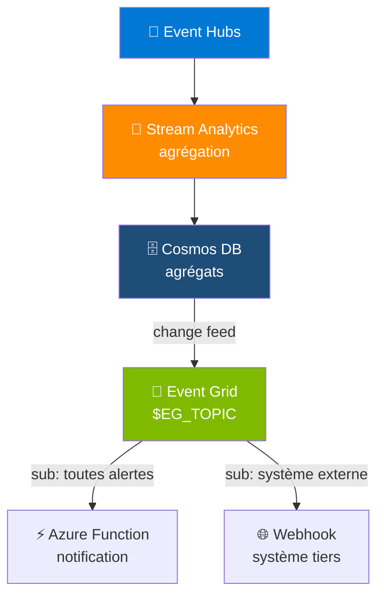
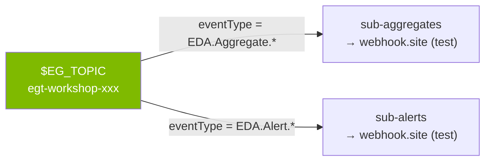

# Module 4 : Azure Event Grid — Routage Réactif depuis Cosmos DB

## 🎯 Objectifs

Dans ce module, vous allez :
- Comprendre le rôle d'Event Grid dans l'architecture de référence
- Maîtriser le modèle pub/sub serverless et ses différences avec Event Hubs
- Publier des événements vers le topic custom déployé en module 02
- Implémenter une Azure Function Java déclenchée par Event Grid
- Configurer des filtres et des abonnements multiples

---

## 📍 Positionnement dans l'Architecture

Dans l'architecture de référence (module 01), Event Grid joue le rôle de **couche réactive** : il reçoit les notifications du **change feed Cosmos DB** et les route vers les handlers concernés, sans que les consommateurs du stream Event Hubs n'aient à s'en préoccuper.



**Ce que fait Event Grid ici** :
- Cosmos DB déclenche un événement à chaque écriture (change feed)
- Le topic custom (`$EG_TOPIC`) reçoit cet événement
- Chaque abonnement filtre et route vers le handler approprié
- Les handlers sont **découplés** — ils ne savent pas d'où vient l'événement

---

## 🆚 Event Grid vs Event Hubs

| Critère | Event Grid | Event Hubs |
|---------|------------|------------|
| **Pattern** | Pub/Sub — push | Streaming — pull |
| **Usage** | Notifications d'événements discrets | Flux continus haute volumétrie |
| **Volumétrie** | Des milliers/sec | Des millions/sec |
| **Rétention** | 24 heures max | 1–90 jours |
| **Ordre** | ❌ Non garanti | ✅ Garanti par partition |
| **Retry** | Built-in 24h, backoff exponentiel | À la charge du consommateur |
| **Prix** | $0.60 / million d'opérations | Throughput Units (~$22/mois/TU) |
| **Modèle** | Push vers le handler | Handler pull sur sa partition |

> Dans l'architecture de référence, ils sont **complémentaires** : Event Hubs gère le stream brut, Event Grid gère les notifications en aval après agrégation.

---

## 📐 Format d'un Événement Event Grid

```json
{
  "id":          "a1b2c3d4-...",
  "eventType":   "EDA.Aggregate.Created",
  "subject":     "aggregates/OrderPlaced/order-001",
  "eventTime":   "2026-04-25T14:32:00Z",
  "dataVersion": "1.0",
  "data": {
    "type":       "OrderPlaced",
    "entityId":   "order-001",
    "eventCount": 12,
    "windowEnd":  "2026-04-25T14:32:00Z"
  }
}
```

| Champ | Rôle |
|-------|------|
| `eventType` | Clé de filtrage principale dans les abonnements |
| `subject` | Chemin hiérarchique — filtrage par préfixe ou suffixe |
| `data` | Payload libre — filtrage par propriété possible |
| `id` | Idempotence — Event Grid peut livrer deux fois |

---

## 🔑 Variables d'environnement

Ce module utilise le topic Event Grid déployé dans le **module 02**. Récupérez les variables :

```bash
# Topic custom créé dans le module 02 — EG_TOPIC est déjà défini si vous reprenez la session
export EG_TOPIC="egt-workshop-$SUFFIX"

export EG_ENDPOINT=$(az eventgrid topic show \
  --name $EG_TOPIC \
  --resource-group $RG \
  --query endpoint \
  --output tsv)

export EG_KEY=$(az eventgrid topic key list \
  --name $EG_TOPIC \
  --resource-group $RG \
  --query key1 \
  --output tsv)

echo "✅ EG_ENDPOINT : $EG_ENDPOINT"
echo "✅ EG_KEY      : ${EG_KEY:0:8}..."
```

---

## ① Abonnements et Filtres

Le topic existe déjà (module 02). On ajoute maintenant des abonnements **spécialisés** par type d'événement.

### Vue des abonnements cibles



### Abonnement vers la Function Azure

> 📌 Le branchement de l'abonnement Event Grid sur la Function `EventGridHandler` est réalisé dans le **module 06 — lab final**, une fois la Function déployée avec l'ensemble du pipeline.

### Créer un abonnement — Webhook (test)

```bash
# Endpoint de test — générez votre URL sur https://webhook.site
WEBHOOK_URL="https://webhook.site/votre-id-unique"

az eventgrid event-subscription create \
  --name "sub-aggregates" \
  --source-resource-id $(az eventgrid topic show \
    --name $EG_TOPIC \
    --resource-group $RG \
    --query id --output tsv) \
  --endpoint-type webhook \
  --endpoint $WEBHOOK_URL \
  --included-event-types "EDA.Aggregate.Created"

echo "✅ Abonnement créé : sub-aggregates → Webhook"
```

### Filtres avancés

```bash
# Filtrer par préfixe de subject
az eventgrid event-subscription create \
  --name "sub-alerts" \
  --source-resource-id $(az eventgrid topic show \
    --name $EG_TOPIC \
    --resource-group $RG \
    --query id --output tsv) \
  --endpoint-type webhook \
  --endpoint $WEBHOOK_URL \
  --subject-begins-with "aggregates/OrderPlaced/" \
  --included-event-types "EDA.Aggregate.Created"

echo "✅ Filtre subject : OrderPlaced uniquement"
```

---

## ② Publier vers le Topic depuis Java

### Dépendances Maven

```xml
<dependencies>
  <!-- SDK Event Grid -->
  <dependency>
    <groupId>com.azure</groupId>
    <artifactId>azure-messaging-eventgrid</artifactId>
    <version>4.21.0</version>
  </dependency>

  <!-- Jackson pour JSON -->
  <dependency>
    <groupId>com.fasterxml.jackson.core</groupId>
    <artifactId>jackson-databind</artifactId>
    <version>2.17.0</version>
  </dependency>
</dependencies>
```

### Publier un événement depuis le change feed Cosmos DB

Dans l'architecture, c'est la **Function connectée au change feed** qui publie dans Event Grid. Voici son implémentation :

```java
package com.example.eda;

import com.azure.core.credential.AzureKeyCredential;
import com.azure.core.util.BinaryData;
import com.azure.messaging.eventgrid.*;
import com.fasterxml.jackson.databind.ObjectMapper;

import java.time.OffsetDateTime;
import java.util.List;
import java.util.Map;
import java.util.UUID;

public class CosmosChangeFeedPublisher {

    private static final String EG_ENDPOINT = System.getenv("EG_ENDPOINT");
    private static final String EG_KEY      = System.getenv("EG_KEY");
    private static final ObjectMapper MAPPER = new ObjectMapper();

    private final EventGridPublisherClient<EventGridEvent> client;

    public CosmosChangeFeedPublisher() {
        this.client = new EventGridPublisherClientBuilder()
            .endpoint(EG_ENDPOINT)
            .credential(new AzureKeyCredential(EG_KEY))
            .buildEventGridEventPublisherClient();
    }

    /**
     * Appelé par la Function Cosmos DB change feed trigger.
     * aggregate = document écrit par Stream Analytics dans Cosmos DB.
     */
    public void publishAggregate(Map<String, Object> aggregate) throws Exception {

        String entityId  = (String) aggregate.get("entityId");
        String eventType = (String) aggregate.get("type");
        int count        = ((Number) aggregate.get("eventCount")).intValue();

        // Construire le payload Event Grid
        Map<String, Object> data = Map.of(
            "type",       eventType,
            "entityId",   entityId,
            "eventCount", count,
            "windowEnd",  aggregate.get("windowEnd")
        );

        EventGridEvent event = new EventGridEvent(
            "aggregates/" + eventType + "/" + entityId,  // subject
            "EDA.Aggregate.Created",                      // eventType
            BinaryData.fromObject(data),                  // data
            "1.0"                                         // dataVersion
        );
        event.setId(UUID.randomUUID().toString());
        event.setEventTime(OffsetDateTime.now());

        client.sendEvents(List.of(event));

        System.out.printf("📤 Publié → EventGrid : %s / %s (count=%d)%n",
            eventType, entityId, count);
    }

    /**
     * Publier une alerte (ex : PaymentFailed détecté dans le stream).
     */
    public void publishAlert(String alertType, String entityId, String reason) {

        Map<String, Object> data = Map.of(
            "alertType", alertType,
            "entityId",  entityId,
            "reason",    reason,
            "timestamp", OffsetDateTime.now().toString()
        );

        EventGridEvent event = new EventGridEvent(
            "alerts/" + alertType + "/" + entityId,
            "EDA.Alert." + alertType,
            BinaryData.fromObject(data),
            "1.0"
        );

        client.sendEvents(List.of(event));
        System.out.printf("🚨 Alerte publiée → EventGrid : %s / %s%n", alertType, entityId);
    }

    // ─── Test local ────────────────────────────────────────────────

    public static void main(String[] args) throws Exception {
        CosmosChangeFeedPublisher publisher = new CosmosChangeFeedPublisher();

        // Simuler un agrégat reçu depuis Cosmos DB
        publisher.publishAggregate(Map.of(
            "type",       "OrderPlaced",
            "entityId",   "order-001",
            "eventCount", 5,
            "windowEnd",  "2026-04-25T14:32:00Z"
        ));

        // Simuler une alerte
        publisher.publishAlert("PaymentFailed", "order-042", "Card declined");
    }
}
```

### Publier en batch (plusieurs agrégats)

```java
import com.azure.core.credential.AzureKeyCredential;
import com.azure.core.util.BinaryData;
import com.azure.messaging.eventgrid.*;

import java.util.ArrayList;
import java.util.List;
import java.util.Map;

public class BatchPublisher {

    private final EventGridPublisherClient<EventGridEvent> client;

    public BatchPublisher() {
        this.client = new EventGridPublisherClientBuilder()
            .endpoint(System.getenv("EG_ENDPOINT"))
            .credential(new AzureKeyCredential(System.getenv("EG_KEY")))
            .buildEventGridEventPublisherClient();
    }

    public void publishBatch(List<Map<String, Object>> aggregates) {
        List<EventGridEvent> events = new ArrayList<>();

        for (Map<String, Object> aggregate : aggregates) {
            String entityId  = (String) aggregate.get("entityId");
            String eventType = (String) aggregate.get("type");

            EventGridEvent event = new EventGridEvent(
                "aggregates/" + eventType + "/" + entityId,
                "EDA.Aggregate.Created",
                BinaryData.fromObject(aggregate),
                "1.0"
            );
            events.add(event);
        }

        // Event Grid accepte jusqu'à 1 MB par batch
        client.sendEvents(events);
        System.out.printf("📤 Batch publié : %d événements%n", events.size());
    }
}
```

---

## ③ Tester le Pipeline

### Publier un événement de test via CLI

> Les événements arrivent sur `webhook.site` — vérifiez dans l'interface que la livraison est effective.

```bash
az eventgrid event publish \
  --topic-name $EG_TOPIC \
  --resource-group $RG \
  --events '[{
    "id":          "test-001",
    "eventType":   "EDA.Aggregate.Created",
    "subject":     "aggregates/OrderPlaced/order-001",
    "eventTime":   "2026-04-25T14:32:00Z",
    "dataVersion": "1.0",
    "data": {
      "type":       "OrderPlaced",
      "entityId":   "order-001",
      "eventCount": 5,
      "windowEnd":  "2026-04-25T14:32:00Z"
    }
  }]'

echo "✅ Événement publié"
```

### Vérifier les livraisons

```bash
# Métriques du topic : événements publiés / livrés / échoués
az monitor metrics list \
  --resource $(az eventgrid topic show \
    --name $EG_TOPIC \
    --resource-group $RG \
    --query id --output tsv) \
  --metric "PublishSuccessCount,DeliverySuccessCount,DeliveryFailCount" \
  --interval PT5M \
  --output table
```


---

## ④ Retry et Dead-lettering

### Comportement de retry par défaut

```
Livraison échoue → Event Grid attend et réessaie :
  10s → 30s → 1min → 5min → 10min → 30min → 1h → ... → 24h

Après 24h sans succès → événement abandonné
```

### Configurer le dead-lettering

```bash
# Créer un container pour les événements morts
az storage container create \
  --name eg-dead-letters \
  --account-name $STORAGE_ACCOUNT

DL_STORAGE_ID=$(az storage account show \
  --name $STORAGE_ACCOUNT \
  --resource-group $RG \
  --query id --output tsv)

# Mettre à jour la subscription avec dead-letter
az eventgrid event-subscription update \
  --name "sub-all-aggregates" \
  --source-resource-id $(az eventgrid topic show \
    --name $EG_TOPIC \
    --resource-group $RG \
    --query id --output tsv) \
  --deadletter-endpoint "${DL_STORAGE_ID}/blobServices/default/containers/eg-dead-letters"

echo "✅ Dead-lettering configuré → $STORAGE_ACCOUNT/eg-dead-letters"
```

> Les événements en dead-letter sont des fichiers JSON dans le container. Inspectez-les pour diagnostiquer les échecs de livraison.

---

## ⑤ Monitoring

### Métriques clés à surveiller

| Métrique | Signal | Seuil d'alerte |
|----------|--------|----------------|
| `PublishSuccessCount` | Événements acceptés par le topic | Chute → problème producteur |
| `DeliverySuccessCount` | Événements livrés aux handlers | Doit suivre `PublishSuccessCount` |
| `DeliveryFailCount` | Livraisons échouées | > 0 → handler en erreur |
| `DeadLetteredCount` | Événements en dead-letter | > 0 → investigation requise |
| `MatchedEventCount` | Événements filtrés par abonnement | Vérifier les filtres |

### Requête KQL

```kql
// Taux de succès de livraison sur 1h
AzureMetrics
| where ResourceProvider == "MICROSOFT.EVENTGRID"
| where MetricName in ("PublishSuccessCount", "DeliverySuccessCount", "DeliveryFailCount")
| summarize Total = sum(Total) by MetricName, bin(TimeGenerated, 5m)
| render timechart

// Événements dead-letterés
AzureMetrics
| where MetricName == "DeadLetteredCount"
| where Total > 0
| order by TimeGenerated desc
```

---

## ⑥ Best Practices

| ✅ À faire | ❌ À éviter |
|------------|-------------|
| Rendre les handlers idempotents | Supposer qu'un événement n'arrive qu'une fois |
| Configurer le dead-lettering | Laisser les événements disparaître en silence |
| Filtrer par `eventType` précis | Abonnement "all events" sans filtres |
| Valider le `eventType` dans le handler | Se fier uniquement au format du payload |
| Utiliser `subject` comme chemin hiérarchique | Subject plat sans structure |
| Monitorer `DeliveryFailCount` | Ignorer les métriques de livraison |

---

## ➡️ Prochaine Étape

L'architecture est complète de bout en bout. Dans le module suivant, on passe au **lab final** : déploiement et validation du pipeline complet en situation réelle.

**[Module 5 : Lab Final — Pipeline Complet →](./06-hands-on-lab.md)**

---

[← Module précédent](./03-event-hubs-advanced.md) | [Retour au sommaire](./workshop.md)
