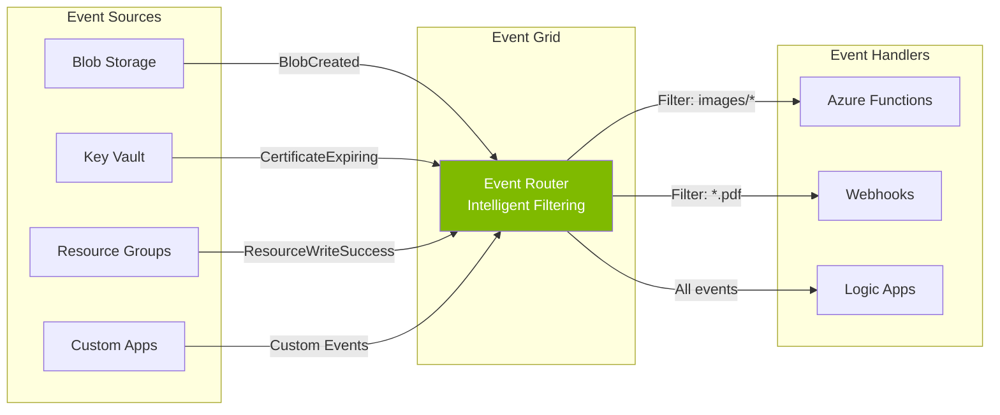

# Module 4 : Azure Event Grid - Serverless Event Routing

## 🎯 Objectifs

Dans ce module, vous allez :
- Comprendre le modèle pub/sub serverless d'Event Grid
- Comparer Event Grid vs Event Hubs (quand utiliser chaque service)
- Réagir aux événements Azure natifs (Blob Storage)
- Implémenter une Azure Function event-driven

> 📘 **Note** : Ce module est un complément léger (10% du workshop) à Event Hubs (70%). Event Grid est parfait pour des **notifications d'événements discrets**, pas pour du streaming haute volumétrie.

---

## 📚 Qu'est-ce qu'Event Grid ?

Azure Event Grid est un service de **routage d'événements serverless** basé sur le pattern **Publish-Subscribe** :



### Caractéristiques Clés

| Caractéristique | Détails |
|-----------------|---------|
| ⚡ **Pay-per-event** | $0.60 par million d'opérations |
| 🔌 **100+ sources natives** | Blob, Key Vault, IoT Hub, Resource Groups... |
| 🎯 **Filtrage intelligent** | Par type, subject, data properties |
| 📦 **Pas de provisioning** | Serverless, scale automatique |
| ⏱️ **Rétention** | 24 heures maximum |
| 🚀 **Latence** | < 1 seconde (P99) |
| 🔄 **Retry** | Built-in avec exponential backoff |

---

## 🆚 Event Grid vs Event Hubs : Choisir le Bon Service

| Critère | Event Grid | Event Hubs |
|---------|------------|------------|
| **Pattern** | Pub/Sub (Push) | Streaming (Pull) |
| **Use Case** | Notifications d'événements discrets | Streaming continu haute volumétrie |
| **Volumétrie** | Des milliers/sec | Des millions/sec |
| **Rétention** | 24 heures max | 1-90 jours |
| **Prix** | $0.60/million events | Throughput Units ($22/mois/TU) |
| **Latence** | < 1s | Quelques secondes |
| **Consumer** | Push (webhook, function) | Pull (consumer groups) |
| **Ordre** | ❌ Non garanti | ✅ Garanti par partition |
| **Exemple** | Blob créé, certificate expirant | Télémétrie IoT, logs applicatifs |

### Quand utiliser Event Grid ?

✅ **OUI** pour :
- Réagir à des événements Azure (Blob uploaded, VM created, Key Vault certificate expiring)
- Notifications légères (< 1000 events/sec)
- Intégration serverless simple
- Budget limité

❌ **NON** pour :
- Streaming continu haute volumétrie (utilisez Event Hubs)
- Ordre garanti requis (utilisez Event Hubs avec partition key)
- Analytics temps réel (utilisez Event Hubs + Stream Analytics)
- Rétention > 24h (utilisez Event Hubs)

---

## 🔄 Format d'un Événement Event Grid

Event Grid utilise le standard **CloudEvents** :

```json
{
  "specversion": "1.0",
  "type": "Microsoft.Storage.BlobCreated",
  "source": "/subscriptions/{sub}/resourceGroups/{rg}/providers/Microsoft.Storage/storageAccounts/mystorageaccount",
  "id": "831e1650-001e-001b-66ab-eeb76e069631",
  "time": "2024-01-15T10:30:00.0000000Z",
  "subject": "/blobServices/default/containers/uploads/blobs/photo.jpg",
  "data": {
    "api": "PutBlob",
    "clientRequestId": "6d79dbfb-0e37-4fc4-981f-442c9ca65760",
    "requestId": "831e1650-001e-001b-66ab-eeb76e000000",
    "contentType": "image/jpeg",
    "contentLength": 524288,
    "blobType": "BlockBlob",
    "url": "https://mystorageaccount.blob.core.windows.net/uploads/photo.jpg"
  }
}
```

---

## 🛠️ Lab Pratique : Traiter Automatiquement les Fichiers Uploadés

### Scénario

Votre application permet aux utilisateurs d'uploader des fichiers dans Blob Storage. Vous voulez **automatiquement** :
- Détecter quand un fichier est uploadé
- Valider le type de fichier (images uniquement)
- Logger les métadonnées
- (Optionnel) Générer des thumbnails

**Architecture :**

```
User uploads → Blob Storage → Event Grid → Azure Function
                                              ├─> Validate
                                              ├─> Log metadata
                                              └─> Process image
```

---

### Étape 1 : Créer l'Infrastructure (10 min)

```bash
#!/bin/bash

# Configuration
RESOURCE_GROUP="rg-eventgrid-workshop"
LOCATION="francecentral"
PROJECT_NAME="eventgrid$(openssl rand -hex 3)"

echo "🚀 Création de l'infrastructure Event Grid"

# Resource group
az group create --name $RESOURCE_GROUP --location $LOCATION

# 1. Storage Account
STORAGE_ACCOUNT="${PROJECT_NAME}storage"
az storage account create \
  --name $STORAGE_ACCOUNT \
  --resource-group $RESOURCE_GROUP \
  --location $LOCATION \
  --sku Standard_LRS \
  --kind StorageV2

# Créer un container pour les uploads
az storage container create \
  --name uploads \
  --account-name $STORAGE_ACCOUNT \
  --public-access off

# 2. Function App
FUNCTION_APP="${PROJECT_NAME}-functions"
az functionapp create \
  --name $FUNCTION_APP \
  --resource-group $RESOURCE_GROUP \
  --storage-account $STORAGE_ACCOUNT \
  --consumption-plan-location $LOCATION \
  --runtime java \
  --runtime-version 17 \
  --functions-version 4

echo "✅ Infrastructure créée"
echo "   Storage Account: $STORAGE_ACCOUNT"
echo "   Function App: $FUNCTION_APP"

# Sauvegarder les variables
cat > .env << EOF
RESOURCE_GROUP=$RESOURCE_GROUP
STORAGE_ACCOUNT=$STORAGE_ACCOUNT
FUNCTION_APP=$FUNCTION_APP
EOF
```

---

### Étape 2 : Créer l'Azure Function en Java (5 min)

```bash
# Créer le projet Functions Java localement
mvn archetype:generate \
  -DarchetypeGroupId=com.microsoft.azure \
  -DarchetypeArtifactId=azure-functions-archetype \
  -DgroupId=com.example.eventgrid \
  -DartifactId=blob-eventgrid-handler \
  -DarchetypeVersion=1.51 \
  -DinteractiveMode=false

cd blob-eventgrid-handler
```

**Fichier : `pom.xml` - Ajouter les dépendances :**

```xml
<dependencies>
    <!-- Azure Functions Java -->
    <dependency>
        <groupId>com.microsoft.azure.functions</groupId>
        <artifactId>azure-functions-java-library</artifactId>
        <version>3.0.0</version>
    </dependency>
    
    <!-- JSON -->
    <dependency>
        <groupId>com.google.code.gson</groupId>
        <artifactId>gson</artifactId>
        <version>2.10.1</version>
    </dependency>
</dependencies>
```

**Fichier : `src/main/java/com/example/eventgrid/BlobUploadHandler.java`**

```java
package com.example.eventgrid;

import com.microsoft.azure.functions.*;
import com.microsoft.azure.functions.annotation.*;
import com.google.gson.Gson;
import com.google.gson.JsonObject;
import java.util.Arrays;
import java.util.logging.Logger;

public class BlobUploadHandler {
    
    private static final Gson gson = new Gson();
    private static final long MAX_SIZE_BYTES = 10 * 1024 * 1024; // 10 MB
    private static final String[] VALID_IMAGE_TYPES = {
        "image/jpeg", "image/png", "image/gif", "image/webp"
    };
    
    @FunctionName("BlobUploadHandler")
    public void run(
        @EventGridTrigger(name = "event") String eventGridEvent,
        final ExecutionContext context
    ) {
        Logger logger = context.getLogger();
        
        logger.info("📨 Event Grid notification reçue");
        
        // Parser l'événement Event Grid
        JsonObject event = gson.fromJson(eventGridEvent, JsonObject.class);
        
        String eventType = event.get("eventType").getAsString();
        String subject = event.get("subject").getAsString();
        JsonObject data = event.getAsJsonObject("data");
        
        logger.info("   Type: " + eventType);
        logger.info("   Subject: " + subject);
        
        if (data == null) {
            logger.warning("⚠️  Données invalides");
            return;
        }
        
        // Extraire les informations du blob
        String url = data.get("url").getAsString();
        String contentType = data.has("contentType") 
            ? data.get("contentType").getAsString() 
            : "";
        long contentLength = data.get("contentLength").getAsLong();
        
        logger.info("📁 Fichier détecté: " + url);
        logger.info("   Content-Type: " + contentType);
        logger.info(String.format("   Taille: %,d bytes", contentLength));
        
        // Validation : seulement les images
        if (!isValidImageType(contentType)) {
            logger.warning("❌ Type non supporté: " + contentType);
            return;
        }
        
        // Validation : taille max 10MB
        if (contentLength > MAX_SIZE_BYTES) {
            logger.warning(String.format(
                "❌ Fichier trop volumineux: %,d bytes (max %,d)", 
                contentLength, MAX_SIZE_BYTES
            ));
            return;
        }
        
        logger.info("✅ Fichier valide, traitement...");
        
        // TODO: Implémenter le traitement réel
        // - Télécharger le blob avec BlobClient
        // - Générer un thumbnail avec ImageIO
        // - Extraire les métadonnées EXIF avec metadata-extractor
        // - Sauvegarder les résultats dans Cosmos DB
        
        try {
            Thread.sleep(500); // Simuler le traitement
        } catch (InterruptedException e) {
            Thread.currentThread().interrupt();
        }
        
        logger.info("🎉 Traitement terminé avec succès");
    }
    
    private boolean isValidImageType(String contentType) {
        if (contentType == null || contentType.isEmpty()) {
            return false;
        }
        
        return Arrays.stream(VALID_IMAGE_TYPES)
            .anyMatch(type -> type.equalsIgnoreCase(contentType));
    }
}
```

---

### Étape 3 : Déployer la Function (2 min)

```bash
# Charger les variables
source .env

# Compiler et packager le projet Maven
mvn clean package

# Déployer avec Maven Azure Functions plugin
mvn azure-functions:deploy -DappName=$FUNCTION_APP -DresourceGroup=$RESOURCE_GROUP

echo "✅ Function déployée"
```

> 💡 **Alternative** : Ajoutez la configuration dans `pom.xml` :
> ```xml
> <plugin>
>     <groupId>com.microsoft.azure</groupId>
>     <artifactId>azure-functions-maven-plugin</artifactId>
>     <version>1.29.0</version>
>     <configuration>
>         <appName>${functionAppName}</appName>
>         <resourceGroup>${resourceGroup}</resourceGroup>
>         <region>${LOCATION}</region>
>     </configuration>
> </plugin>
> ```

---

### Étape 4 : Créer l'Event Subscription (3 min)

Lier le Storage Account à la Function via Event Grid :

```bash
# Obtenir les IDs
STORAGE_ID=$(az storage account show \
  --name $STORAGE_ACCOUNT \
  --resource-group $RESOURCE_GROUP \
  --query id -o tsv)

FUNCTION_ID=$(az functionapp function show \
  --name $FUNCTION_APP \
  --resource-group $RESOURCE_GROUP \
  --function-name BlobUploadHandler \
  --query id -o tsv)

# Créer la subscription Event Grid
az eventgrid event-subscription create \
  --name sub-blob-uploads \
  --source-resource-id $STORAGE_ID \
  --endpoint-type azurefunction \
  --endpoint $FUNCTION_ID \
  --included-event-types Microsoft.Storage.BlobCreated \
  --subject-begins-with /blobServices/default/containers/uploads/

echo "✅ Event subscription créée"
echo "   Source: Blob Storage ($STORAGE_ACCOUNT)"
echo "   Handler: Azure Function (BlobUploadHandler)"
echo "   Filter: Container 'uploads' seulement"
```

---

### Étape 5 : Tester (5 min)

#### 1. Uploader une image valide

```bash
# Créer une image de test
echo "Test image content" > test-image.jpg

az storage blob upload \
  --account-name $STORAGE_ACCOUNT \
  --container-name uploads \
  --name test-image.jpg \
  --file test-image.jpg \
  --content-type "image/jpeg" \
  --overwrite

echo "✅ Image uploadée"
```

#### 2. Uploader un fichier non-image (devrait être rejeté)

```bash
echo "Not an image" > test.txt

az storage blob upload \
  --account-name $STORAGE_ACCOUNT \
  --container-name uploads \
  --name test.txt \
  --file test.txt \
  --content-type "text/plain" \
  --overwrite

echo "✅ Fichier texte uploadé"
```

#### 3. Vérifier les logs de la Function

```bash
# Ouvrir les logs en temps réel
func azure functionapp logstream $FUNCTION_APP --browser

# Ou dans le portail Azure :
# Function App → Functions → BlobUploadHandler → Monitor → Logs
```

**Logs attendus :**

```
📨 Event Grid notification reçue
   Type: Microsoft.Storage.BlobCreated
   Subject: /blobServices/default/containers/uploads/blobs/test-image.jpg
📁 Fichier détecté: https://....blob.core.windows.net/uploads/test-image.jpg
   Content-Type: image/jpeg
   Taille: 19 bytes
✅ Fichier valide, traitement...
🎉 Traitement terminé avec succès

📨 Event Grid notification reçue
   Type: Microsoft.Storage.BlobCreated
   Subject: /blobServices/default/containers/uploads/blobs/test.txt
📁 Fichier détecté: https://....blob.core.windows.net/uploads/test.txt
   Content-Type: text/plain
   Taille: 14 bytes
❌ Type non supporté: text/plain
```

---

## ✅ Quiz

### Question 1
**Quelle est la différence principale entre Event Grid et Event Hubs ?**

<details>
<summary>Réponse</summary>

**Event Grid** = Pub/Sub pour **événements discrets** (push)
- Notifications légères (blob créé, certificate expirant)
- 24h rétention max
- Pay-per-event

**Event Hubs** = Streaming pour **flux continus** (pull)
- Télémétrie haute volumétrie (millions events/sec)
- 1-90 jours rétention
- Ordre garanti par partition
</details>

### Question 2
**Comment Event Grid garantit-il la livraison d'un événement ?**

<details>
<summary>Réponse</summary>

Event Grid utilise un **retry policy** avec exponential backoff :
- Réessaie pendant **24 heures** maximum
- Intervalles : 10s, 30s, 1min, 5min, 10min, 30min, 1h...
- Après 24h, l'événement est abandonné (ou envoyé en dead letter si configuré)
</details>

### Question 3
**Peut-on utiliser Event Grid pour un pipeline IoT à 10,000 events/sec ?**

<details>
<summary>Réponse</summary>

**Non**, utilisez **Event Hubs** pour ce use case :
- Event Grid supporte des milliers/sec, pas des dizaines de milliers
- Pas d'ordre garanti dans Event Grid
- Rétention 24h max (vs 90 jours Event Hubs)
- Event Grid est fait pour des notifications, pas du streaming continu
</details>

---

## 🎯 Points Clés

| Concept | Explication |
|---------|-------------|
| **Serverless** | Pas de provisioning, pay-per-event ($0.60/million) |
| **Push model** | Event Grid pousse vers les handlers (vs pull Event Hubs) |
| **Filtrage** | Par type, subject, data properties |
| **Retry** | Built-in pendant 24h avec exponential backoff |
| **Use Case** | Notifications d'événements discrets, pas streaming |
| **Complémentarité** | Event Grid ≠ concurrent à Event Hubs, mais complémentaire |

---

## 📚 Ressources

- 📖 **[Event-Driven Architecture Style - Microsoft Learn](https://learn.microsoft.com/en-us/azure/architecture/guide/architecture-styles/event-driven)** ⭐ Guide complet
- [Azure Event Grid Documentation](https://docs.microsoft.com/azure/event-grid/)
- [Event Grid vs Event Hubs vs Service Bus](https://docs.microsoft.com/azure/event-grid/compare-messaging-services)
- [CloudEvents Specification](https://cloudevents.io/)

---

## 🧹 Nettoyage

```bash
# Supprimer toutes les ressources
az group delete --name $RESOURCE_GROUP --yes --no-wait

echo "✅ Ressources supprimées"
```

---

## ➡️ Prochaine Étape

Maintenant que vous comprenez Event Grid pour des notifications légères, passons aux **patterns architecturaux streaming** !

**[Module 5 : Patterns de Streaming et Architecture Event-Driven →](./05-streaming-patterns.md)**

---

[← Module précédent](./03-event-hubs-advanced.md) | [Retour au sommaire](./workshop.md) | [Module suivant →](./05-streaming-patterns.md)
