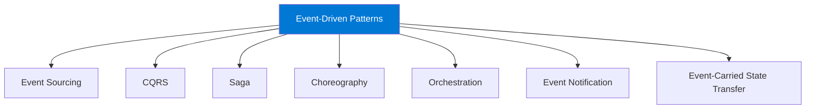
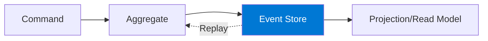
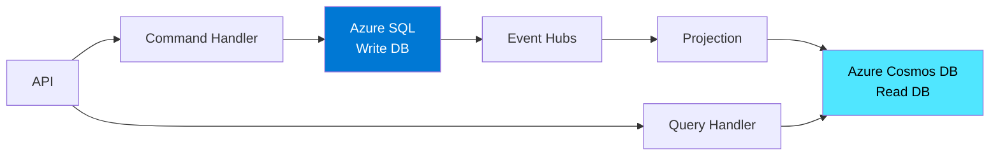
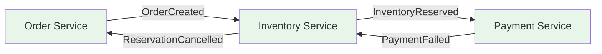
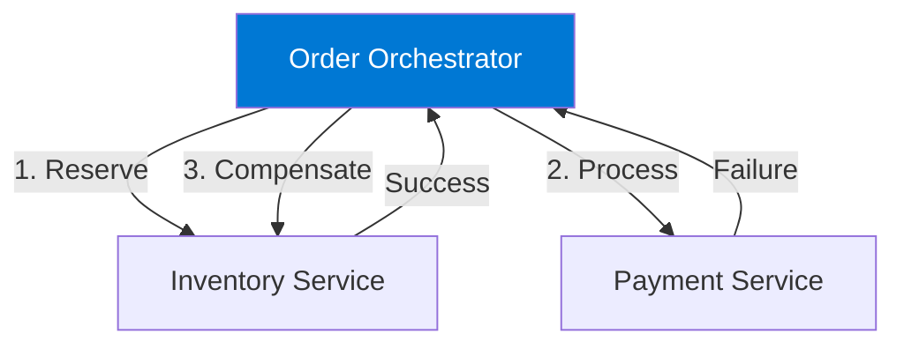

# Module 5 : Patterns d'Architecture Event-Driven

**Durée estimée : 30 minutes**

## 🎯 Objectifs

Dans ce module, vous allez :
- Découvrir les patterns architecturaux event-driven classiques
- Comprendre Event Sourcing et CQRS
- Apprendre les patterns Saga, Choreography et Orchestration
- Savoir quand utiliser chaque pattern

## 🏗️ Patterns Architecturaux

### Vue d'ensemble



---

## 📝 Pattern 1 : Event Sourcing

### Concept

Au lieu de stocker l'**état actuel**, on stocke la **séquence complète d'événements** qui ont mené à cet état.

### Exemple : Compte Bancaire

#### Approche Traditionnelle (CRUD)

```
Table: BankAccount
+------------+-------------+
| AccountId  | Balance     |
+------------+-------------+
| ACC-001    | 1500.00     |
+------------+-------------+
```

❌ **Problème** : On ne sait pas comment on est arrivé à 1500€

#### Approche Event Sourcing

```
Table: BankAccountEvents
+------------+------------------+----------+------------+
| AccountId  | EventType        | Amount   | Timestamp  |
+------------+------------------+----------+------------+
| ACC-001    | AccountOpened    | 1000.00  | 2024-01-01 |
| ACC-001    | MoneyDeposited   | 500.00   | 2024-01-05 |
| ACC-001    | MoneyWithdrawn   | 200.00   | 2024-01-10 |
| ACC-001    | MoneyDeposited   | 200.00   | 2024-01-15 |
+------------+------------------+----------+------------+

Balance actuel = 1000 + 500 - 200 + 200 = 1500€
```

✅ **Avantages** :
- Historique complet et auditabilité
- Possibilité de reconstruire l'état à n'importe quel moment
- Debugging facilité
- Time travel (replay)

### Architecture



### Implémentation Simplifiée (.NET)

```csharp
// Événements
public record AccountOpened(string AccountId, decimal InitialDeposit, DateTime Timestamp);
public record MoneyDeposited(string AccountId, decimal Amount, DateTime Timestamp);
public record MoneyWithdrawn(string AccountId, decimal Amount, DateTime Timestamp);

// Aggregate
public class BankAccount
{
    public string AccountId { get; private set; }
    public decimal Balance { get; private set; }
    private List<object> _uncommittedEvents = new();

    // Appliquer un événement
    public void Apply(AccountOpened e)
    {
        AccountId = e.AccountId;
        Balance = e.InitialDeposit;
    }

    public void Apply(MoneyDeposited e)
    {
        Balance += e.Amount;
    }

    public void Apply(MoneyWithdrawn e)
    {
        if (Balance < e.Amount)
            throw new InvalidOperationException("Insufficient funds");
        Balance -= e.Amount;
    }

    // Commandes
    public void Open(string accountId, decimal initialDeposit)
    {
        var evt = new AccountOpened(accountId, initialDeposit, DateTime.UtcNow);
        ApplyAndRecord(evt);
    }

    public void Deposit(decimal amount)
    {
        var evt = new MoneyDeposited(AccountId, amount, DateTime.UtcNow);
        ApplyAndRecord(evt);
    }

    public void Withdraw(decimal amount)
    {
        var evt = new MoneyWithdrawn(AccountId, amount, DateTime.UtcNow);
        ApplyAndRecord(evt);
    }

    private void ApplyAndRecord(object evt)
    {
        ((dynamic)this).Apply((dynamic)evt);
        _uncommittedEvents.Add(evt);
    }

    // Reconstruire depuis les événements
    public static BankAccount LoadFromHistory(IEnumerable<object> history)
    {
        var account = new BankAccount();
        foreach (var evt in history)
        {
            ((dynamic)account).Apply((dynamic)evt);
        }
        return account;
    }
}
```

### Services Azure pour Event Sourcing

- **Azure Event Hubs** : Stream d'événements
- **Azure Cosmos DB** : Event Store avec change feed
- **Azure Table Storage** : Event Store simple et économique

### Quand utiliser Event Sourcing ?

✅ **Utilisez quand :**
- Audit complet requis (finance, santé)
- Besoin de replay/reconstruction
- Analyses historiques importantes
- Debugging complexe nécessaire

❌ **Évitez quand :**
- Application CRUD simple
- Pas besoin d'historique
- Équipe non familière avec le concept

---

## 🔄 Pattern 2 : CQRS (Command Query Responsibility Segregation)

### Concept

Séparer les **opérations de lecture** (Query) et les **opérations d'écriture** (Command).

### Architecture Traditionnelle

```
Application ──> Same Model ──> Same Database
      │                              │
   Reads & Writes            Complex queries + Updates
```

### Architecture CQRS

```
Application ──┬──[Commands]──> Write Model ──> Write DB (normalized)
              │                     │
              │                  [Events]
              │                     │
              │                     ↓
              └──[Queries]──> Read Model ──> Read DB (denormalized)
```

### Avantages

✅ **Optimisation indépendante**
- Write DB : Optimisé pour transactions (SQL)
- Read DB : Optimisé pour queries (NoSQL, caches)

✅ **Scalabilité**
- Scaler les reads indépendamment des writes
- Read replicas multiples

✅ **Modèles différents**
- Write : Domaine complexe avec business rules
- Read : Modèles plats pour l'UI

### Implémentation avec Azure



### Exemple : E-Commerce

#### Command Side (Écriture)

```csharp
// Command
public record CreateOrderCommand(string CustomerId, List<OrderItem> Items);

// Command Handler
public class CreateOrderHandler
{
    private readonly SqlDbContext _dbContext;
    private readonly IEventPublisher _eventPublisher;

    public async Task<string> Handle(CreateOrderCommand command)
    {
        // Validation et business logic
        var order = new Order
        {
            OrderId = Guid.NewGuid().ToString(),
            CustomerId = command.CustomerId,
            Items = command.Items,
            Status = OrderStatus.Pending,
            CreatedAt = DateTime.UtcNow
        };

        // Sauvegarder dans write DB
        _dbContext.Orders.Add(order);
        await _dbContext.SaveChangesAsync();

        // Publier événement
        await _eventPublisher.PublishAsync(new OrderCreatedEvent
        {
            OrderId = order.OrderId,
            CustomerId = order.CustomerId,
            TotalAmount = order.Items.Sum(i => i.Price * i.Quantity),
            CreatedAt = order.CreatedAt
        });

        return order.OrderId;
    }
}
```

#### Query Side (Lecture)

```csharp
// Query
public record GetCustomerOrdersQuery(string CustomerId);

// Read Model (dénormalisé, optimisé pour l'UI)
public class CustomerOrdersReadModel
{
    public string CustomerId { get; set; }
    public string CustomerName { get; set; }
    public List<OrderSummary> RecentOrders { get; set; }
    public decimal TotalSpent { get; set; }
    public int TotalOrders { get; set; }
}

// Query Handler
public class GetCustomerOrdersHandler
{
    private readonly ICosmosDbRepository _cosmosDb;

    public async Task<CustomerOrdersReadModel> Handle(GetCustomerOrdersQuery query)
    {
        // Lecture simple depuis le read model dénormalisé
        return await _cosmosDb.GetAsync<CustomerOrdersReadModel>(query.CustomerId);
    }
}

// Projection (met à jour le read model quand un événement arrive)
public class OrderCreatedProjection
{
    private readonly ICosmosDbRepository _cosmosDb;

    public async Task Handle(OrderCreatedEvent evt)
    {
        var readModel = await _cosmosDb.GetAsync<CustomerOrdersReadModel>(evt.CustomerId)
                        ?? new CustomerOrdersReadModel { CustomerId = evt.CustomerId };

        // Mettre à jour le read model
        readModel.RecentOrders.Add(new OrderSummary
        {
            OrderId = evt.OrderId,
            TotalAmount = evt.TotalAmount,
            CreatedAt = evt.CreatedAt
        });
        readModel.TotalOrders++;
        readModel.TotalSpent += evt.TotalAmount;

        await _cosmosDb.UpsertAsync(readModel);
    }
}
```

### Eventual Consistency

⚠️ **Important** : Le read model n'est pas instantanément à jour (eventual consistency).

```
User creates order → Write DB (immediate) → Event published
                                                ↓
                              [delay: 100ms - 1s]
                                                ↓
User queries orders ← Read DB (may not have new order yet)
```

**Solutions :**
- UI affiche "Votre commande est en cours de traitement"
- Return-and-display pattern (retourner l'objet créé directement)
- Cache invalidation

---

## 🔗 Pattern 3 : Saga Pattern

### Concept

Gérer des **transactions distribuées** à travers plusieurs microservices sans transaction ACID globale.

### Problème

```
E-commerce Order Process:
1. Réserver inventaire
2. Traiter paiement
3. Créer shipment
4. Envoyer notification

❌ Si le paiement échoue après la réservation, comment rollback ?
```

### Solution : Saga

Séquence d'étapes avec des **compensating transactions** en cas d'échec.

```
Reserve Inventory → Process Payment → Create Shipment
      ↓ (failure)         ↓ (failure)       ↓
Cancel Reservation   Refund Payment    Cancel Shipment
```

### Deux Approches

#### A. Choreography (Décentralisé)

Chaque service écoute les événements et décide quoi faire.



**Avantages :**
- Pas de point unique de défaillance
- Services découplés

**Inconvénients :**
- Logique distribuée, difficile à comprendre
- Pas de vue globale du workflow

#### B. Orchestration (Centralisé)

Un **orchestrateur** coordonne toutes les étapes.



**Avantages :**
- Vue centralisée du workflow
- Facile à comprendre et debugger

**Inconvénients :**
- Point unique de défaillance
- Couplage avec l'orchestrateur

### Implémentation avec Azure Durable Functions

```csharp
[FunctionName("OrderSagaOrchestrator")]
public static async Task<string> RunOrchestrator(
    [OrchestrationTrigger] IDurableOrchestrationContext context)
{
    var order = context.GetInput<Order>();

    try
    {
        // Étape 1 : Réserver l'inventaire
        var inventoryReserved = await context.CallActivityAsync<bool>(
            "ReserveInventory", order.Items);

        if (!inventoryReserved)
            return "Failed: Inventory unavailable";

        // Étape 2 : Traiter le paiement
        var paymentProcessed = await context.CallActivityAsync<bool>(
            "ProcessPayment", order.PaymentDetails);

        if (!paymentProcessed)
        {
            // Compensation : Annuler la réservation
            await context.CallActivityAsync("CancelInventoryReservation", order.Items);
            return "Failed: Payment declined";
        }

        // Étape 3 : Créer l'expédition
        var shipmentCreated = await context.CallActivityAsync<bool>(
            "CreateShipment", order);

        if (!shipmentCreated)
        {
            // Compensation : Rembourser et annuler réservation
            await context.CallActivityAsync("RefundPayment", order.PaymentDetails);
            await context.CallActivityAsync("CancelInventoryReservation", order.Items);
            return "Failed: Shipment creation failed";
        }

        // Étape 4 : Notification
        await context.CallActivityAsync("SendOrderConfirmation", order);

        return "Success: Order completed";
    }
    catch (Exception ex)
    {
        // Compensation globale
        await CompensateAll(context, order);
        return $"Failed: {ex.Message}";
    }
}
```

---

## 🎭 Pattern 4 : Choreography vs Orchestration

### Choreography (Chorégraphie)

**Analogie** : Danseurs qui réagissent les uns aux autres sans chef d'orchestre.

```
Service A publishes event → Service B reacts → Service C reacts
```

**Quand l'utiliser :**
- ✅ Workflow simple avec peu d'étapes
- ✅ Services très découplés souhaités
- ✅ Pas de logique conditionnelle complexe

**Exemple :**
```
NewUserRegistered → SendWelcomeEmail
                  → CreateUserProfile
                  → AddToAnalytics
```

### Orchestration

**Analogie** : Chef d'orchestre qui coordonne tous les musiciens.

```
Orchestrator → calls Service A → calls Service B → calls Service C
```

**Quand l'utiliser :**
- ✅ Workflow complexe avec conditions
- ✅ Besoin de vue globale
- ✅ Long-running processes
- ✅ Compensation nécessaire

**Exemple : Onboarding Client**
```
1. Créer compte
2. SI entreprise → Validation KYC
3. SI KYC OK → Activer services premium
4. Envoyer welcome pack
5. Programmer follow-up dans 7 jours
```

---

## 📬 Pattern 5 : Event Notification vs Event-Carried State Transfer

### Event Notification (Léger)

Événement contient juste une **référence** :

```json
{
  "eventType": "OrderCreated",
  "orderId": "ORD-12345",
  "timestamp": "2024-01-15T10:00:00Z"
}
```

**Consommateur doit appeler l'API** pour obtenir les détails :
```
Receive event → GET /api/orders/ORD-12345 → Process
```

✅ **Avantages :**
- Événements légers
- Données toujours à jour

❌ **Inconvénients :**
- Couplage (consommateur dépend de l'API)
- Latence additionnelle

### Event-Carried State Transfer (Complet)

Événement contient **toutes les données** :

```json
{
  "eventType": "OrderCreated",
  "orderId": "ORD-12345",
  "customerId": "CUST-789",
  "customerEmail": "customer@example.com",
  "items": [
    { "productId": "PROD-001", "quantity": 2, "price": 99.99 }
  ],
  "totalAmount": 199.98,
  "shippingAddress": { ... },
  "timestamp": "2024-01-15T10:00:00Z"
}
```

**Consommateur a tout** :
```
Receive event → Process directly (no API call)
```

✅ **Avantages :**
- Découplage complet
- Pas d'appel API supplémentaire
- Performance

❌ **Inconvénients :**
- Événements volumineux
- Duplication de données
- Données potentiellement obsolètes

### Choix

| Critère | Event Notification | Event-Carried State |
|---------|-------------------|---------------------|
| Taille événement | Petit | Grand |
| Couplage | Fort | Faible |
| Performance | Moyenne | Élevée |
| Données à jour | ✅ Toujours | ⚠️ Snapshot |

---

## 🎯 Tableau Récapitulatif des Patterns

| Pattern | Usage Principal | Complexité | Azure Services |
|---------|----------------|------------|----------------|
| **Event Sourcing** | Audit, historique complet | ⭐⭐⭐⭐ | Event Hubs, Cosmos DB |
| **CQRS** | Optimisation read/write | ⭐⭐⭐ | SQL + Cosmos DB |
| **Saga** | Transactions distribuées | ⭐⭐⭐⭐ | Durable Functions |
| **Choreography** | Workflows simples | ⭐⭐ | Event Grid, Service Bus |
| **Orchestration** | Workflows complexes | ⭐⭐⭐ | Durable Functions, Logic Apps |

---

## ✅ Quiz

1. **Quelle est la différence entre Event Sourcing et CQRS ?**
   <details>
   <summary>Réponse</summary>
   Event Sourcing stocke les événements comme source de vérité. CQRS sépare les modèles read/write. Souvent utilisés ensemble mais indépendants.
   </details>

2. **Quand choisir Choreography vs Orchestration ?**
   <details>
   <summary>Réponse</summary>
   Choreography pour workflows simples et découplage max. Orchestration pour workflows complexes avec logique conditionnelle.
   </details>

3. **Comment gérer l'eventual consistency en CQRS ?**
   <details>
   <summary>Réponse</summary>
   Informer l'utilisateur du délai, return-and-display pattern, ou accepter un léger délai dans l'UI.
   </details>

## 📚 Ressources

- [Microsoft - Event Sourcing Pattern](https://docs.microsoft.com/azure/architecture/patterns/event-sourcing)
- [Microsoft - CQRS Pattern](https://docs.microsoft.com/azure/architecture/patterns/cqrs)
- [Microsoft - Saga Pattern](https://docs.microsoft.com/azure/architecture/reference-architectures/saga/saga)
- [Martin Fowler - Event Sourcing](https://martinfowler.com/eaaDev/EventSourcing.html)

## ➡️ Prochaine Étape

Il est temps de mettre tout cela en pratique avec un lab final complet !

**[Module 6 : Lab Final - Application E-Commerce →](./06-hands-on-lab.md)**

---

[← Module précédent](./04-event-grid.md) | [Retour au sommaire](./workshop.md)
