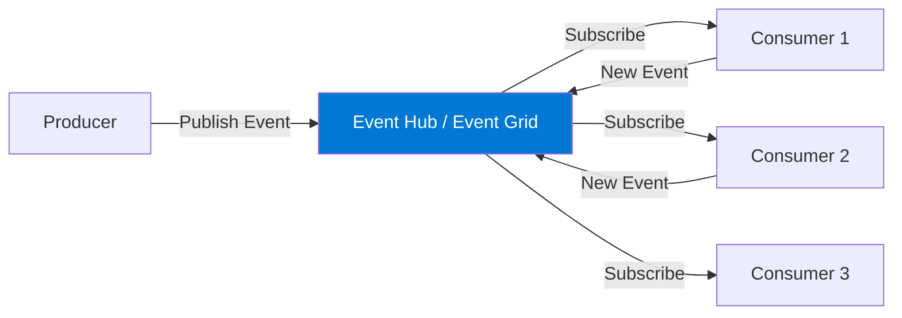
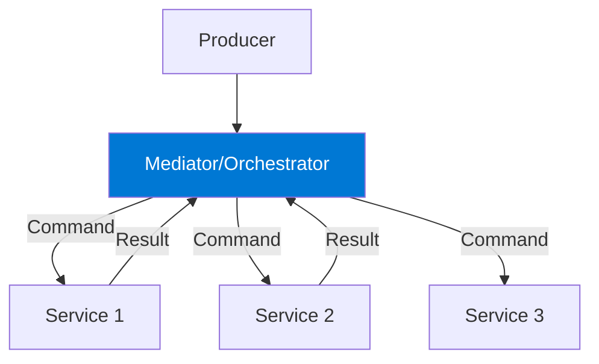
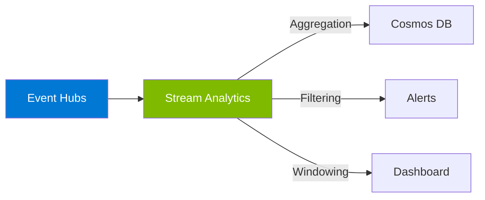
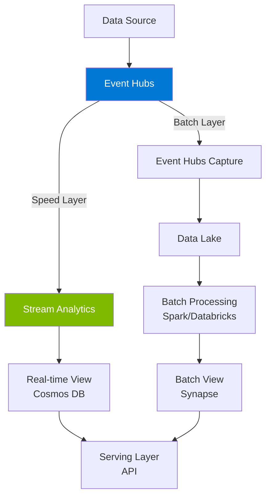

# Module 5 : Patterns de Streaming et Architecture Event-Driven

## 🎯 Objectifs

Dans ce module, vous allez :
- Comprendre les topologies event-driven (Broker vs Mediator)
- Explorer les patterns de traitement (Simple, Complex, Stream Processing)
- Maîtriser Event Sourcing appliqué au streaming
- Découvrir la Lambda Architecture
- Apprendre les best practices de production

> 📚 **Lecture recommandée** : Ce module s'inspire du [guide officiel Microsoft sur l'architecture event-driven](https://learn.microsoft.com/en-us/azure/architecture/guide/architecture-styles/event-driven)

## 🏗️ Topologies Event-Driven

### 1. Broker Topology (Chorégraphie)

**Analogie** : Danseurs qui réagissent les uns aux autres sans chef d'orchestre.



**Caractéristiques :**
- ✅ **Découplage maximal** - Les composants ne se connaissent pas
- ✅ **Scalabilité** - Ajout facile de nouveaux consumers
- ✅ **Dynamique** - Pas de coordination centrale
- ❌ **Complexité** - Difficile de tracer le flux complet
- ❌ **Pas de transaction distribuée** - Risque d'incohérence

**Quand l'utiliser :**
- Flux d'événements simples
- Découplage fort requis
- Pas de logique conditionnelle complexe

**Exemple avec Event Hubs :**
```
[IoT Devices] → [Event Hubs] → ├─→ [Alert Service] (détecte anomalie)
                                ├─→ [Storage Service] (archive)
                                └─→ [Analytics Service] (agrège)

Chaque consumer agit indépendamment.
```

### 2. Mediator Topology (Orchestration)

**Analogie** : Chef d'orchestre qui coordonne tous les musiciens.



**Caractéristiques :**
- ✅ **Vue centralisée** - Facile à comprendre et debugger
- ✅ **Transactions distribuées** - Gestion des compensations
- ✅ **Logique conditionnelle** - Workflows complexes
- ❌ **Couplage** - Dépendance au médiateur
- ❌ **Point de défaillance** - Le médiateur doit être résilient

**Quand l'utiliser :**
- Workflows complexes avec conditions
- Transactions distribuées (Saga pattern)
- Besoin de visibilité globale

**Exemple avec Azure Durable Functions :**
```csharp
[FunctionName("IoTDataProcessingOrchestrator")]
public static async Task RunOrchestrator(
    [OrchestrationTrigger] IDurableOrchestrationContext context)
{
    var telemetryData = context.GetInput<TelemetryData>();

    // Étape 1 : Valider les données
    var isValid = await context.CallActivityAsync<bool>(
        "ValidateTelemetry", telemetryData);

    if (!isValid)
    {
        await context.CallActivityAsync("SendAlert", "Invalid data");
        return;
    }

    // Étape 2 : Enrichir avec météo
    var enrichedData = await context.CallActivityAsync<EnrichedTelemetry>(
        "EnrichWithWeather", telemetryData);

    // Étape 3 : Sauvegarder
    await context.CallActivityAsync("SaveToCosmosDB", enrichedData);

    // Étape 4 : Analytics
    await context.CallActivityAsync("UpdateAnalytics", enrichedData);
}
```

## 📊 Patterns de Traitement d'Événements

### 1. Simple Event Processing

**Principe** : Un événement → Une action immédiate

```
Event → Function → Action (send email, update DB, etc.)
```

**Exemple avec Event Grid + Azure Functions :**
```csharp
[FunctionName("BlobUploadHandler")]
public static void Run(
    [EventGridTrigger] EventGridEvent eventGridEvent,
    ILogger log)
{
    var blobUrl = eventGridEvent.Data["url"].ToString();
    log.LogInformation($"New blob: {blobUrl}");
    
    // Action immédiate
    SendNotification($"New file uploaded: {blobUrl}");
}
```

**Use Case :** Notifications, webhooks, actions simples

---

### 2. Complex Event Processing (CEP)

**Principe** : Analyser plusieurs événements pour détecter des patterns

```
Event Stream → Pattern Detection → Alert/Action
```

**Exemple avec Stream Analytics :**
```sql
-- Détecter une température anormale sur 5 minutes
SELECT
    DeviceId,
    AVG(Temperature) AS AvgTemp,
    System.Timestamp() AS WindowEnd
INTO
    [AlertOutput]
FROM
    [EventHubInput] TIMESTAMP BY Timestamp
GROUP BY
    DeviceId,
    TumblingWindow(minute, 5)
HAVING
    AVG(Temperature) > 30
```

**Use Case :** Détection d'anomalies, alertes, monitoring

---

### 3. Event Stream Processing

**Principe** : Traiter un flux continu avec transformations et agrégations



**Pipeline complet :**
```
IoT → Event Hubs → Stream Analytics → ├─→ Real-time dashboard
                                      ├─→ Hot storage (Cosmos DB)
                                      └─→ Cold storage (Data Lake)
```

**Use Case :** IoT analytics, clickstream, financial trading

---

## 🔄 Event Sourcing pour le Streaming

### Concept

Au lieu de stocker l'**état actuel**, on stocke **tous les événements** qui ont créé cet état.

```
Traditional: [Device State] = { temperature: 25°C, status: "OK" }

Event Sourcing:
  Event 1: DeviceStarted { deviceId, timestamp }
  Event 2: TemperatureRecorded { deviceId, temp: 20, timestamp }
  Event 3: TemperatureRecorded { deviceId, temp: 25, timestamp }
  
  Current State = replay all events
```

### Implémentation avec Event Hubs

```csharp
// Stocker tous les événements dans Event Hubs
public class DeviceEventStore
{
    private readonly EventHubProducerClient _producer;

    public async Task RecordEventAsync(DeviceEvent evt)
    {
        var eventData = new EventData(JsonSerializer.Serialize(evt));
        
        // Partition key = DeviceId pour ordre garanti
        await _producer.SendAsync(new[] { eventData }, 
            new SendEventOptions { PartitionKey = evt.DeviceId });
    }
}

// Rebuild l'état depuis les événements
public class DeviceStateProjection
{
    public DeviceState RebuildState(IEnumerable<DeviceEvent> events)
    {
        var state = new DeviceState();
        
        foreach (var evt in events.OrderBy(e => e.Timestamp))
        {
            state = evt switch
            {
                DeviceStarted e => state with { Status = "Active" },
                TemperatureRecorded e => state with { Temperature = e.Temperature },
                DeviceStopped e => state with { Status = "Inactive" },
                _ => state
            };
        }
        
        return state;
    }
}
```

### Avantages avec Event Hubs

✅ **Historique complet** - Rétention jusqu'à 90 jours
✅ **Replay** - Reconstruire l'état à n'importe quel moment
✅ **Audit trail** - Traçabilité complète
✅ **Analytics** - Analyser les tendances historiques
✅ **Debugging** - Reproduire les bugs

---

## 🏛️ Lambda Architecture

Pattern pour combiner traitement **batch** et **temps réel**.



### Les Trois Couches

#### 1. Speed Layer (Hot Path)
- **Latence** : < 1 seconde
- **Technologie** : Event Hubs + Stream Analytics
- **Use Case** : Alertes temps réel, dashboards

```sql
-- Stream Analytics: Alerte en temps réel
SELECT DeviceId, AVG(Temperature) as AvgTemp
INTO RealTimeAlerts
FROM EventHubInput TIMESTAMP BY Timestamp
GROUP BY DeviceId, TumblingWindow(second, 10)
HAVING AVG(Temperature) > 30
```

#### 2. Batch Layer (Cold Path)
- **Latence** : Heures/Jours
- **Technologie** : Event Hubs Capture + Data Lake + Spark
- **Use Case** : Analyses historiques, ML training

```python
# Spark job sur données capturées
df = spark.read.format("avro").load("wasbs://capture@storage/")
daily_stats = df.groupBy("deviceId", date("timestamp")) \
    .agg(avg("temperature"), max("temperature"), min("temperature"))
daily_stats.write.mode("overwrite").saveAsTable("daily_device_stats")
```

#### 3. Serving Layer
- **Rôle** : Combiner hot + cold
- **Technologie** : API / Power BI

```csharp
public async Task<DeviceMetrics> GetDeviceMetrics(string deviceId)
{
    // Hot data (dernières 24h)
    var realtimeData = await _cosmosDb.GetRecentMetrics(deviceId);
    
    // Cold data (historique)
    var historicalData = await _synapse.GetHistoricalMetrics(deviceId);
    
    return new DeviceMetrics
    {
        Current = realtimeData,
        Historical = historicalData
    };
}
```

---

## ⚠️ Challenges et Solutions

### 1. Eventual Consistency

**Problème** : Les données ne sont pas immédiatement cohérentes.

```
Producer publie → Event Hubs → [delay 100ms-1s] → Consumer traite
```

**Solutions :**
- ✅ Concevoir l'UI pour accepter le délai
- ✅ Afficher "Processing..." pendant la propagation
- ✅ Utiliser des correlation IDs pour tracer
- ✅ Accepter la cohérence éventuelle pour les analytics

**Exemple :**
```typescript
// Frontend: Afficher optimistically
async function createOrder(order) {
    // 1. Afficher immédiatement (optimistic UI)
    displayOrder({ ...order, status: 'Processing' });
    
    // 2. Publier vers Event Hubs
    await eventHubClient.send(order);
    
    // 3. Écouter la confirmation via SignalR
    signalR.on('OrderProcessed', (orderId) => {
        if (orderId === order.id) {
            displayOrder({ ...order, status: 'Confirmed' });
        }
    });
}
```

---

### 2. Ordre des Événements

**Problème** : Dans un système distribué, l'ordre peut être perdu.

**Solutions avec Event Hubs :**

```csharp
// ✅ Solution 1: Partition Key
var eventData = new EventData(body);
await producer.SendAsync(new[] { eventData }, 
    new SendEventOptions { 
        PartitionKey = deviceId  // Ordre garanti par device
    });

// ✅ Solution 2: Sequence Number dans le payload
var telemetry = new {
    DeviceId = "device-001",
    SequenceNumber = 12345,
    Timestamp = DateTime.UtcNow,
    Data = ...
};

// Consumer: Ordonner par SequenceNumber
var orderedEvents = events.OrderBy(e => e.SequenceNumber);
```

---

### 3. Observabilité

**Problème** : Tracer un événement à travers plusieurs systèmes.

**Solution : Correlation ID**

```csharp
// Producer: Ajouter Correlation ID
var correlationId = Guid.NewGuid().ToString();
var eventData = new EventData(body);
eventData.Properties.Add("CorrelationId", correlationId);
await producer.SendAsync(new[] { eventData });

// Consumer: Logger avec Correlation ID
_logger.LogInformation(
    "Processing event {EventId} with correlation {CorrelationId}",
    eventData.MessageId,
    eventData.Properties["CorrelationId"]
);

// Application Insights: Tracer le flux complet
```

**KQL Query pour tracer :**
```kql
traces
| where customDimensions.CorrelationId == "abc-123"
| project timestamp, message, operation_Name
| order by timestamp asc
```

---

### 4. Error Handling dans le Streaming

**Stratégies :**

#### Retry avec Backoff
```csharp
var retryPolicy = Policy
    .Handle<Exception>()
    .WaitAndRetryAsync(3, 
        retryAttempt => TimeSpan.FromSeconds(Math.Pow(2, retryAttempt)));

await retryPolicy.ExecuteAsync(async () => 
{
    await ProcessEventAsync(eventData);
});
```

#### Dead Letter via Event Grid
```csharp
try
{
    await ProcessEventAsync(eventData);
}
catch (Exception ex)
{
    // Publier vers Event Grid pour investigation
    await _eventGridClient.PublishAsync(new EventGridEvent
    {
        EventType = "Processing.Failed",
        Subject = $"events/{eventData.MessageId}",
        Data = new { 
            OriginalEvent = eventData,
            Error = ex.Message 
        }
    });
}
```

---

## 📘 Best Practices Production

> 🛡️ **CRITIQUE** : Avant de déployer en production, lisez le [PRODUCTION_GUIDE.md](./PRODUCTION_GUIDE.md) qui couvre :
> - **Sécurité** : Managed Identity, Key Vault, Private Endpoints, Audit
> - **Résilience** : Retry avec Resilience4j, Circuit Breaker, Idempotence, Dead Letter
> - **Principes** : Pourquoi partitions/checkpointing/batches, Versioning, Correlation IDs

### Performance

| Practice | Description |
|----------|-------------|
| 🚀 **Batching** | Envoyer par lots de 100-1000 events |
| 🔑 **Partition Key** | Utiliser pour distribution et ordre |
| ♻️ **Connection Pooling** | Réutiliser les clients Event Hubs |
| 📊 **Monitoring** | Application Insights + Azure Monitor |
| ⚡ **Async everywhere** | Toujours utiliser async/await |

### Résilience

| Practice | Description |
|----------|-------------|
| 🔄 **Retry Policy** | Backoff exponentiel |
| 🔒 **Circuit Breaker** | Éviter cascade de pannes |
| 💾 **Checkpointing** | Reprendre après panne |
| 🔍 **Health Checks** | Vérifier connexions |
| 📝 **Idempotence** | Traiter plusieurs fois sans effet |

### Coûts

| Practice | Description |
|----------|-------------|
| 📉 **Juste nécessaire** | Pas d'over-provisioning |
| 📦 **Capture** | Moins cher que consumer custom |
| ⏱️ **Rétention minimale** | Seulement ce qui est nécessaire |
| 🎯 **Tier adapté** | Standard vs Premium vs Dedicated |

---

## 🎯 Récapitulatif

| Pattern | Use Case | Service Azure |
|---------|----------|---------------|
| **Broker Topology** | Découplage maximal | Event Hubs + Event Grid |
| **Mediator Topology** | Workflows complexes | Durable Functions |
| **Simple Processing** | Action immédiate | Event Grid + Functions |
| **Complex Processing** | Pattern detection | Stream Analytics |
| **Stream Processing** | Flux continu | Event Hubs + Stream Analytics |
| **Event Sourcing** | Audit complet | Event Hubs + Cosmos DB |
| **Lambda Architecture** | Batch + Real-time | Event Hubs + Capture + Stream Analytics |

---

## ✅ Quiz

1. **Quelle topologie choisir pour un workflow de commande avec compensation ?**
   <details>
   <summary>Réponse</summary>
   <strong>Mediator Topology</strong> - Pour gérer les transactions distribuées avec Saga pattern.
   </details>

2. **Comment garantir l'ordre des événements dans Event Hubs ?**
   <details>
   <summary>Réponse</summary>
   Utiliser une <strong>Partition Key</strong> cohérente (ex: DeviceId). L'ordre est garanti au sein d'une partition.
   </details>

3. **Quel pattern pour combiner analytics temps réel et historique ?**
   <details>
   <summary>Réponse</summary>
   <strong>Lambda Architecture</strong> - Speed layer (temps réel) + Batch layer (historique) + Serving layer.
   </details>

## 📚 Ressources

- 📖 **[Event-Driven Architecture Style - Microsoft Learn](https://learn.microsoft.com/en-us/azure/architecture/guide/architecture-styles/event-driven)** ⭐ **MUST READ**
- [Event Sourcing Pattern](https://docs.microsoft.com/azure/architecture/patterns/event-sourcing)
- [Compensating Transaction Pattern](https://docs.microsoft.com/azure/architecture/patterns/compensating-transaction)
- [Choreography Pattern](https://docs.microsoft.com/azure/architecture/patterns/choreography)

## ➡️ Prochaine Étape

Il est temps de mettre tout cela en pratique avec un lab final complet !

**[Module 6 : Lab Final - Pipeline IoT Complet →](./06-hands-on-lab.md)**

---

[← Module précédent](./04-event-grid.md) | [Retour au sommaire](./workshop.md)
