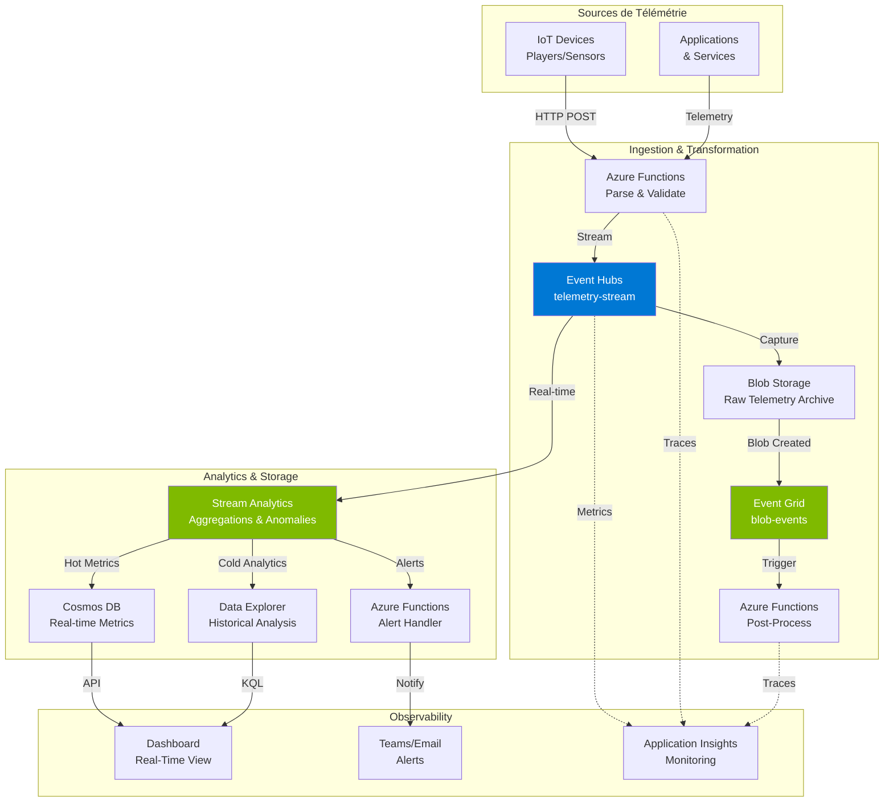

# Module 6 : Lab Final - Pipeline de Monitoring et Observabilité Temps Réel

> 📚 **Architecture inspirée de** : [Monitoring Observable Systems - Microsoft Learn](https://learn.microsoft.com/en-us/azure/architecture/example-scenario/monitoring/monitoring-observable-systems-media) (version sans Fabric)

## 🎯 Objectif

Construire un **système de monitoring temps réel** pour surveiller des applications et devices clients, en utilisant les **patterns event-driven et streaming** étudiés dans ce workshop.

**Use Case** : Monitoring d'une flotte de 1000+ devices IoT (capteurs industriels, véhicules connectés, ou players vidéo) générant de la télémétrie en temps réel.

## 🏗️ Architecture Globale



*[Télécharger le diagramme Visio](./assets/monitoring-architecture.vsdx)*

## 📋 Services Utilisés

| Service | Rôle | Pattern |
|---------|------|---------|
| **Event Hubs** | Front door ingestion (millions events/sec) | Event Streaming |
| **Event Hubs Capture** | Archive automatique vers Blob Storage | Lambda Architecture (Cold Path) |
| **Blob Storage** | Stockage brut télémétrie (format Avro) | Data Lake |
| **Event Grid** | Notification création blobs | Event Notification |
| **Azure Functions** | Parsing, validation, alerting | Serverless Processing |
| **Stream Analytics** | Aggregations temps réel & anomalies | Stream Processing |
| **Cosmos DB** | Métriques temps réel (hot storage) | NoSQL Time-Series |
| **Data Explorer (ADX)** | Analytics historiques (cold storage) | Time-Series Analytics |
| **Application Insights** | Observabilité du pipeline | APM & Monitoring |

## 🎓 Patterns Implémentés

| Pattern | Implémentation | Module Référence |
|---------|----------------|------------------|
| **Event Streaming** | Event Hubs pour ingestion massive | Module 2 & 3 |
| **Lambda Architecture** | Hot path (Stream Analytics) + Cold path (Capture + ADX) | Module 5 |
| **Event Notification** | Event Grid sur Blob Storage | Module 4 |
| **Stream Processing** | Stream Analytics avec fenêtres temporelles | Module 5 |
| **Serverless Processing** | Azure Functions event-driven | Module 4 |
| **Observability** | Application Insights + correlation IDs | Module 5 |

## 🛠️ Étape 1 : Provisionner l'Infrastructure

### Script de Déploiement Azure CLI

```bash
#!/bin/bash

# Configuration
RESOURCE_GROUP="rg-monitoring-eventdriven"
LOCATION="francecentral"
PROJECT_NAME="monitor$(openssl rand -hex 3)"

echo "🚀 Déploiement du pipeline de monitoring temps réel"
echo "   Resource Group: $RESOURCE_GROUP"
echo "   Location: $LOCATION"
echo "   Project Name: $PROJECT_NAME"
echo ""

# Créer le resource group
echo "📦 Création du resource group..."
az group create --name $RESOURCE_GROUP --location $LOCATION

# 1. Event Hubs (Front Door)
echo "📡 Création du Event Hubs namespace..."
EH_NAMESPACE="${PROJECT_NAME}-eh"
az eventhubs namespace create \
  --name $EH_NAMESPACE \
  --resource-group $RESOURCE_GROUP \
  --location $LOCATION \
  --sku Standard \
  --capacity 2

# Créer le Event Hub pour la télémétrie
az eventhubs eventhub create \
  --name telemetry-stream \
  --namespace-name $EH_NAMESPACE \
  --resource-group $RESOURCE_GROUP \
  --partition-count 8 \
  --message-retention 3

# Consumer groups
az eventhubs eventhub consumer-group create \
  --name stream-analytics \
  --eventhub-name telemetry-stream \
  --namespace-name $EH_NAMESPACE \
  --resource-group $RESOURCE_GROUP

az eventhubs eventhub consumer-group create \
  --name monitoring-functions \
  --eventhub-name telemetry-stream \
  --namespace-name $EH_NAMESPACE \
  --resource-group $RESOURCE_GROUP

# 2. Blob Storage (pour Capture et archive)
echo "💾 Création du Storage Account..."
STORAGE_ACCOUNT="${PROJECT_NAME}storage"
az storage account create \
  --name $STORAGE_ACCOUNT \
  --resource-group $RESOURCE_GROUP \
  --location $LOCATION \
  --sku Standard_LRS \
  --kind StorageV2

# Créer le container pour Capture
STORAGE_KEY=$(az storage account keys list \
  --account-name $STORAGE_ACCOUNT \
  --resource-group $RESOURCE_GROUP \
  --query "[0].value" -o tsv)

az storage container create \
  --name telemetry-capture \
  --account-name $STORAGE_ACCOUNT \
  --account-key $STORAGE_KEY

# 3. Activer Event Hubs Capture
echo "📦 Activation du Event Hubs Capture..."
az eventhubs eventhub update \
  --name telemetry-stream \
  --namespace-name $EH_NAMESPACE \
  --resource-group $RESOURCE_GROUP \
  --enable-capture true \
  --capture-interval 300 \
  --capture-size-limit 314572800 \
  --destination-name EventHubArchive.AzureBlockBlob \
  --storage-account $STORAGE_ACCOUNT \
  --blob-container telemetry-capture \
  --archive-name-format '{Namespace}/{EventHub}/{PartitionId}/{Year}/{Month}/{Day}/{Hour}/{Minute}/{Second}'

# 4. Event Grid System Topic (blob events)
echo "⚡ Création du Event Grid System Topic..."
EG_TOPIC="${PROJECT_NAME}-blob-events"
az eventgrid system-topic create \
  --name $EG_TOPIC \
  --resource-group $RESOURCE_GROUP \
  --location $LOCATION \
  --topic-type Microsoft.Storage.StorageAccounts \
  --source $(az storage account show -n $STORAGE_ACCOUNT -g $RESOURCE_GROUP --query id -o tsv)

# 5. Cosmos DB (Hot storage pour métriques temps réel)
echo "🌍 Création de Cosmos DB..."
COSMOS_ACCOUNT="${PROJECT_NAME}-cosmos"
az cosmosdb create \
  --name $COSMOS_ACCOUNT \
  --resource-group $RESOURCE_GROUP \
  --locations regionName=$LOCATION \
  --kind GlobalDocumentDB \
  --default-consistency-level Session

# Créer la database et container
az cosmosdb sql database create \
  --account-name $COSMOS_ACCOUNT \
  --resource-group $RESOURCE_GROUP \
  --name MonitoringMetrics

az cosmosdb sql container create \
  --account-name $COSMOS_ACCOUNT \
  --database-name MonitoringMetrics \
  --resource-group $RESOURCE_GROUP \
  --name DeviceMetrics \
  --partition-key-path "/deviceId" \
  --throughput 400

# 6. Application Insights
echo "📊 Création de Application Insights..."
APPINSIGHTS_NAME="${PROJECT_NAME}-ai"
az monitor app-insights component create \
  --app $APPINSIGHTS_NAME \
  --resource-group $RESOURCE_GROUP \
  --location $LOCATION \
  --kind web

APPINSIGHTS_KEY=$(az monitor app-insights component show \
  --app $APPINSIGHTS_NAME \
  --resource-group $RESOURCE_GROUP \
  --query instrumentationKey -o tsv)

# 7. Function App (pour parsing et alerting)
echo "⚡ Création de la Function App..."
FUNCTION_APP="${PROJECT_NAME}-functions"
az functionapp create \
  --name $FUNCTION_APP \
  --resource-group $RESOURCE_GROUP \
  --consumption-plan-location $LOCATION \
  --runtime dotnet-isolated \
  --runtime-version 8 \
  --functions-version 4 \
  --storage-account $STORAGE_ACCOUNT \
  --app-insights $APPINSIGHTS_NAME

# 8. Stream Analytics Job
echo "🌊 Création du Stream Analytics Job..."
SA_JOB="${PROJECT_NAME}-sa"
az stream-analytics job create \
  --name $SA_JOB \
  --resource-group $RESOURCE_GROUP \
  --location $LOCATION \
  --sku Standard

echo ""
echo "✅ Infrastructure déployée avec succès!"
echo ""
echo "📝 Informations de connexion :"
echo "   Event Hubs Namespace: $EH_NAMESPACE"
echo "   Storage Account: $STORAGE_ACCOUNT"
echo "   Cosmos DB Account: $COSMOS_ACCOUNT"
echo "   Function App: $FUNCTION_APP"
echo "   Stream Analytics Job: $SA_JOB"
echo "   Application Insights Key: $APPINSIGHTS_KEY"
echo ""

# Sauvegarder les connection strings
echo "🔑 Récupération des connection strings..."
EH_CONNECTION_STRING=$(az eventhubs namespace authorization-rule keys list \
  --namespace-name $EH_NAMESPACE \
  --resource-group $RESOURCE_GROUP \
  --name RootManageSharedAccessKey \
  --query primaryConnectionString -o tsv)

COSMOS_CONNECTION_STRING=$(az cosmosdb keys list \
  --name $COSMOS_ACCOUNT \
  --resource-group $RESOURCE_GROUP \
  --type connection-strings \
  --query "connectionStrings[0].connectionString" -o tsv)

# Créer un fichier .env pour le développement local
cat > .env << EOF
RESOURCE_GROUP=$RESOURCE_GROUP
EVENT_HUBS_NAMESPACE=$EH_NAMESPACE
EVENT_HUBS_CONNECTION_STRING=$EH_CONNECTION_STRING
STORAGE_ACCOUNT=$STORAGE_ACCOUNT
STORAGE_CONNECTION_STRING=DefaultEndpointsProtocol=https;AccountName=$STORAGE_ACCOUNT;AccountKey=$STORAGE_KEY;EndpointSuffix=core.windows.net
COSMOS_ACCOUNT=$COSMOS_ACCOUNT
COSMOS_CONNECTION_STRING=$COSMOS_CONNECTION_STRING
APPINSIGHTS_INSTRUMENTATION_KEY=$APPINSIGHTS_KEY
FUNCTION_APP=$FUNCTION_APP
STREAM_ANALYTICS_JOB=$SA_JOB
EOF

echo "✅ Fichier .env créé avec les connection strings"
  --name $EH_NAMESPACE \
  --resource-group $RESOURCE_GROUP \
  --location $LOCATION \
  --sku Standard

az eventhubs eventhub create \
  --name analytics-stream \
  --namespace-name $EH_NAMESPACE \
  --resource-group $RESOURCE_GROUP \
  --partition-count 4

# 4. Cosmos DB
echo "🗄️  Création de Cosmos DB..."
COSMOS_ACCOUNT="${PROJECT_NAME}-cosmos"
az cosmosdb create \
  --name $COSMOS_ACCOUNT \
  --resource-group $RESOURCE_GROUP \
  --locations regionName=$LOCATION \
  --default-consistency-level Session

az cosmosdb sql database create \
  --account-name $COSMOS_ACCOUNT \
  --resource-group $RESOURCE_GROUP \
  --name EcommerceDB

az cosmosdb sql container create \
  --account-name $COSMOS_ACCOUNT \
  --resource-group $RESOURCE_GROUP \
  --database-name EcommerceDB \
  --name OrderReadModels \
  --partition-key-path "/customerId"

# 5. Azure SQL
echo "💾 Création d'Azure SQL Database..."
SQL_SERVER="${PROJECT_NAME}-sql"
SQL_ADMIN="sqladmin"
SQL_PASSWORD="P@ssw0rd$(openssl rand -hex 4)!"

az sql server create \
  --name $SQL_SERVER \
  --resource-group $RESOURCE_GROUP \
  --location $LOCATION \
  --admin-user $SQL_ADMIN \
  --admin-password $SQL_PASSWORD

# Autoriser les services Azure
az sql server firewall-rule create \
  --server $SQL_SERVER \
  --resource-group $RESOURCE_GROUP \
  --name AllowAzureServices \
  --start-ip-address 0.0.0.0 \
  --end-ip-address 0.0.0.0

az sql db create \
  --server $SQL_SERVER \
  --resource-group $RESOURCE_GROUP \
  --name OrdersDB \
  --service-objective S0

# 6. Storage Account pour Functions
echo "📦 Création du Storage Account..."
STORAGE_ACCOUNT="${PROJECT_NAME}st"
az storage account create \
  --name $STORAGE_ACCOUNT \
  --resource-group $RESOURCE_GROUP \
  --location $LOCATION \
  --sku Standard_LRS

# 7. Function App
echo "⚡ Création du Function App..."
FUNCTION_APP="${PROJECT_NAME}-func"
az functionapp create \
  --name $FUNCTION_APP \
  --resource-group $RESOURCE_GROUP \
  --storage-account $STORAGE_ACCOUNT \
  --runtime dotnet-isolated \
  --runtime-version 8 \
  --functions-version 4 \
  --consumption-plan-location $LOCATION

echo ""
echo "✅ Infrastructure déployée avec succès !"
echo ""
echo "📝 Informations de connexion:"
echo "   Service Bus: $SB_NAMESPACE"
echo "   Event Grid: $EG_TOPIC"
echo "   Event Hubs: $EH_NAMESPACE"
echo "   Cosmos DB: $COSMOS_ACCOUNT"
echo "   SQL Server: $SQL_SERVER"
echo "   SQL Password: $SQL_PASSWORD"
echo "   Function App: $FUNCTION_APP"
echo ""

# Générer le fichier .env
cat > .env << EOF
RESOURCE_GROUP=$RESOURCE_GROUP
SERVICE_BUS_NAMESPACE=$SB_NAMESPACE
EVENT_GRID_TOPIC=$EG_TOPIC
EVENT_HUB_NAMESPACE=$EH_NAMESPACE
COSMOS_ACCOUNT=$COSMOS_ACCOUNT
SQL_SERVER=$SQL_SERVER
SQL_DATABASE=OrdersDB
SQL_USER=$SQL_ADMIN
SQL_PASSWORD=$SQL_PASSWORD
FUNCTION_APP=$FUNCTION_APP
EOF

echo "💾 Configuration sauvegardée dans .env"
```

Sauvegarder ce script dans `deploy-infrastructure.sh` et l'exécuter :

```bash
chmod +x deploy-infrastructure.sh
./deploy-infrastructure.sh
```

---

## 💻 Étape 2 : Implémenter le Order Processing Service

### Créer le projet

```bash
dotnet new console -n OrderProcessingService
cd OrderProcessingService

# Packages nécessaires
dotnet add package Azure.Messaging.ServiceBus
dotnet add package Azure.Messaging.EventGrid
dotnet add package Microsoft.Data.SqlClient
dotnet add package System.Text.Json
```

### Code Principal

#### `Models.cs`

```csharp
using System.Text.Json.Serialization;

namespace OrderProcessingService;

public record OrderCommand(
    string OrderId,
    string CustomerId,
    List<OrderItem> Items,
    decimal TotalAmount,
    DateTime Timestamp
);

public record OrderItem(
    string ProductId,
    string ProductName,
    int Quantity,
    decimal Price
);

public record OrderEntity
{
    public string OrderId { get; set; }
    public string CustomerId { get; set; }
    public decimal TotalAmount { get; set; }
    public string ItemsJson { get; set; }
    public string Status { get; set; }
    public DateTime CreatedAt { get; set; }
}

public record OrderCreatedEvent(
    string OrderId,
    string CustomerId,
    decimal TotalAmount,
    int ItemCount,
    DateTime Timestamp
);
```

#### `OrderProcessor.cs`

```csharp
using Azure.Messaging.ServiceBus;
using Azure.Messaging.EventGrid;
using Azure;
using Microsoft.Data.SqlClient;
using System.Text.Json;

namespace OrderProcessingService;

public class OrderProcessor
{
    private readonly string _serviceBusConnectionString;
    private readonly string _sqlConnectionString;
    private readonly EventGridPublisherClient _eventGridClient;

    public OrderProcessor(
        string serviceBusConnectionString,
        string sqlConnectionString,
        string eventGridTopicEndpoint,
        string eventGridTopicKey)
    {
        _serviceBusConnectionString = serviceBusConnectionString;
        _sqlConnectionString = sqlConnectionString;
        _eventGridClient = new EventGridPublisherClient(
            new Uri(eventGridTopicEndpoint),
            new AzureKeyCredential(eventGridTopicKey)
        );
    }

    public async Task StartAsync()
    {
        await using var client = new ServiceBusClient(_serviceBusConnectionString);
        await using var processor = client.CreateProcessor("order-commands");

        processor.ProcessMessageAsync += ProcessOrderAsync;
        processor.ProcessErrorAsync += ErrorHandler;

        Console.WriteLine("📥 Order Processor démarré. En attente de commandes...\n");

        await processor.StartProcessingAsync();
        
        Console.WriteLine("Appuyez sur Entrée pour arrêter...");
        Console.ReadLine();
        
        await processor.StopProcessingAsync();
    }

    private async Task ProcessOrderAsync(ProcessMessageEventArgs args)
    {
        var body = args.Message.Body.ToString();
        var orderCommand = JsonSerializer.Deserialize<OrderCommand>(body);

        Console.WriteLine($"📦 Traitement de la commande: {orderCommand.OrderId}");

        try
        {
            // 1. Valider la commande
            if (orderCommand.TotalAmount <= 0)
                throw new InvalidOperationException("Montant invalide");

            // 2. Sauvegarder dans SQL (Write Model)
            await SaveOrderToDatabase(orderCommand);
            Console.WriteLine($"   ✅ Sauvegardée dans la base de données");

            // 3. Publier l'événement OrderCreated vers Event Grid
            await PublishOrderCreatedEvent(orderCommand);
            Console.WriteLine($"   ✅ Événement publié vers Event Grid");

            // 4. Compléter le message
            await args.CompleteMessageAsync(args.Message);
            Console.WriteLine($"   ✅ Commande {orderCommand.OrderId} traitée avec succès\n");
        }
        catch (Exception ex)
        {
            Console.WriteLine($"   ❌ Erreur: {ex.Message}");
            
            // Retry ou dead-letter
            if (args.Message.DeliveryCount >= 3)
            {
                await args.DeadLetterMessageAsync(args.Message);
                Console.WriteLine($"   ⚰️  Commande envoyée en dead-letter\n");
            }
            else
            {
                await args.AbandonMessageAsync(args.Message);
            }
        }
    }

    private async Task SaveOrderToDatabase(OrderCommand order)
    {
        using var connection = new SqlConnection(_sqlConnectionString);
        await connection.OpenAsync();

        var sql = @"
            INSERT INTO Orders (OrderId, CustomerId, TotalAmount, ItemsJson, Status, CreatedAt)
            VALUES (@OrderId, @CustomerId, @TotalAmount, @ItemsJson, @Status, @CreatedAt)
        ";

        using var command = new SqlCommand(sql, connection);
        command.Parameters.AddWithValue("@OrderId", order.OrderId);
        command.Parameters.AddWithValue("@CustomerId", order.CustomerId);
        command.Parameters.AddWithValue("@TotalAmount", order.TotalAmount);
        command.Parameters.AddWithValue("@ItemsJson", JsonSerializer.Serialize(order.Items));
        command.Parameters.AddWithValue("@Status", "Pending");
        command.Parameters.AddWithValue("@CreatedAt", order.Timestamp);

        await command.ExecuteNonQueryAsync();
    }

    private async Task PublishOrderCreatedEvent(OrderCommand order)
    {
        var evt = new EventGridEvent(
            subject: $"orders/{order.OrderId}",
            eventType: "Ecommerce.OrderCreated",
            dataVersion: "1.0",
            data: new OrderCreatedEvent(
                order.OrderId,
                order.CustomerId,
                order.TotalAmount,
                order.Items.Count,
                order.Timestamp
            )
        );

        await _eventGridClient.SendEventAsync(evt);
    }

    private Task ErrorHandler(ProcessErrorEventArgs args)
    {
        Console.WriteLine($"❌ Erreur: {args.Exception.Message}");
        return Task.CompletedTask;
    }
}
```

#### `Program.cs`

```csharp
using OrderProcessingService;

// Configuration (depuis variables d'environnement ou .env)
var serviceBusConnectionString = Environment.GetEnvironmentVariable("SERVICE_BUS_CONNECTION_STRING");
var sqlConnectionString = Environment.GetEnvironmentVariable("SQL_CONNECTION_STRING");
var eventGridTopicEndpoint = Environment.GetEnvironmentVariable("EVENT_GRID_TOPIC_ENDPOINT");
var eventGridTopicKey = Environment.GetEnvironmentVariable("EVENT_GRID_TOPIC_KEY");

// Créer et démarrer le processor
var processor = new OrderProcessor(
    serviceBusConnectionString,
    sqlConnectionString,
    eventGridTopicEndpoint,
    eventGridTopicKey
);

await processor.StartAsync();
```

### Créer la table SQL

```sql
CREATE TABLE Orders (
    OrderId NVARCHAR(50) PRIMARY KEY,
    CustomerId NVARCHAR(50) NOT NULL,
    TotalAmount DECIMAL(18, 2) NOT NULL,
    ItemsJson NVARCHAR(MAX) NOT NULL,
    Status NVARCHAR(20) NOT NULL,
    CreatedAt DATETIME2 NOT NULL
);

CREATE INDEX IX_Orders_CustomerId ON Orders(CustomerId);
CREATE INDEX IX_Orders_CreatedAt ON Orders(CreatedAt DESC);
```

---

## ⚡ Étape 3 : Créer les Azure Functions (Event Handlers)

### Initialiser le projet Functions

```bash
func init EcommerceFunctions --worker-runtime dotnet-isolated
cd EcommerceFunctions

# Packages
dotnet add package Azure.Messaging.EventHubs
dotnet add package Microsoft.Azure.Cosmos
```

### Function 1 : Inventory Service

```csharp
using Microsoft.Azure.Functions.Worker;
using Microsoft.Extensions.Logging;
using Azure.Messaging;
using System.Text.Json;

namespace EcommerceFunctions;

public class InventoryService
{
    private readonly ILogger<InventoryService> _logger;

    public InventoryService(ILogger<InventoryService> logger)
    {
        _logger = logger;
    }

    [Function("InventoryService")]
    public void Run(
        [EventGridTrigger] CloudEvent cloudEvent)
    {
        if (cloudEvent.Type == "Ecommerce.OrderCreated")
        {
            var data = JsonSerializer.Deserialize<JsonElement>(cloudEvent.Data.ToString());
            var orderId = data.GetProperty("OrderId").GetString();
            var itemCount = data.GetProperty("ItemCount").GetInt32();

            _logger.LogInformation($"📦 Inventory: Réservation pour commande {orderId} ({itemCount} items)");
            
            // TODO: Logique de réservation réelle
            // - Vérifier disponibilité
            // - Réserver le stock
            // - Publier InventoryReserved event
            
            _logger.LogInformation($"✅ Inventory réservé pour {orderId}");
        }
    }
}
```

### Function 2 : Payment Service

```csharp
[Function("PaymentService")]
public void Run(
    [EventGridTrigger] CloudEvent cloudEvent)
{
    if (cloudEvent.Type == "Ecommerce.OrderCreated")
    {
        var data = JsonSerializer.Deserialize<JsonElement>(cloudEvent.Data.ToString());
        var orderId = data.GetProperty("OrderId").GetString();
        var totalAmount = data.GetProperty("TotalAmount").GetDecimal();

        _logger.LogInformation($"💳 Payment: Traitement de {totalAmount}€ pour {orderId}");
        
        // TODO: Intégration avec payment gateway
        // - Stripe, PayPal, etc.
        // - Publier PaymentProcessed event
        
        _logger.LogInformation($"✅ Paiement traité pour {orderId}");
    }
}
```

### Function 3 : Notification Service

```csharp
[Function("NotificationService")]
public void Run(
    [EventGridTrigger] CloudEvent cloudEvent)
{
    if (cloudEvent.Type == "Ecommerce.OrderCreated")
    {
        var data = JsonSerializer.Deserialize<JsonElement>(cloudEvent.Data.ToString());
        var orderId = data.GetProperty("OrderId").GetString();
        var customerId = data.GetProperty("CustomerId").GetString();

        _logger.LogInformation($"📧 Notification: Envoi email pour commande {orderId}");
        
        // TODO: Envoyer l'email/SMS
        // - Azure Communication Services
        // - SendGrid, Twilio, etc.
        
        _logger.LogInformation($"✅ Notification envoyée pour {orderId}");
    }
}
```

### Function 4 : Analytics Projection (Event Hubs → Cosmos DB)

```csharp
using Microsoft.Azure.Functions.Worker;
using Azure.Messaging.EventHubs;
using Microsoft.Azure.Cosmos;

[Function("AnalyticsProjection")]
public async Task Run(
    [EventHubTrigger("analytics-stream", Connection = "EventHubConnection")] EventData[] events,
    FunctionContext context)
{
    var cosmosClient = new CosmosClient(Environment.GetEnvironmentVariable("COSMOS_CONNECTION_STRING"));
    var container = cosmosClient.GetContainer("EcommerceDB", "OrderReadModels");

    foreach (var evt in events)
    {
        var body = evt.EventBody.ToString();
        var data = JsonSerializer.Deserialize<JsonElement>(body);

        // Mise à jour du read model dans Cosmos DB
        var customerId = data.GetProperty("CustomerId").GetString();
        
        // TODO: Mettre à jour le read model agrégé
        // - Total orders per customer
        // - Total spent
        // - Recent orders list
        
        _logger.LogInformation($"📊 Read model mis à jour pour client {customerId}");
    }
}
```

---

## 📤 Étape 4 : Créer un Producteur de Commandes (API)

### API simple en .NET Minimal API

```csharp
using Azure.Messaging.ServiceBus;
using System.Text.Json;

var builder = WebApplication.CreateBuilder(args);

// Configuration Service Bus
var serviceBusConnectionString = builder.Configuration["SERVICE_BUS_CONNECTION_STRING"];
var serviceBusClient = new ServiceBusClient(serviceBusConnectionString);
var sender = serviceBusClient.CreateSender("order-commands");

builder.Services.AddSingleton(sender);
builder.Services.AddEndpointsApiExplorer();
builder.Services.AddSwaggerGen();

var app = builder.Build();

app.UseSwagger();
app.UseSwaggerUI();

// Endpoint pour créer une commande
app.MapPost("/api/orders", async (CreateOrderRequest request, ServiceBusSender sender) =>
{
    var orderId = $"ORD-{Guid.NewGuid().ToString()[..8]}";
    
    var orderCommand = new
    {
        OrderId = orderId,
        CustomerId = request.CustomerId,
        Items = request.Items,
        TotalAmount = request.Items.Sum(i => i.Quantity * i.Price),
        Timestamp = DateTime.UtcNow
    };

    var message = new ServiceBusMessage(JsonSerializer.Serialize(orderCommand));
    await sender.SendMessageAsync(message);

    return Results.Accepted($"/api/orders/{orderId}", new { OrderId = orderId, Status = "Processing" });
});

app.Run();

public record CreateOrderRequest(
    string CustomerId,
    List<OrderItem> Items
);

public record OrderItem(
    string ProductId,
    string ProductName,
    int Quantity,
    decimal Price
);
```

---

## 🧪 Étape 5 : Tester le Workflow Complet

### 1. Démarrer le Order Processing Service

```bash
cd OrderProcessingService
dotnet run
```

### 2. Déployer les Azure Functions

```bash
cd EcommerceFunctions
func azure functionapp publish $FUNCTION_APP
```

### 3. Envoyer une commande via l'API

```bash
curl -X POST http://localhost:5000/api/orders \
  -H "Content-Type: application/json" \
  -d '{
    "customerId": "CUST-001",
    "items": [
      {
        "productId": "PROD-123",
        "productName": "Laptop",
        "quantity": 1,
        "price": 999.99
      },
      {
        "productId": "PROD-456",
        "productName": "Mouse",
        "quantity": 2,
        "price": 29.99
      }
    ]
  }'
```

### 4. Observer le flux

```
1. API → Service Bus Queue ✅
2. Order Processor consomme ✅
3. Sauvegarde dans SQL ✅
4. Publish vers Event Grid ✅
5. Inventory Function triggered ✅
6. Payment Function triggered ✅
7. Notification Function triggered ✅
8. Analytics vers Event Hubs ✅
9. Projection vers Cosmos DB ✅
```

---

## 📊 Étape 6 : Monitoring et Observabilité

### Application Insights

```bash
# Créer Application Insights
APP_INSIGHTS="${PROJECT_NAME}-insights"

az monitor app-insights component create \
  --app $APP_INSIGHTS \
  --resource-group $RESOURCE_GROUP \
  --location $LOCATION

# Connecter la Function App
INSTRUMENTATION_KEY=$(az monitor app-insights component show \
  --app $APP_INSIGHTS \
  --resource-group $RESOURCE_GROUP \
  --query instrumentationKey -o tsv)

az functionapp config appsettings set \
  --name $FUNCTION_APP \
  --resource-group $RESOURCE_GROUP \
  --settings APPINSIGHTS_INSTRUMENTATIONKEY=$INSTRUMENTATION_KEY
```

### Queries KQL utiles

```kql
// Vue d'ensemble des événements
traces
| where timestamp > ago(1h)
| summarize count() by operation_Name
| render barchart

// Latence par service
requests
| summarize avg(duration), percentile(duration, 95) by cloud_RoleName
| render timechart

// Erreurs
exceptions
| where timestamp > ago(1h)
| project timestamp, operation_Name, problemId, outerMessage
```

---

## 🧹 Nettoyage

```bash
az group delete --name $RESOURCE_GROUP --yes --no-wait
```

---

## 🎓 Ce que vous avez appris

✅ **Architecture complète event-driven**
- Queue-based load leveling (Service Bus)
- Pub/Sub avec Event Grid
- Streaming avec Event Hubs

✅ **CQRS en pratique**
- Write model (SQL)
- Read model (Cosmos DB)
- Projections asynchrones

✅ **Patterns implémentés**
- Command/Event separation
- Event-driven choreography
- Eventual consistency

✅ **Scalabilité et résilience**
- Services découplés
- Dead-letter queues
- Retry automatique

## 🚀 Améliorations Possibles

Pour aller plus loin, vous pourriez :

1. **Implémenter Event Sourcing**
   - Stocker tous les événements de commande
   - Rebuild des aggregates depuis l'historique

2. **Ajouter un Saga Orchestrator**
   - Utiliser Durable Functions
   - Gérer les compensations

3. **Améliorer l'observabilité**
   - Distributed tracing avec correlation IDs
   - Dashboards personnalisés

4. **Sécuriser**
   - Managed Identity partout
   - Azure Key Vault pour les secrets
   - Private Endpoints

5. **Optimiser les coûts**
   - Auto-scaling intelligent
   - Reserved capacity
   - Archiving des données anciennes

---

## 🎉 Félicitations !

Vous avez terminé le workshop sur l'architecture event-driven dans Azure ! 🎓

Vous êtes maintenant capable de concevoir et implémenter des systèmes event-driven robustes, scalables et résilients sur Microsoft Azure.

---

[← Module précédent](./04-event-grid.md) | [Retour au sommaire](./workshop.md)
