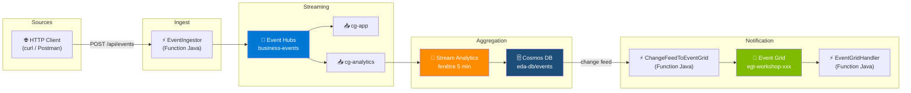

# Module 6 : Lab Final — Pipeline Event-Driven Complet

## 🎯 Objectifs

Dans ce lab final, vous assemblez **toutes les briques** déployées en module 02 et codées en modules 03 et 04 :

- Vérifier que l'infrastructure module 02 est opérationnelle
- Implémenter l'ingesteur HTTP → Event Hubs (Function Java)
- Configurer Stream Analytics pour l'agrégation fenêtrée
- Câbler le change feed Cosmos DB → Event Grid (Function Java)
- Déployer l'`EventGridHandler` et créer l'abonnement Event Grid
- Valider le pipeline de bout en bout par injection de données

---

## 🏗️ Vue d'Ensemble du Pipeline



---

## 🔑 Variables — Récapitulatif Module 02

Reprenez votre session shell ou réexportez les variables :

```bash
# ── Identifiants ─────────────────────────────────────────────
export SUFFIX=<votre_suffix>          # même valeur qu'en module 02
export RG="rg-eda-workshop"
export LOCATION="francecentral"

# ── Event Hubs ───────────────────────────────────────────────
export EH_NAMESPACE="evhns-workshop-$SUFFIX"
export EH_NAME="business-events"
export EH_CG_APP="cg-app"
export EH_CG_SA="cg-analytics"

# ── Storage ──────────────────────────────────────────────────
export STORAGE_ACCOUNT="stworkshop$SUFFIX"
export CHECKPOINT_CONTAINER="eh-checkpoints"

# ── Function App ─────────────────────────────────────────────
export FUNC_APP="func-ingest-$SUFFIX"

# ── Cosmos DB ────────────────────────────────────────────────
export COSMOS_ACCOUNT="cosmos-workshop-$SUFFIX"
export COSMOS_DB="eda-db"
export COSMOS_CONTAINER="events"

# ── Stream Analytics ─────────────────────────────────────────
export SA_JOB="sa-workshop-$SUFFIX"

# ── Event Grid ───────────────────────────────────────────────
export EG_TOPIC="egt-workshop-$SUFFIX"

# ── Connection Strings ───────────────────────────────────────
export EH_PRODUCER_CS=$(az eventhubs namespace authorization-rule keys list \
  --namespace-name $EH_NAMESPACE --resource-group $RG \
  --name policy-producer --query primaryConnectionString --output tsv)

export EH_CONSUMER_CS=$(az eventhubs namespace authorization-rule keys list \
  --namespace-name $EH_NAMESPACE --resource-group $RG \
  --name policy-consumer --query primaryConnectionString --output tsv)

export STORAGE_CS=$(az storage account show-connection-string \
  --name $STORAGE_ACCOUNT --resource-group $RG --query connectionString --output tsv)

export EG_ENDPOINT=$(az eventgrid topic show \
  --name $EG_TOPIC --resource-group $RG --query endpoint --output tsv)

export EG_KEY=$(az eventgrid topic key list \
  --name $EG_TOPIC --resource-group $RG --query key1 --output tsv)

export COSMOS_CS=$(az cosmosdb keys list \
  --name $COSMOS_ACCOUNT --resource-group $RG \
  --type connection-strings \
  --query "connectionStrings[0].connectionString" --output tsv)

echo "✅ Variables chargées"
```

---

## ① Vérification de l'Infrastructure

Avant de coder, vérifiez que chaque ressource module 02 est bien provisionnée :

```bash
echo "=== Event Hubs ==="
az eventhubs eventhub show \
  --name $EH_NAME \
  --namespace-name $EH_NAMESPACE \
  --resource-group $RG \
  --query "{name:name, partitions:partitionCount}" --output table

echo "=== Consumer Groups ==="
az eventhubs eventhub consumer-group list \
  --eventhub-name $EH_NAME \
  --namespace-name $EH_NAMESPACE \
  --resource-group $RG \
  --query "[].name" --output table

echo "=== Cosmos DB ==="
az cosmosdb sql container show \
  --account-name $COSMOS_ACCOUNT --resource-group $RG \
  --database-name $COSMOS_DB --name $COSMOS_CONTAINER \
  --query "{container:id, partitionKey:partitionKey.paths}" --output table

echo "=== Event Grid Topic ==="
az eventgrid topic show \
  --name $EG_TOPIC --resource-group $RG \
  --query "{name:name, endpoint:endpoint, state:provisioningState}" --output table

echo "=== Function App ==="
az functionapp show \
  --name $FUNC_APP --resource-group $RG \
  --query "{name:name, state:state}" --output table

echo "=== Stream Analytics ==="
az stream-analytics job show \
  --name $SA_JOB --resource-group $RG \
  --query "{name:name, state:jobState}" --output table
```

> Toutes les ressources doivent apparaître. Si une est manquante, revenez au module 02 pour la provisionner.

---

## ② Maven — Projet Functions Unifié

Les trois Functions du pipeline sont dans un seul projet Maven déployé sur `$FUNC_APP`.

### Structure du projet

```
eda-functions/
├── pom.xml
└── src/main/java/com/example/eda/
    ├── EventIngestor.java          ← HTTP → Event Hubs
    ├── ChangeFeedToEventGrid.java  ← Cosmos DB change feed → Event Grid
    └── EventGridHandler.java       ← Event Grid → action
```

### `pom.xml`

```xml
<?xml version="1.0" encoding="UTF-8"?>
<project xmlns="http://maven.apache.org/POM/4.0.0"
         xmlns:xsi="http://www.w3.org/2001/XMLSchema-instance"
         xsi:schemaLocation="http://maven.apache.org/POM/4.0.0
           http://maven.apache.org/xsd/maven-4.0.0.xsd">
  <modelVersion>4.0.0</modelVersion>

  <groupId>com.example</groupId>
  <artifactId>eda-functions</artifactId>
  <version>1.0-SNAPSHOT</version>
  <packaging>jar</packaging>

  <properties>
    <java.version>21</java.version>
    <maven.compiler.source>21</maven.compiler.source>
    <maven.compiler.target>21</maven.compiler.target>
    <azure.functions.maven.plugin.version>1.36.0</azure.functions.maven.plugin.version>
    <azure.functions.java.library.version>3.1.0</azure.functions.java.library.version>
  </properties>

  <dependencies>
    <!-- Azure Functions runtime -->
    <dependency>
      <groupId>com.microsoft.azure.functions</groupId>
      <artifactId>azure-functions-java-library</artifactId>
      <version>${azure.functions.java.library.version}</version>
    </dependency>

    <!-- Event Hubs -->
    <dependency>
      <groupId>com.azure</groupId>
      <artifactId>azure-messaging-eventhubs</artifactId>
      <version>5.18.0</version>
    </dependency>

    <!-- Event Grid -->
    <dependency>
      <groupId>com.azure</groupId>
      <artifactId>azure-messaging-eventgrid</artifactId>
      <version>4.21.0</version>
    </dependency>

    <!-- Jackson -->
    <dependency>
      <groupId>com.fasterxml.jackson.core</groupId>
      <artifactId>jackson-databind</artifactId>
      <version>2.17.0</version>
    </dependency>
  </dependencies>

  <build>
    <plugins>
      <plugin>
        <groupId>com.microsoft.azure</groupId>
        <artifactId>azure-functions-maven-plugin</artifactId>
        <version>${azure.functions.maven.plugin.version}</version>
        <configuration>
          <appName>${env.FUNC_APP}</appName>
          <resourceGroup>${env.RG}</resourceGroup>
          <region>${env.LOCATION}</region>
          <runtime>
            <os>linux</os>
            <javaVersion>21</javaVersion>
          </runtime>
        </configuration>
      </plugin>
    </plugins>
  </build>
</project>
```

### `EventIngestor.java` — HTTP → Event Hubs

```java
package com.example.eda;

import com.azure.messaging.eventhubs.*;
import com.fasterxml.jackson.databind.ObjectMapper;
import com.microsoft.azure.functions.*;
import com.microsoft.azure.functions.annotation.*;

import java.util.Map;
import java.util.Optional;

public class EventIngestor {

    private static final String EH_PRODUCER_CS = System.getenv("EH_PRODUCER_CS");
    private static final String EH_NAME        = "business-events";
    private static final ObjectMapper MAPPER   = new ObjectMapper();

    private static final EventHubProducerClient PRODUCER =
        new EventHubClientBuilder()
            .connectionString(EH_PRODUCER_CS, EH_NAME)
            .buildProducerClient();

    @FunctionName("EventIngestor")
    public HttpResponseMessage run(
        @HttpTrigger(
            name = "req",
            methods = { HttpMethod.POST },
            authLevel = AuthorizationLevel.FUNCTION,
            route = "events"
        ) HttpRequestMessage<Optional<String>> request,
        final ExecutionContext context
    ) {
        String body = request.getBody().orElse("{}");

        try {
            Map<?, ?> payload = MAPPER.readValue(body, Map.class);

            EventDataBatch batch = PRODUCER.createBatch();
            batch.tryAdd(new EventData(body));
            PRODUCER.send(batch);

            context.getLogger().info("📨 Événement ingéré : " + payload.get("type"));

            return request.createResponseBuilder(HttpStatus.ACCEPTED)
                .body(Map.of("status", "accepted"))
                .build();

        } catch (Exception e) {
            context.getLogger().severe("❌ Erreur ingestion : " + e.getMessage());
            return request.createResponseBuilder(HttpStatus.BAD_REQUEST)
                .body(Map.of("error", e.getMessage()))
                .build();
        }
    }
}
```

---

## ③ Stream Analytics — Agrégation en Fenêtre

Stream Analytics consomme `cg-analytics` et agrège les événements par fenêtre de 5 minutes avant d'écrire dans Cosmos DB.

### Configurer l'entrée Event Hubs

```bash
EH_CONSUMER_KEY=$(az eventhubs namespace authorization-rule keys list \
  --namespace-name $EH_NAMESPACE \
  --resource-group $RG \
  --name policy-consumer \
  --query primaryKey --output tsv)

az stream-analytics input create \
  --job-name $SA_JOB \
  --resource-group $RG \
  --name "eh-input" \
  --properties "{
    \"type\": \"Stream\",
    \"datasource\": {
      \"type\": \"Microsoft.EventHub/EventHub\",
      \"properties\": {
        \"eventHubName\": \"$EH_NAME\",
        \"serviceBusNamespace\": \"$EH_NAMESPACE\",
        \"consumerGroupName\": \"$EH_CG_SA\",
        \"sharedAccessPolicyName\": \"policy-consumer\",
        \"sharedAccessPolicyKey\": \"$EH_CONSUMER_KEY\"
      }
    },
    \"serialization\": { \"type\": \"Json\", \"properties\": { \"encoding\": \"UTF8\" } }
  }"

echo "✅ Entrée SA configurée : $EH_NAME / $EH_CG_SA"
```

### Configurer la sortie Cosmos DB

```bash
COSMOS_KEY=$(az cosmosdb keys list \
  --name $COSMOS_ACCOUNT \
  --resource-group $RG \
  --query primaryMasterKey --output tsv)

az stream-analytics output create \
  --job-name $SA_JOB \
  --resource-group $RG \
  --name "cosmos-output" \
  --properties "{
    \"datasource\": {
      \"type\": \"Microsoft.Storage/DocumentDB\",
      \"properties\": {
        \"accountId\": \"$COSMOS_ACCOUNT\",
        \"accountKey\": \"$COSMOS_KEY\",
        \"database\": \"$COSMOS_DB\",
        \"collectionNamePattern\": \"$COSMOS_CONTAINER\",
        \"partitionKey\": \"type\",
        \"documentId\": \"id\"
      }
    }
  }"

echo "✅ Sortie Cosmos DB configurée : $COSMOS_DB/$COSMOS_CONTAINER"
```

### Requête SAQL — Fenêtre Bascule (Tumbling) 5 min

```sql
SELECT
    System.Timestamp()          AS windowEnd,
    type,
    COUNT(*)                    AS eventCount,
    AVG(CAST(value AS float))   AS avgValue,
    MIN(CAST(value AS float))   AS minValue,
    MAX(CAST(value AS float))   AS maxValue,
    CONCAT(type, '-', CAST(System.Timestamp() AS nvarchar(max))) AS id
INTO
    [cosmos-output]
FROM
    [eh-input] TIMESTAMP BY timestamp
GROUP BY
    type,
    TumblingWindow(minute, 5)
```

> Collez cette requête dans l'éditeur de requête Stream Analytics (portail Azure → votre job SA → Requête).

### Démarrer le job

```bash
az stream-analytics job start \
  --name $SA_JOB \
  --resource-group $RG \
  --output-start-mode JobStartTime

echo "✅ Stream Analytics démarré"

az stream-analytics job show \
  --name $SA_JOB --resource-group $RG \
  --query "{state:jobState, lastOutput:lastOutputEventTime}" --output table
```

---

## ④ ChangeFeedToEventGrid — Function Java

Cette Function est déclenchée automatiquement à chaque écriture de Stream Analytics dans Cosmos DB. Elle publie l'agrégat dans Event Grid.

### `ChangeFeedToEventGrid.java`

```java
package com.example.eda;

import com.azure.core.credential.AzureKeyCredential;
import com.azure.core.util.BinaryData;
import com.azure.messaging.eventgrid.*;
import com.fasterxml.jackson.databind.ObjectMapper;
import com.microsoft.azure.functions.*;
import com.microsoft.azure.functions.annotation.*;

import java.time.OffsetDateTime;
import java.util.List;
import java.util.Map;
import java.util.UUID;

public class ChangeFeedToEventGrid {

    private static final String EG_ENDPOINT  = System.getenv("EG_ENDPOINT");
    private static final String EG_KEY       = System.getenv("EG_KEY");
    private static final ObjectMapper MAPPER = new ObjectMapper();

    private static final EventGridPublisherClient<EventGridEvent> EG_CLIENT =
        new EventGridPublisherClientBuilder()
            .endpoint(EG_ENDPOINT)
            .credential(new AzureKeyCredential(EG_KEY))
            .buildEventGridEventPublisherClient();

    @FunctionName("ChangeFeedToEventGrid")
    public void run(
        @CosmosDBTrigger(
            name          = "documents",
            databaseName  = "eda-db",
            containerName = "events",
            connection    = "COSMOS_CS",
            createLeaseContainerIfNotExists = true
        )
        List<String> documents,
        final ExecutionContext context
    ) {
        context.getLogger().info(
            String.format("🔔 Change feed : %d document(s)", documents.size())
        );

        for (String raw : documents) {
            try {
                Map<?, ?> aggregate = MAPPER.readValue(raw, Map.class);

                String type      = (String) aggregate.get("type");
                String entityId  = aggregate.getOrDefault("id", UUID.randomUUID()).toString();
                int    count     = aggregate.get("eventCount") != null
                    ? ((Number) aggregate.get("eventCount")).intValue() : 0;
                String windowEnd = aggregate.get("windowEnd") != null
                    ? aggregate.get("windowEnd").toString()
                    : OffsetDateTime.now().toString();

                Map<String, Object> data = Map.of(
                    "type",       type,
                    "entityId",   entityId,
                    "eventCount", count,
                    "windowEnd",  windowEnd
                );

                EventGridEvent event = new EventGridEvent(
                    "aggregates/" + type + "/" + entityId,
                    "EDA.Aggregate.Created",
                    BinaryData.fromObject(data),
                    "1.0"
                );
                event.setId(UUID.randomUUID().toString());
                event.setEventTime(OffsetDateTime.now());

                EG_CLIENT.sendEvents(List.of(event));
                context.getLogger().info(
                    "📤 Publié → Event Grid : " + type + " (count=" + count + ")"
                );

            } catch (Exception e) {
                // Ne pas lever l'exception pour traiter les autres documents du batch
                context.getLogger().severe("❌ Erreur publication : " + e.getMessage());
            }
        }
    }
}
```

---

## ⑤ EventGridHandler — Handler et Abonnement

### `EventGridHandler.java`

```java
package com.example.eda;

import com.fasterxml.jackson.databind.ObjectMapper;
import com.microsoft.azure.functions.*;
import com.microsoft.azure.functions.annotation.*;

import java.util.Map;
import java.util.logging.Logger;

public class EventGridHandler {

    private static final ObjectMapper MAPPER = new ObjectMapper();

    @FunctionName("EventGridHandler")
    public void run(
        @EventGridTrigger(name = "event") String eventGridEvent,
        final ExecutionContext context
    ) {
        Logger log = context.getLogger();

        try {
            Map<?, ?> envelope = MAPPER.readValue(eventGridEvent, Map.class);

            String eventType = (String) envelope.get("eventType");
            String subject   = (String) envelope.get("subject");
            String eventId   = (String) envelope.get("id");
            Map<?, ?> data   = (Map<?, ?>) envelope.get("data");

            log.info(String.format("📨 Event Grid reçu [%s] : %s", eventType, subject));

            // Idempotence : Event Grid peut livrer le même événement deux fois.
            // En production : vérifiez si eventId a déjà été traité (Cosmos DB, Redis…)

            switch (eventType) {
                case "EDA.Aggregate.Created" -> handleAggregate(data, log);
                default -> log.info("ℹ️ Type non géré : " + eventType);
            }

            log.info("✅ Traité : " + eventId);

        } catch (Exception ex) {
            log.severe("❌ Erreur handler : " + ex.getMessage());
            throw new RuntimeException(ex); // Event Grid retentera automatiquement
        }
    }

    private void handleAggregate(Map<?, ?> data, Logger log) {
        String type     = (String) data.get("type");
        String entityId = (String) data.get("entityId");
        int    count    = ((Number) data.get("eventCount")).intValue();

        log.info(String.format(
            "📊 Agrégat — type: %s | entity: %s | count: %d",
            type, entityId, count
        ));

        // Ici : dashboard update, push notification, webhook Teams, etc.
    }
}
```

### Déployer les Functions

```bash
cd eda-functions

# Déployer sur $FUNC_APP (package inclus automatiquement)
mvn azure-functions:deploy

echo "✅ Functions déployées sur $FUNC_APP"

# Vérifier que les 3 fonctions sont présentes
az functionapp function list \
  --name $FUNC_APP \
  --resource-group $RG \
  --query "[].{name:name}" --output table
```

### Configurer les App Settings

```bash
az functionapp config appsettings set \
  --name $FUNC_APP \
  --resource-group $RG \
  --settings \
    "EH_PRODUCER_CS=$EH_PRODUCER_CS" \
    "EG_ENDPOINT=$EG_ENDPOINT" \
    "EG_KEY=$EG_KEY" \
    "COSMOS_CS=$COSMOS_CS"

echo "✅ App Settings configurés"
```

### Créer l'abonnement Event Grid → EventGridHandler

```bash
FUNC_ID=$(az functionapp function show \
  --name $FUNC_APP \
  --resource-group $RG \
  --function-name EventGridHandler \
  --query id --output tsv)

az eventgrid event-subscription create \
  --name "egs-notification" \
  --source-resource-id $(az eventgrid topic show \
    --name $EG_TOPIC --resource-group $RG --query id --output tsv) \
  --endpoint-type azurefunction \
  --endpoint $FUNC_ID \
  --included-event-types "EDA.Aggregate.Created"

echo "✅ Abonnement créé : egs-notification → EventGridHandler"
```

---

## ⑥ Test de Bout en Bout

### Récupérer l'URL de l'ingesteur

```bash
INGESTOR_URL=$(az functionapp function show \
  --name $FUNC_APP \
  --resource-group $RG \
  --function-name EventIngestor \
  --query invokeUrlTemplate --output tsv)

INGESTOR_KEY=$(az functionapp keys list \
  --name $FUNC_APP \
  --resource-group $RG \
  --query functionKeys.default --output tsv)

echo "URL : $INGESTOR_URL"
```

### Injecter des événements de test

```bash
# 10 événements OrderPlaced
for i in $(seq 1 10); do
  curl -s -X POST "${INGESTOR_URL}?code=${INGESTOR_KEY}" \
    -H "Content-Type: application/json" \
    -d "{
      \"type\": \"OrderPlaced\",
      \"entityId\": \"order-$(printf '%03d' $i)\",
      \"value\": $((RANDOM % 500 + 50)),
      \"timestamp\": \"$(date -u +%Y-%m-%dT%H:%M:%SZ)\"
    }"
  echo " ← order-$(printf '%03d' $i)"
done

# 5 événements PaymentFailed
for i in $(seq 1 5); do
  curl -s -X POST "${INGESTOR_URL}?code=${INGESTOR_KEY}" \
    -H "Content-Type: application/json" \
    -d "{
      \"type\": \"PaymentFailed\",
      \"entityId\": \"order-$(printf '%03d' $((i + 100)))\",
      \"value\": $((RANDOM % 200 + 100)),
      \"timestamp\": \"$(date -u +%Y-%m-%dT%H:%M:%SZ)\"
    }"
  echo " ← payment-failed-$(printf '%03d' $i)"
done

echo "✅ 15 événements injectés"
```

### Vérifier chaque étape

```bash
# 1️⃣ Event Hubs — messages entrants
az monitor metrics list \
  --resource $(az eventhubs eventhub show \
    --name $EH_NAME --namespace-name $EH_NAMESPACE \
    --resource-group $RG --query id --output tsv) \
  --metric "IncomingMessages,OutgoingMessages" \
  --interval PT1M --output table

# 2️⃣ Stream Analytics — état et dernière sortie
az stream-analytics job show \
  --name $SA_JOB --resource-group $RG \
  --query "{state:jobState, lastOutput:lastOutputEventTime}" --output table

# 3️⃣ Event Grid — livraisons (après ~5 min, le temps que SA ferme sa fenêtre)
az monitor metrics list \
  --resource $(az eventgrid topic show \
    --name $EG_TOPIC --resource-group $RG --query id --output tsv) \
  --metric "PublishSuccessCount,DeliverySuccessCount,DeliveryFailCount" \
  --interval PT5M --output table

# 4️⃣ Function App — logs en temps réel
func azure functionapp logstream $FUNC_APP
```

### Flux attendu

```
1. curl POST /api/events        → EventIngestor reçoit ✅
2. EventIngestor → EH           → IncomingMessages > 0 ✅
3. EH (cg-analytics) → SA       → jobState = Running ✅
4. SA (fenêtre 5 min) → Cosmos  → document écrit ✅
5. Cosmos change feed → CFTEG   → "📤 Publié → Event Grid" dans les logs ✅
6. EG → EventGridHandler        → "📊 Agrégat reçu" dans les logs ✅
```

---

## ⑦ Monitoring du Pipeline

### Métriques clés par composant

| Composant | Métrique | Seuil OK |
|-----------|----------|----------|
| Event Hubs | `IncomingMessages` | > 0 après injection |
| Stream Analytics | `jobState` | `Running` |
| Stream Analytics | `OutputEvents` | > 0 après 5 min |
| Event Grid | `DeliverySuccessCount` | > 0 |
| Event Grid | `DeliveryFailCount` | = 0 |
| Function App | logs `✅ Traité` | Présent |

### Requêtes KQL

```kql
// Événements ingérés par EventIngestor
traces
| where message startswith "📨"
| summarize count() by bin(timestamp, 1m)
| render timechart title="Événements ingérés / min"
```

```kql
// Livraisons Event Grid
AzureMetrics
| where ResourceProvider == "MICROSOFT.EVENTGRID"
| where MetricName in ("PublishSuccessCount", "DeliverySuccessCount", "DeliveryFailCount")
| summarize Total = sum(Total) by MetricName, bin(TimeGenerated, 5m)
| render timechart title="Event Grid — livraisons"
```

```kql
// Erreurs dans les Functions
exceptions
| where timestamp > ago(1h)
| project timestamp, operation_Name, problemId, outerMessage
| order by timestamp desc
```

---

## ➡️ Prochaine Étape

Le pipeline event-driven est complet et validé de bout en bout. Dans le module suivant, on explore comment **intégrer des agents IA** (Microsoft Foundry) pour enrichir ce pipeline avec de l'intelligence contextuelle en temps réel.

**[Module 7 : Foundry Agents + Event-Driven →](./07-foundry-event-driven.md)**

---

[← Module précédent](./04-event-grid.md) | [Retour au sommaire](./workshop.md)
