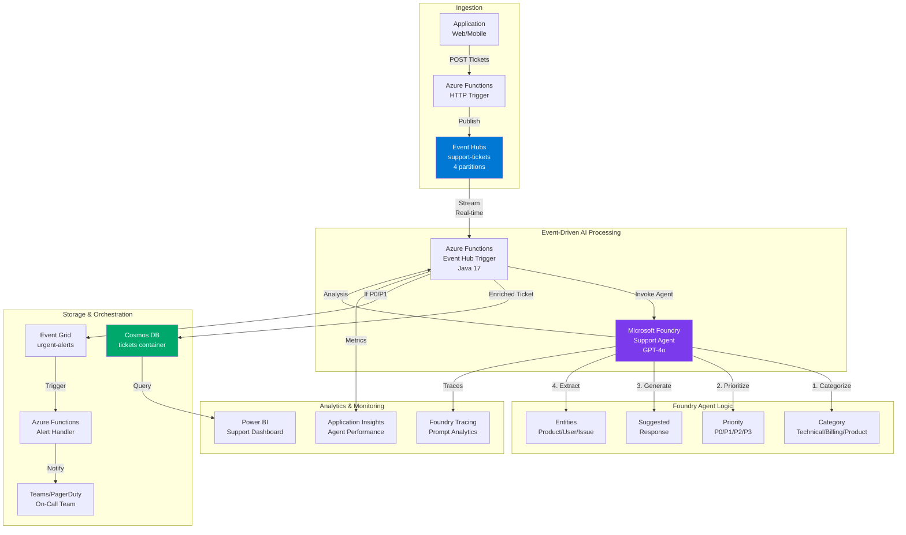
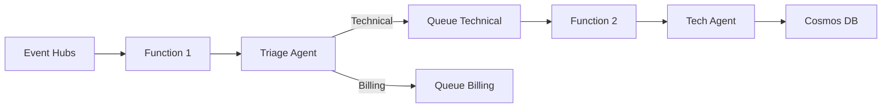
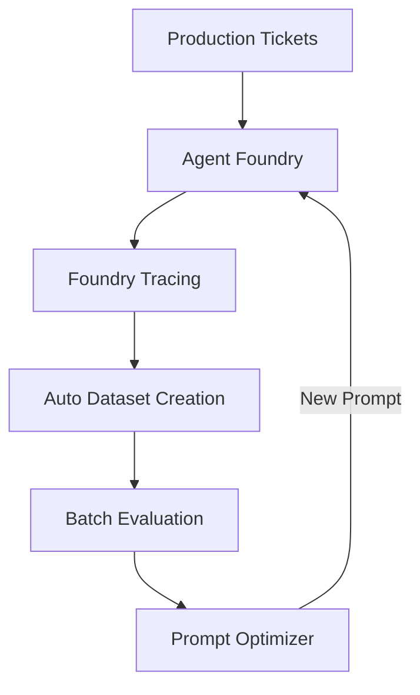

# Module 7 : Foundry Agents + Event-Driven - Pipeline Intelligent en Temps Réel

## 🎯 Objectif

Construire un pipeline **event-driven intelligent** qui combine Event Hubs avec **Microsoft Foundry Agents** pour traiter, analyser et réagir de manière autonome aux événements en temps réel.

**Use Case** : Système intelligent de support client qui analyse automatiquement les tickets, catégorise les demandes, génère des réponses suggérées et priorise selon l'urgence - le tout en temps réel via streaming.

## 🏗️ Architecture



## 📋 Technologies Utilisées

| Service | Rôle |
|---------|------|
| **Event Hubs** | Streaming des tickets support en temps réel |
| **Microsoft Foundry Agent** | Agent IA autonome (GPT-4o) pour analyse et catégorisation |
| **Azure Functions (Java)** | Event-driven processing et orchestration |
| **Cosmos DB** | Stockage des tickets enrichis avec IA |
| **Event Grid** | Notifications pour tickets urgents (P0/P1) |
| **Application Insights** | Monitoring du pipeline et performance agent |
| **Foundry Tracing** | Analytics prompts et optimisation agent |

## 🤖 Pourquoi Foundry + Event-Driven ?

### ✅ Avantages de l'Architecture

| Avantage | Explication |
|----------|-------------|
| **Scalabilité automatique** | Event Hubs + Functions scale avec le volume de tickets |
| **Intelligence contextuelle** | Agent Foundry comprend le contexte business et génère des réponses pertinentes |
| **Traçabilité complète** | Chaque décision de l'agent est tracée (Foundry Tracing) |
| **Optimisation continue** | Foundry Prompt Optimizer améliore automatiquement les prompts selon les résultats |
| **Décisions temps réel** | Priorisation et routage instantané (< 2 secondes) |
| **Multi-modal** | Peut traiter texte, images (screenshots), documents joints |

### 🆚 Foundry Agent vs. Azure AI Language

| Critère | **Foundry Agent** ✅ | Azure AI Language |
|---------|---------------------|-------------------|
| **Compréhension** | Contextuelle, raisonnement complexe | Basique (sentiment, entities) |
| **Personnalisation** | Instructions métier custom, RAG | Modèles pré-entraînés fixes |
| **Actions** | Génère réponses, appelle tools | Analyse seulement |
| **Évolution** | Prompt optimization automatique | Modèle statique |
| **Cas d'usage** | Support, décisions, orchestration | Analytics basique |

## 🎓 Patterns IA + Event-Driven avec Foundry

| Pattern | Description | Implémentation |
|---------|-------------|----------------|
| **Agent-per-Stream** | Un agent Foundry traite un stream Event Hub | Function trigger + agent invoke |
| **Intelligent Routing** | Agent décide du routing selon analyse | Priority-based Event Grid topics |
| **Enrichissement IA** | Agent ajoute contexte et insights | Cosmos DB avec métadonnées agent |
| **Feedback Loop** | Traces → Dataset → Prompt Optimization | Foundry batch eval + optimizer |
| **Multi-Agent Workflow** | Plusieurs agents en pipeline | Agent1 (categorize) → Agent2 (respond) |

---

## 🛠️ Lab 1 : Provisionner l'Infrastructure Foundry + Event Hubs (20 min)

### Étape 1.1 : Déployer l'infrastructure Azure

```bash
#!/bin/bash

# Configuration
RESOURCE_GROUP="rg-foundry-eventdriven"
LOCATION="francecentral"
PROJECT_NAME="foundryev$(openssl rand -hex 3)"

echo "🚀 Déploiement du pipeline Foundry + Event-Driven"
echo "   Resource Group: $RESOURCE_GROUP"
echo "   Project: $PROJECT_NAME"

# Resource group
az group create --name $RESOURCE_GROUP --location $LOCATION

# 1. Event Hubs Namespace
NAMESPACE_NAME="${PROJECT_NAME}-ns"
az eventhubs namespace create \
  --name $NAMESPACE_NAME \
  --resource-group $RESOURCE_GROUP \
  --location $LOCATION \
  --sku Standard \
  --capacity 1

# Event Hub pour les tickets
az eventhubs eventhub create \
  --name support-tickets \
  --namespace-name $NAMESPACE_NAME \
  --resource-group $RESOURCE_GROUP \
  --partition-count 4 \
  --message-retention 1

# 2. Microsoft Foundry Project (AI Foundry)
FOUNDRY_HUB="${PROJECT_NAME}-hub"
az ml workspace create \
  --name $FOUNDRY_HUB \
  --resource-group $RESOURCE_GROUP \
  --location $LOCATION \
  --kind hub

echo "✅ Foundry Hub créé : $FOUNDRY_HUB"

# 3. Azure AI Services (pour connexion Foundry)
AI_SERVICE="${PROJECT_NAME}-ai"
az cognitiveservices account create \
  --name $AI_SERVICE \
  --resource-group $RESOURCE_GROUP \
  --kind AIServices \
  --sku S0 \
  --location $LOCATION \
  --yes

# 4. Cosmos DB (NoSQL)
COSMOS_ACCOUNT="${PROJECT_NAME}-cosmos"
az cosmosdb create \
  --name $COSMOS_ACCOUNT \
  --resource-group $RESOURCE_GROUP \
  --locations regionName=$LOCATION failoverPriority=0 \
  --default-consistency-level Session

az cosmosdb sql database create \
  --account-name $COSMOS_ACCOUNT \
  --resource-group $RESOURCE_GROUP \
  --name SupportTickets

az cosmosdb sql container create \
  --account-name $COSMOS_ACCOUNT \
  --resource-group $RESOURCE_GROUP \
  --database-name SupportTickets \
  --name tickets \
  --partition-key-path "/ticketId" \
  --throughput 400

# 5. Storage Account
STORAGE_ACCOUNT="${PROJECT_NAME}storage"
az storage account create \
  --name $STORAGE_ACCOUNT \
  --resource-group $RESOURCE_GROUP \
  --location $LOCATION \
  --sku Standard_LRS

# 6. Application Insights
APPINSIGHTS_NAME="${PROJECT_NAME}-insights"
az monitor app-insights component create \
  --app $APPINSIGHTS_NAME \
  --location $LOCATION \
  --resource-group $RESOURCE_GROUP

# 7. Function App (Java 17)
FUNCTION_APP="${PROJECT_NAME}-functions"
az functionapp create \
  --name $FUNCTION_APP \
  --resource-group $RESOURCE_GROUP \
  --storage-account $STORAGE_ACCOUNT \
  --consumption-plan-location $LOCATION \
  --runtime java \
  --runtime-version 17 \
  --functions-version 4

# Event Hubs connection string
EH_CONNECTION=$(az eventhubs namespace authorization-rule keys list \
  --namespace-name $NAMESPACE_NAME \
  --resource-group $RESOURCE_GROUP \
  --name RootManageSharedAccessKey \
  --query primaryConnectionString -o tsv)

# Cosmos DB connection string
COSMOS_CONNECTION=$(az cosmosdb keys list \
  --name $COSMOS_ACCOUNT \
  --resource-group $RESOURCE_GROUP \
  --type connection-strings \
  --query "connectionStrings[0].connectionString" -o tsv)

# Configurer Function App
az functionapp config appsettings set \
  --name $FUNCTION_APP \
  --resource-group $RESOURCE_GROUP \
  --settings \
    "EventHubConnection=$EH_CONNECTION" \
    "CosmosDBConnection=$COSMOS_CONNECTION"

echo ""
echo "✅ Infrastructure déployée !"
echo ""
echo "📋 Services créés :"
echo "   Event Hubs: $NAMESPACE_NAME"
echo "   Foundry Hub: $FOUNDRY_HUB"
echo "   Cosmos DB: $COSMOS_ACCOUNT"
echo "   Function App: $FUNCTION_APP"
echo ""
echo "⏭️  Prochaine étape : Créer l'agent Foundry dans AI Foundry Studio"
echo "   👉 https://ai.azure.com"
```

### Étape 1.2 : Créer l'Agent Foundry (AI Foundry Studio)

#### A. Via le portail AI Foundry Studio

1. **Ouvrir AI Foundry Studio**
   ```
   https://ai.azure.com
   ```

2. **Créer un nouveau Agent**
   - Cliquez sur **"Agents"** → **"Create Agent"**
   - Nom : `support-ticket-analyzer`
   - Model : **GPT-4o (latest)**

3. **Configurer les Instructions de l'Agent**

```markdown
# Support Ticket Analyzer Agent

## Role
You are an intelligent support ticket analyzer for a SaaS company. Your role is to analyze incoming customer support tickets, categorize them, prioritize them, and generate suggested responses.

## Capabilities
- **Categorization**: Classify tickets into Technical, Billing, Product Feature, or General Inquiry
- **Prioritization**: Assign priority levels (P0/P1/P2/P3) based on urgency and impact
- **Entity Extraction**: Identify product names, user information, and issue types
- **Response Generation**: Create helpful, professional suggested responses

## Priority Levels
- **P0 (Critical)**: Service down, security breach, data loss - immediate action required
- **P1 (High)**: Major feature broken, multiple users affected, payment issues
- **P2 (Medium)**: Single user issue, feature request, minor bug
- **P3 (Low)**: Questions, documentation requests, general feedback

## Output Format
Always respond in JSON format:
{
  "category": "Technical|Billing|Product|General",
  "priority": "P0|P1|P2|P3",
  "entities": {
    "product": "product name if mentioned",
    "user_email": "email if provided",
    "issue_type": "specific issue identified"
  },
  "sentiment": "Positive|Neutral|Negative",
  "urgency_score": 1-10,
  "suggested_response": "Professional response to the customer",
  "internal_notes": "Notes for support team",
  "estimated_resolution_time": "time estimate",
  "requires_escalation": true|false
}

## Guidelines
- Be professional and empathetic
- Identify technical jargon and explain it
- Recognize frustrated customers and adjust priority
- Suggest proactive solutions when possible
- Flag tickets that need human escalation
```

4. **Déployer l'Agent**
   - Cliquez sur **"Deploy"**
   - Nom du déploiement : `support-analyzer-v1`
   - Notez l'**Agent Endpoint** et la **clé API**

### Étape 1.3 : Configuration des Variables d'Environnement

```bash
# Foundry Agent Configuration
FOUNDRY_ENDPOINT="https://YOUR_FOUNDRY_HUB.cognitiveservices.azure.com"
FOUNDRY_API_KEY="YOUR_API_KEY"
FOUNDRY_AGENT_NAME="support-ticket-analyzer"

# Ajouter à Function App
az functionapp config appsettings set \
  --name $FUNCTION_APP \
  --resource-group $RESOURCE_GROUP \
  --settings \
    "FOUNDRY_ENDPOINT=$FOUNDRY_ENDPOINT" \
    "FOUNDRY_API_KEY=$FOUNDRY_API_KEY" \
    "FOUNDRY_AGENT_NAME=$FOUNDRY_AGENT_NAME"

# Sauvegarder localement
cat > .env << EOF
RESOURCE_GROUP=$RESOURCE_GROUP
NAMESPACE_NAME=$NAMESPACE_NAME
EVENT_HUB_CONNECTION=$EH_CONNECTION
COSMOS_DB_CONNECTION=$COSMOS_CONNECTION
FOUNDRY_ENDPOINT=$FOUNDRY_ENDPOINT
FOUNDRY_API_KEY=$FOUNDRY_API_KEY
FOUNDRY_AGENT_NAME=$FOUNDRY_AGENT_NAME
EOF

echo "✅ Configuration sauvegardée dans .env"
```

---

## 🛠️ Lab 2 : Créer le Producer de Tickets (15 min)

### Structure du Projet Maven

```bash
mkdir support-ticket-producer
cd support-ticket-producer
```

**pom.xml**

```xml
<?xml version="1.0" encoding="UTF-8"?>
<project xmlns="http://maven.apache.org/POM/4.0.0"
         xmlns:xsi="http://www.w3.org/2001/XMLSchema-instance"
         xsi:schemaLocation="http://maven.apache.org/POM/4.0.0 
         http://maven.apache.org/xsd/maven-4.0.0.xsd">
    <modelVersion>4.0.0</modelVersion>
    
    <groupId>com.workshop</groupId>
    <artifactId>support-ticket-producer</artifactId>
    <version>1.0-SNAPSHOT</version>
    
    <properties>
        <maven.compiler.source>17</maven.compiler.source>
        <maven.compiler.target>17</maven.compiler.target>
        <project.build.sourceEncoding>UTF-8</project.build.sourceEncoding>
    </properties>
    
    <dependencies>
        <!-- Azure Event Hubs -->
        <dependency>
            <groupId>com.azure</groupId>
            <artifactId>azure-messaging-eventhubs</artifactId>
            <version>5.18.0</version>
        </dependency>
        
        <!-- Gson for JSON -->
        <dependency>
            <groupId>com.google.code.gson</groupId>
            <artifactId>gson</artifactId>
            <version>2.10.1</version>
        </dependency>
        
        <!-- Dotenv -->
        <dependency>
            <groupId>io.github.cdimascio</groupId>
            <artifactId>dotenv-java</artifactId>
            <version>3.0.0</version>
        </dependency>
        
        <!-- Logging -->
        <dependency>
            <groupId>org.slf4j</groupId>
            <artifactId>slf4j-simple</artifactId>
            <version>2.0.9</version>
        </dependency>
    </dependencies>
    
    <build>
        <plugins>
            <plugin>
                <groupId>org.apache.maven.plugins</groupId>
                <artifactId>maven-shade-plugin</artifactId>
                <version>3.5.0</version>
                <executions>
                    <execution>
                        <phase>package</phase>
                        <goals>
                            <goal>shade</goal>
                        </goals>
                        <configuration>
                            <transformers>
                                <transformer implementation="org.apache.maven.plugins.shade.resource.ManifestResourceTransformer">
                                    <mainClass>com.workshop.TicketProducer</mainClass>
                                </transformer>
                            </transformers>
                        </configuration>
                    </execution>
                </executions>
            </plugin>
        </plugins>
    </build>
</project>
```

### Code Java : Producer de Tickets

**src/main/java/com/workshop/SupportTicket.java**

```java
package com.workshop;

import java.time.Instant;

public class SupportTicket {
    private String ticketId;
    private String customerId;
    private String customerEmail;
    private String subject;
    private String description;
    private String timestamp;
    private String source;
    
    public SupportTicket(String ticketId, String customerId, String customerEmail,
                        String subject, String description) {
        this.ticketId = ticketId;
        this.customerId = customerId;
        this.customerEmail = customerEmail;
        this.subject = subject;
        this.description = description;
        this.timestamp = Instant.now().toString();
        this.source = "web_portal";
    }
    
    // Getters and Setters
    public String getTicketId() { return ticketId; }
    public void setTicketId(String ticketId) { this.ticketId = ticketId; }
    
    public String getCustomerId() { return customerId; }
    public void setCustomerId(String customerId) { this.customerId = customerId; }
    
    public String getCustomerEmail() { return customerEmail; }
    public void setCustomerEmail(String customerEmail) { this.customerEmail = customerEmail; }
    
    public String getSubject() { return subject; }
    public void setSubject(String subject) { this.subject = subject; }
    
    public String getDescription() { return description; }
    public void setDescription(String description) { this.description = description; }
    
    public String getTimestamp() { return timestamp; }
    public void setTimestamp(String timestamp) { this.timestamp = timestamp; }
    
    public String getSource() { return source; }
    public void setSource(String source) { this.source = source; }
}
```

**src/main/java/com/workshop/TicketProducer.java**

```java
package com.workshop;

import com.azure.messaging.eventhubs.*;
import com.google.gson.Gson;
import io.github.cdimascio.dotenv.Dotenv;
import org.slf4j.Logger;
import org.slf4j.LoggerFactory;

import java.util.*;
import java.util.concurrent.atomic.AtomicInteger;

/**
 * Producer qui génère des tickets de support et les envoie à Event Hubs
 */
public class TicketProducer {
    private static final Logger logger = LoggerFactory.getLogger(TicketProducer.class);
    private static final Gson gson = new Gson();
    private static final Random random = new Random();
    private static final AtomicInteger ticketCounter = new AtomicInteger(0);
    
    // Exemples de tickets réalistes
    private static final String[][] SAMPLE_TICKETS = {
        // Critical (P0)
        {
            "Payment System Down",
            "Our entire payment processing system is down. Customers cannot complete purchases. " +
            "This started 10 minutes ago and is affecting all users globally. Revenue is at risk!"
        },
        {
            "Security Breach Alert",
            "We detected unauthorized access attempts on our production database. " +
            "Multiple failed login attempts from unknown IP addresses. Need immediate investigation."
        },
        
        // High Priority (P1)
        {
            "API Gateway Returning 500 Errors",
            "Our API gateway is intermittently returning 500 errors for about 30% of requests. " +
            "This is affecting multiple customers trying to integrate with our service."
        },
        {
            "Unable to Process Refunds",
            "The refund processing feature is broken. I have 15 customers waiting for refunds " +
            "and the system shows 'Error processing refund' every time."
        },
        
        // Medium Priority (P2)
        {
            "Dashboard Not Loading Charts",
            "The analytics dashboard is not loading any charts. Everything else works fine but " +
            "the visualization section just shows a loading spinner indefinitely."
        },
        {
            "Export Feature Missing Data",
            "When I export reports to CSV, some columns are missing. Specifically the 'revenue' " +
            "and 'conversion_rate' columns don't appear in the exported file."
        },
        
        // Low Priority (P3)
        {
            "Feature Request: Dark Mode",
            "It would be great to have a dark mode option for the dashboard. " +
            "Many users work late at night and would appreciate this feature."
        },
        {
            "Documentation Question",
            "I'm trying to understand how to use the webhook integration. " +
            "The documentation mentions 'signing requests' but doesn't provide code examples."
        },
        {
            "Logo Update Request",
            "We recently rebranded our company and need to update our logo in your system. " +
            "Can you please help us change it? I've attached the new logo file."
        }
    };
    
    private static final String[] CUSTOMER_NAMES = {
        "Sophie Martin", "Julien Dubois", "Marie Lefevre", "Thomas Bernard",
        "Camille Petit", "Lucas Robert", "Emma Moreau", "Hugo Simon"
    };
    
    private static final String[] COMPANIES = {
        "TechCorp", "DataFlow SAS", "CloudNine", "DigitalPro",
        "InnovateLab", "SmartSystems", "FutureTech", "WebSolutions"
    };
    
    public static void main(String[] args) {
        // Charger la configuration
        Dotenv dotenv = Dotenv.configure().ignoreIfMissing().load();
        String connectionString = dotenv.get("EVENT_HUB_CONNECTION");
        
        if (connectionString == null || connectionString.isEmpty()) {
            logger.error("❌ EVENT_HUB_CONNECTION non définie dans .env");
            System.exit(1);
        }
        
        logger.info("🎫 Support Ticket Producer - Démarrage");
        logger.info("📊 Envoi de tickets vers Event Hubs...");
        
        // Créer le producer
        try (EventHubProducerClient producer = new EventHubClientBuilder()
                .connectionString(connectionString, "support-tickets")
                .buildProducerClient()) {
            
            // Nombre de tickets à envoyer
            int totalTickets = 50;
            int batchSize = 5;
            
            for (int i = 0; i < totalTickets; i += batchSize) {
                sendBatch(producer, Math.min(batchSize, totalTickets - i));
                
                // Pause entre les batches
                Thread.sleep(2000);
            }
            
            logger.info("✅ Tous les tickets ont été envoyés !");
            logger.info("📈 Total: {} tickets", totalTickets);
            
        } catch (Exception e) {
            logger.error("❌ Erreur lors de l'envoi des tickets", e);
        }
    }
    
    private static void sendBatch(EventHubProducerClient producer, int count) {
        EventDataBatch batch = producer.createBatch();
        
        for (int i = 0; i < count; i++) {
            SupportTicket ticket = generateRandomTicket();
            String json = gson.toJson(ticket);
            
            EventData eventData = new EventData(json);
            
            // Partition key pour distribuer les tickets
            String partitionKey = ticket.getCustomerId();
            
            if (!batch.tryAdd(eventData)) {
                // Batch plein, envoyer et créer un nouveau batch
                producer.send(batch);
                logger.info("📤 Batch envoyé ({} events)", batch.getCount());
                
                batch = producer.createBatch();
                batch.tryAdd(eventData);
            }
            
            logger.info("🎫 Ticket créé: {} | {} | {}",
                    ticket.getTicketId(),
                    ticket.getSubject(),
                    ticket.getCustomerEmail());
        }
        
        // Envoyer le dernier batch
        if (batch.getCount() > 0) {
            producer.send(batch);
            logger.info("📤 Batch envoyé ({} events)", batch.getCount());
        }
    }
    
    private static SupportTicket generateRandomTicket() {
        int ticketNum = ticketCounter.incrementAndGet();
        String ticketId = String.format("TKT-%05d", ticketNum);
        
        String customerName = CUSTOMER_NAMES[random.nextInt(CUSTOMER_NAMES.length)];
        String company = COMPANIES[random.nextInt(COMPANIES.length)];
        String customerId = "CUST-" + (1000 + random.nextInt(9000));
        String email = customerName.toLowerCase().replace(" ", ".") + "@" + 
                      company.toLowerCase() + ".com";
        
        String[] ticketContent = SAMPLE_TICKETS[random.nextInt(SAMPLE_TICKETS.length)];
        String subject = ticketContent[0];
        String description = ticketContent[1];
        
        return new SupportTicket(ticketId, customerId, email, subject, description);
    }
}
```

### Exécution

```bash
# Compiler
mvn clean package

# Exécuter
java -jar target/support-ticket-producer-1.0-SNAPSHOT.jar
```

**Sortie attendue** :
```
🎫 Support Ticket Producer - Démarrage
📊 Envoi de tickets vers Event Hubs...
🎫 Ticket créé: TKT-00001 | Payment System Down | sophie.martin@techcorp.com
🎫 Ticket créé: TKT-00002 | Dashboard Not Loading Charts | julien.dubois@dataflow.com
📤 Batch envoyé (5 events)
...
✅ Tous les tickets ont été envoyés !
📈 Total: 50 tickets
```

---

## 🛠️ Lab 3 : Azure Function avec Foundry Agent (30 min)

### Structure du Projet Azure Functions

```bash
mvn archetype:generate \
  -DarchetypeGroupId=com.microsoft.azure \
  -DarchetypeArtifactId=azure-functions-archetype \
  -DgroupId=com.workshop \
  -DartifactId=foundry-event-processor \
  -Dversion=1.0-SNAPSHOT
```

**pom.xml (ajouter les dépendances)**

```xml
<!-- Azure Event Hubs -->
<dependency>
    <groupId>com.azure</groupId>
    <artifactId>azure-messaging-eventhubs</artifactId>
    <version>5.18.0</version>
</dependency>

<!-- Azure Cosmos DB -->
<dependency>
    <groupId>com.azure</groupId>
    <artifactId>azure-cosmos</artifactId>
    <version>4.53.0</version>
</dependency>

<!-- HTTP Client pour appeler Foundry -->
<dependency>
    <groupId>com.squareup.okhttp3</groupId>
    <artifactId>okhttp</artifactId>
    <version>4.12.0</version>
</dependency>

<!-- Gson -->
<dependency>
    <groupId>com.google.code.gson</groupId>
    <artifactId>gson</artifactId>
    <version>2.10.1</version>
</dependency>
```

### Code Java : Azure Function avec Foundry Agent

**src/main/java/com/workshop/models/AgentRequest.java**

```java
package com.workshop.models;

public class AgentRequest {
    private String ticketId;
    private String subject;
    private String description;
    private String customerEmail;
    
    public AgentRequest(String ticketId, String subject, String description, String customerEmail) {
        this.ticketId = ticketId;
        this.subject = subject;
        this.description = description;
        this.customerEmail = customerEmail;
    }
    
    // Getters
    public String getTicketId() { return ticketId; }
    public String getSubject() { return subject; }
    public String getDescription() { return description; }
    public String getCustomerEmail() { return customerEmail; }
}
```

**src/main/java/com/workshop/models/AgentResponse.java**

```java
package com.workshop.models;

import java.util.Map;

public class AgentResponse {
    private String category;
    private String priority;
    private Map<String, String> entities;
    private String sentiment;
    private int urgencyScore;
    private String suggestedResponse;
    private String internalNotes;
    private String estimatedResolutionTime;
    private boolean requiresEscalation;
    
    // Getters and Setters
    public String getCategory() { return category; }
    public void setCategory(String category) { this.category = category; }
    
    public String getPriority() { return priority; }
    public void setPriority(String priority) { this.priority = priority; }
    
    public Map<String, String> getEntities() { return entities; }
    public void setEntities(Map<String, String> entities) { this.entities = entities; }
    
    public String getSentiment() { return sentiment; }
    public void setSentiment(String sentiment) { this.sentiment = sentiment; }
    
    public int getUrgencyScore() { return urgencyScore; }
    public void setUrgencyScore(int urgencyScore) { this.urgencyScore = urgencyScore; }
    
    public String getSuggestedResponse() { return suggestedResponse; }
    public void setSuggestedResponse(String suggestedResponse) { this.suggestedResponse = suggestedResponse; }
    
    public String getInternalNotes() { return internalNotes; }
    public void setInternalNotes(String internalNotes) { this.internalNotes = internalNotes; }
    
    public String getEstimatedResolutionTime() { return estimatedResolutionTime; }
    public void setEstimatedResolutionTime(String time) { this.estimatedResolutionTime = time; }
    
    public boolean isRequiresEscalation() { return requiresEscalation; }
    public void setRequiresEscalation(boolean requiresEscalation) { this.requiresEscalation = requiresEscalation; }
}
```

**src/main/java/com/workshop/models/EnrichedTicket.java**

```java
package com.workshop.models;

import java.time.Instant;

public class EnrichedTicket {
    private String id;
    private String ticketId;
    private String customerId;
    private String customerEmail;
    private String subject;
    private String description;
    private String receivedAt;
    
    // Enrichissements de l'agent Foundry
    private String category;
    private String priority;
    private String sentiment;
    private int urgencyScore;
    private String suggestedResponse;
    private String internalNotes;
    private String estimatedResolutionTime;
    private boolean requiresEscalation;
    
    private String processedAt;
    private String processingDurationMs;
    
    // Constructor
    public EnrichedTicket() {
        this.processedAt = Instant.now().toString();
    }
    
    // Getters and Setters (tous les champs)
    public String getId() { return id; }
    public void setId(String id) { this.id = id; }
    
    public String getTicketId() { return ticketId; }
    public void setTicketId(String ticketId) { 
        this.ticketId = ticketId;
        this.id = ticketId; // Cosmos DB document id
    }
    
    public String getCustomerId() { return customerId; }
    public void setCustomerId(String customerId) { this.customerId = customerId; }
    
    public String getCustomerEmail() { return customerEmail; }
    public void setCustomerEmail(String customerEmail) { this.customerEmail = customerEmail; }
    
    public String getSubject() { return subject; }
    public void setSubject(String subject) { this.subject = subject; }
    
    public String getDescription() { return description; }
    public void setDescription(String description) { this.description = description; }
    
    public String getReceivedAt() { return receivedAt; }
    public void setReceivedAt(String receivedAt) { this.receivedAt = receivedAt; }
    
    public String getCategory() { return category; }
    public void setCategory(String category) { this.category = category; }
    
    public String getPriority() { return priority; }
    public void setPriority(String priority) { this.priority = priority; }
    
    public String getSentiment() { return sentiment; }
    public void setSentiment(String sentiment) { this.sentiment = sentiment; }
    
    public int getUrgencyScore() { return urgencyScore; }
    public void setUrgencyScore(int urgencyScore) { this.urgencyScore = urgencyScore; }
    
    public String getSuggestedResponse() { return suggestedResponse; }
    public void setSuggestedResponse(String suggestedResponse) { this.suggestedResponse = suggestedResponse; }
    
    public String getInternalNotes() { return internalNotes; }
    public void setInternalNotes(String internalNotes) { this.internalNotes = internalNotes; }
    
    public String getEstimatedResolutionTime() { return estimatedResolutionTime; }
    public void setEstimatedResolutionTime(String time) { this.estimatedResolutionTime = time; }
    
    public boolean isRequiresEscalation() { return requiresEscalation; }
    public void setRequiresEscalation(boolean requiresEscalation) { this.requiresEscalation = requiresEscalation; }
    
    public String getProcessedAt() { return processedAt; }
    public void setProcessedAt(String processedAt) { this.processedAt = processedAt; }
    
    public String getProcessingDurationMs() { return processingDurationMs; }
    public void setProcessingDurationMs(String duration) { this.processingDurationMs = duration; }
}
```

**src/main/java/com/workshop/services/FoundryAgentClient.java**

```java
package com.workshop.services;

import com.google.gson.Gson;
import com.google.gson.JsonObject;
import com.workshop.models.AgentRequest;
import com.workshop.models.AgentResponse;
import okhttp3.*;
import org.slf4j.Logger;
import org.slf4j.LoggerFactory;

import java.io.IOException;
import java.util.concurrent.TimeUnit;

/**
 * Client pour invoquer un agent Microsoft Foundry
 */
public class FoundryAgentClient {
    private static final Logger logger = LoggerFactory.getLogger(FoundryAgentClient.class);
    private static final Gson gson = new Gson();
    
    private final String endpoint;
    private final String apiKey;
    private final String agentName;
    private final OkHttpClient httpClient;
    
    public FoundryAgentClient(String endpoint, String apiKey, String agentName) {
        this.endpoint = endpoint;
        this.apiKey = apiKey;
        this.agentName = agentName;
        
        this.httpClient = new OkHttpClient.Builder()
                .connectTimeout(30, TimeUnit.SECONDS)
                .readTimeout(60, TimeUnit.SECONDS)
                .writeTimeout(30, TimeUnit.SECONDS)
                .build();
    }
    
    /**
     * Invoke l'agent Foundry pour analyser un ticket
     */
    public AgentResponse analyzeTicket(AgentRequest request) throws IOException {
        long startTime = System.currentTimeMillis();
        
        // Construction du prompt pour l'agent
        String prompt = buildPrompt(request);
        
        // Payload pour l'API Foundry
        JsonObject payload = new JsonObject();
        payload.addProperty("agent_name", agentName);
        payload.addProperty("prompt", prompt);
        payload.addProperty("temperature", 0.3); // Bas pour cohérence
        payload.addProperty("max_tokens", 1000);
        
        String jsonPayload = gson.toJson(payload);
        
        // HTTP Request
        RequestBody body = RequestBody.create(
                jsonPayload,
                MediaType.parse("application/json")
        );
        
        Request httpRequest = new Request.Builder()
                .url(endpoint + "/agents/invoke")
                .addHeader("Authorization", "Bearer " + apiKey)
                .addHeader("Content-Type", "application/json")
                .post(body)
                .build();
        
        logger.info("🤖 Invocation de l'agent Foundry pour ticket: {}", request.getTicketId());
        
        // Exécution
        try (Response response = httpClient.newCall(httpRequest).execute()) {
            if (!response.isSuccessful()) {
                throw new IOException("Erreur agent Foundry: " + response.code() + " - " + response.message());
            }
            
            String responseBody = response.body().string();
            
            // Parser la réponse JSON de l'agent
            JsonObject jsonResponse = gson.fromJson(responseBody, JsonObject.class);
            String agentOutput = jsonResponse.get("response").getAsString();
            
            // L'agent retourne du JSON - le parser
            AgentResponse agentResponse = gson.fromJson(agentOutput, AgentResponse.class);
            
            long duration = System.currentTimeMillis() - startTime;
            logger.info("✅ Agent terminé en {}ms | Priority: {} | Category: {}",
                    duration, agentResponse.getPriority(), agentResponse.getCategory());
            
            return agentResponse;
        }
    }
    
    private String buildPrompt(AgentRequest request) {
        return String.format("""
                Analyze this support ticket and provide your response in JSON format.
                
                Ticket ID: %s
                Customer Email: %s
                Subject: %s
                Description: %s
                
                Provide your analysis following the JSON schema defined in your instructions.
                """,
                request.getTicketId(),
                request.getCustomerEmail(),
                request.getSubject(),
                request.getDescription()
        );
    }
}
```

**src/main/java/com/workshop/TicketProcessorFunction.java**

```java
package com.workshop;

import com.azure.cosmos.CosmosClient;
import com.azure.cosmos.CosmosClientBuilder;
import com.azure.cosmos.CosmosContainer;
import com.azure.cosmos.CosmosDatabase;
import com.azure.cosmos.models.CosmosItemResponse;
import com.google.gson.Gson;
import com.google.gson.JsonObject;
import com.microsoft.azure.functions.*;
import com.microsoft.azure.functions.annotation.*;
import com.workshop.models.*;
import com.workshop.services.FoundryAgentClient;
import org.slf4j.Logger;
import org.slf4j.LoggerFactory;

/**
 * Azure Function déclenchée par Event Hubs qui invoque un agent Foundry
 * pour analyser les tickets de support
 */
public class TicketProcessorFunction {
    private static final Logger logger = LoggerFactory.getLogger(TicketProcessorFunction.class);
    private static final Gson gson = new Gson();
    
    // Clients (initialisés une seule fois - réutilisés)
    private static FoundryAgentClient agentClient;
    private static CosmosContainer cosmosContainer;
    
    static {
        // Initialiser le client Foundry
        String foundryEndpoint = System.getenv("FOUNDRY_ENDPOINT");
        String foundryApiKey = System.getenv("FOUNDRY_API_KEY");
        String agentName = System.getenv("FOUNDRY_AGENT_NAME");
        
        agentClient = new FoundryAgentClient(foundryEndpoint, foundryApiKey, agentName);
        
        // Initialiser Cosmos DB
        String cosmosConnection = System.getenv("CosmosDBConnection");
        CosmosClient cosmosClient = new CosmosClientBuilder()
                .connectionString(cosmosConnection)
                .buildClient();
        
        CosmosDatabase database = cosmosClient.getDatabase("SupportTickets");
        cosmosContainer = database.getContainer("tickets");
        
        logger.info("✅ Clients initialisés (Foundry + Cosmos DB)");
    }
    
    /**
     * Function déclenchée par Event Hubs
     */
    @FunctionName("TicketProcessor")
    public void processTickets(
            @EventHubTrigger(
                    name = "events",
                    eventHubName = "support-tickets",
                    connection = "EventHubConnection",
                    consumerGroup = "$Default",
                    cardinality = Cardinality.MANY
            ) String[] events,
            final ExecutionContext context) {
        
        Logger log = context.getLogger();
        log.info("🎫 Traitement de {} tickets...", events.length);
        
        for (String eventData : events) {
            try {
                long startTime = System.currentTimeMillis();
                
                // Parser le ticket
                JsonObject ticketJson = gson.fromJson(eventData, JsonObject.class);
                String ticketId = ticketJson.get("ticketId").getAsString();
                String customerId = ticketJson.get("customerId").getAsString();
                String customerEmail = ticketJson.get("customerEmail").getAsString();
                String subject = ticketJson.get("subject").getAsString();
                String description = ticketJson.get("description").getAsString();
                String receivedAt = ticketJson.get("timestamp").getAsString();
                
                log.info("📨 Ticket reçu: {} - {}", ticketId, subject);
                
                // 1. Invoquer l'agent Foundry
                AgentRequest agentRequest = new AgentRequest(
                        ticketId, subject, description, customerEmail
                );
                
                AgentResponse agentResponse = agentClient.analyzeTicket(agentRequest);
                
                // 2. Créer le ticket enrichi
                EnrichedTicket enrichedTicket = new EnrichedTicket();
                enrichedTicket.setTicketId(ticketId);
                enrichedTicket.setCustomerId(customerId);
                enrichedTicket.setCustomerEmail(customerEmail);
                enrichedTicket.setSubject(subject);
                enrichedTicket.setDescription(description);
                enrichedTicket.setReceivedAt(receivedAt);
                
                // Métadonnées de l'agent
                enrichedTicket.setCategory(agentResponse.getCategory());
                enrichedTicket.setPriority(agentResponse.getPriority());
                enrichedTicket.setSentiment(agentResponse.getSentiment());
                enrichedTicket.setUrgencyScore(agentResponse.getUrgencyScore());
                enrichedTicket.setSuggestedResponse(agentResponse.getSuggestedResponse());
                enrichedTicket.setInternalNotes(agentResponse.getInternalNotes());
                enrichedTicket.setEstimatedResolutionTime(agentResponse.getEstimatedResolutionTime());
                enrichedTicket.setRequiresEscalation(agentResponse.isRequiresEscalation());
                
                long duration = System.currentTimeMillis() - startTime;
                enrichedTicket.setProcessingDurationMs(String.valueOf(duration));
                
                // 3. Sauvegarder dans Cosmos DB
                CosmosItemResponse<EnrichedTicket> response = cosmosContainer.createItem(enrichedTicket);
                
                log.info("✅ Ticket {} traité et sauvegardé | Priority: {} | Category: {} | {}ms",
                        ticketId,
                        agentResponse.getPriority(),
                        agentResponse.getCategory(),
                        duration);
                
                // 4. Si P0 ou P1, déclencher une alerte (Event Grid)
                if (agentResponse.getPriority().equals("P0") || agentResponse.getPriority().equals("P1")) {
                    log.warning("🚨 ALERTE : Ticket {} nécessite escalade immédiate ({})",
                            ticketId, agentResponse.getPriority());
                    // TODO: Publier vers Event Grid pour notification
                }
                
            } catch (Exception e) {
                log.severe("❌ Erreur traitement ticket: " + e.getMessage());
                logger.error("Erreur détaillée:", e);
            }
        }
        
        log.info("✅ Batch terminé ({} tickets traités)", events.length);
    }
}
```

### Configuration locale.settings.json

```json
{
  "IsEncrypted": false,
  "Values": {
    "AzureWebJobsStorage": "UseDevelopmentStorage=true",
    "FUNCTIONS_WORKER_RUNTIME": "java",
    "EventHubConnection": "Endpoint=sb://...",
    "CosmosDBConnection": "AccountEndpoint=https://...",
    "FOUNDRY_ENDPOINT": "https://YOUR_FOUNDRY_HUB.cognitiveservices.azure.com",
    "FOUNDRY_API_KEY": "YOUR_API_KEY",
    "FOUNDRY_AGENT_NAME": "support-ticket-analyzer"
  }
}
```

### Déploiement

```bash
# Build
mvn clean package

# Test local
mvn azure-functions:run

# Déployer vers Azure
mvn azure-functions:deploy
```

---

## 🛠️ Lab 4 : Test End-to-End et Monitoring (10 min)

### 1. Lancer le Producer

```bash
cd support-ticket-producer
java -jar target/support-ticket-producer-1.0-SNAPSHOT.jar
```

### 2. Observer les Logs Azure Functions

```bash
# En temps réel
func azure functionapp logstream foundryev-functions

# Ou via Azure CLI
az monitor app-insights query \
  --app foundryev-insights \
  --analytics-query "traces | where message contains 'Ticket' | order by timestamp desc | take 50"
```

**Logs attendus** :
```
🎫 Traitement de 5 tickets...
📨 Ticket reçu: TKT-00001 - Payment System Down
🤖 Invocation de l'agent Foundry pour ticket: TKT-00001
✅ Agent terminé en 1847ms | Priority: P0 | Category: Technical
✅ Ticket TKT-00001 traité et sauvegardé | Priority: P0 | Category: Technical | 2103ms
🚨 ALERTE : Ticket TKT-00001 nécessite escalade immédiate (P0)
```

### 3. Vérifier Cosmos DB

```bash
# Lister les tickets
az cosmosdb sql container item list \
  --account-name foundryev-cosmos \
  --database-name SupportTickets \
  --container-name tickets \
  --resource-group rg-foundry-eventdriven
```

**Ou via le portail Azure** :
```sql
-- Data Explorer > Query
SELECT * FROM c 
WHERE c.priority = "P0"
ORDER BY c.urgencyScore DESC
```

**Résultat attendu** :
```json
{
  "id": "TKT-00001",
  "ticketId": "TKT-00001",
  "customerId": "CUST-5432",
  "customerEmail": "sophie.martin@techcorp.com",
  "subject": "Payment System Down",
  "description": "Our entire payment processing system is down...",
  "receivedAt": "2024-01-15T14:23:11Z",
  "category": "Technical",
  "priority": "P0",
  "sentiment": "Negative",
  "urgencyScore": 10,
  "suggestedResponse": "Thank you for reporting this critical issue. Our engineering team has been immediately notified and is investigating the payment system outage. We understand the revenue impact and are treating this as our top priority. You can expect updates every 15 minutes until resolved. ETA: 30-60 minutes.",
  "internalNotes": "Critical production issue. Escalate to on-call engineer. Check payment gateway logs and database connections. Possible upstream API issue.",
  "estimatedResolutionTime": "30-60 minutes",
  "requiresEscalation": true,
  "processedAt": "2024-01-15T14:23:13Z",
  "processingDurationMs": "2103"
}
```

### 4. Dashboard Application Insights

**KQL Queries**

**Performance de l'agent** :
```kql
customMetrics
| where name == "AgentProcessingTime"
| summarize 
    avg(value), 
    percentile(value, 50), 
    percentile(value, 95), 
    percentile(value, 99) by bin(timestamp, 5m)
| render timechart
```

**Distribution des priorités** :
```kql
customEvents
| where name == "TicketProcessed"
| extend priority = tostring(customDimensions.priority)
| summarize count() by priority
| render piechart
```

**Top catégories** :
```kql
customEvents
| where name == "TicketProcessed"
| extend category = tostring(customDimensions.category)
| summarize count() by category
| order by count_ desc
```

**Alertes P0/P1** :
```kql
traces
| where message contains "ALERTE"
| extend ticketId = extract("Ticket (\\S+)", 1, message)
| extend priority = extract("\\((P\\d)\\)", 1, message)
| project timestamp, ticketId, priority, message
| order by timestamp desc
```

---

## 🎓 Lab 5 : Foundry Prompt Optimization (Bonus - 15 min)

### Pourquoi Optimiser les Prompts ?

Foundry Prompt Optimizer analyse les traces de votre agent et suggère des améliorations pour :
- **Améliorer la précision** (moins d'erreurs de catégorisation)
- **Réduire la latence** (prompts plus courts)
- **Augmenter la cohérence** (réponses plus uniformes)

### Étape 1 : Créer un Dataset depuis les Traces

```bash
# Via AI Foundry Studio Portal
# 1. Aller dans "Agents" > "support-ticket-analyzer"
# 2. Cliquer sur "Tracing" tab
# 3. Filtrer les dernières 100 invocations
# 4. Cliquer "Create Dataset from Traces"
# 5. Nom: "support-tickets-v1"
```

### Étape 2 : Lancer le Batch Evaluation

**eval_config.yaml**

```yaml
evaluation:
  name: "support-agent-eval-v1"
  dataset: "support-tickets-v1"
  metrics:
    - name: "category_accuracy"
      type: "classification"
      ground_truth_column: "expected_category"
      prediction_column: "agent_category"
    
    - name: "priority_accuracy"
      type: "classification"
      ground_truth_column: "expected_priority"
      prediction_column: "agent_priority"
    
    - name: "response_quality"
      type: "llm_judge"
      criteria:
        - professional_tone
        - empathy
        - actionable_solution
      judge_model: "gpt-4"
    
    - name: "latency"
      type: "performance"
      threshold_ms: 3000
```

```bash
# Lancer l'évaluation
az ml job create --file eval_config.yaml --resource-group rg-foundry-eventdriven
```

### Étape 3 : Prompt Optimizer

```bash
# Lancer l'optimisation automatique
az ml prompt-optimizer run \
  --agent support-ticket-analyzer \
  --evaluation-job eval-v1 \
  --optimization-goal "maximize_accuracy" \
  --resource-group rg-foundry-eventdriven
```

**Le Prompt Optimizer va** :
1. Analyser les erreurs de classification
2. Identifier les ambiguïtés dans les instructions
3. Générer 5-10 variants de prompts
4. Tester chaque variant sur le dataset
5. Recommander le meilleur prompt

**Exemple de suggestion** :
```diff
# Instructions de l'Agent - Avant
- **Prioritization**: Assign priority levels (P0/P1/P2/P3) based on urgency and impact

# Instructions de l'Agent - Après (optimisé)
+ **Prioritization**: Assign priority levels using these EXACT criteria:
+ - P0: Service completely down OR security breach OR data loss affecting multiple customers
+ - P1: Major feature broken OR payment/billing issue OR >10 users affected
+ - P2: Single user issue OR feature request OR minor bug with workaround
+ - P3: Documentation OR general question OR cosmetic issue
```

---

## 📊 Cas d'Usage Avancés

### 1. Multi-Agent Workflow

**Architecture** : Agent1 (Triage) → Agent2 (Technical Analysis) → Agent3 (Response Generator)



### 2. RAG avec Knowledge Base

**Agent avec documentation produit** :

```python
# Ajouter à l'agent Foundry
knowledge_sources:
  - type: "azure_search"
    index: "product-documentation"
    semantic_config: "default"
```

L'agent peut maintenant répondre avec des références exactes à la documentation.

### 3. Feedback Loop Automatique

**Pipeline d'amélioration continue** :



Configuration Scheduler :
```yaml
trigger:
  schedule: "0 2 * * 0"  # Chaque dimanche à 2h
steps:
  - create_dataset_from_traces:
      days: 7
  - run_evaluation
  - optimize_prompt:
      auto_deploy: true  # Déploie automatiquement si amélioration >5%
```

---

## 🎯 Exercices Pratiques

### Exercice 1 : Ajouter un Tool à l'Agent

**Objectif** : Permettre à l'agent de vérifier le statut d'un service avant de répondre.

**Tool Definition** :
```json
{
  "name": "check_service_status",
  "description": "Check the current status of a service",
  "parameters": {
    "service_name": {
      "type": "string",
      "description": "Name of the service to check",
      "enum": ["api", "payment", "database", "auth"]
    }
  }
}
```

### Exercice 2 : Implémenter Event Grid pour Alertes P0

**Objectif** : Publier vers Event Grid quand l'agent détecte un ticket P0.

**Java Code** :
```java
// Dans TicketProcessorFunction
@FunctionName("PublishAlert")
@EventGridOutput(name = "outputEvent", topicEndpointUri = "EventGridTopicUri", topicKeySetting = "EventGridKey")
public EventGridEvent publishAlert(
    @EventHubTrigger(...) String event
) {
    // Si P0, créer un EventGridEvent
}
```

### Exercice 3 : Dashboard Power BI

**Objectif** : Créer un dashboard temps réel des tickets par priorité.

**Connexion** : Cosmos DB → Power BI Direct Query

---

## 📖 Ressources

### Documentation Foundry

- [Microsoft Foundry Documentation](https://learn.microsoft.com/azure/ai-services/agents/)
- [Agent Framework SDK](https://github.com/microsoft/agent-framework)
- [Foundry Tracing & Evaluation](https://learn.microsoft.com/azure/ai-services/agents/tracing)
- [Prompt Optimization Guide](https://learn.microsoft.com/azure/ai-services/agents/prompt-optimization)

### Architecture Patterns

- [Event-Driven AI Pipelines](https://learn.microsoft.com/azure/architecture/ai-ml/guide/event-driven-ai)
- [Agent Orchestration Patterns](https://learn.microsoft.com/azure/architecture/ai-ml/guide/agent-patterns)

---

## ✅ Récapitulatif

Vous avez maintenant un pipeline **event-driven + IA** complet avec Microsoft Foundry :

| Composant | Technologie | Rôle |
|-----------|-------------|------|
| **Streaming** | Event Hubs | Ingestion haute performance des tickets |
| **Intelligence** | Foundry Agent (GPT-4o) | Analyse contextuelle, priorisation, génération de réponses |
| **Processing** | Azure Functions (Java) | Orchestration event-driven |
| **Storage** | Cosmos DB | Tickets enrichis avec métadonnées IA |
| **Monitoring** | Application Insights + Foundry Tracing | Observabilité complète |
| **Optimization** | Foundry Prompt Optimizer | Amélioration continue automatique |

### 🚀 Avantages vs. Approches Traditionnelles

| Critère | **Foundry + Event Hubs** | Azure AI Language |
|---------|-------------------------|-------------------|
| **Flexibilité** | Instructions custom, adaptable au business | Modèles fixes |
| **Raisonnement** | Comprend contexte et nuances | Analyse basique |
| **Actions** | Génère réponses, prend décisions | Classification only |
| **Évolution** | Auto-amélioration via prompt optimizer | Statique |
| **Traçabilité** | Chaque décision tracée et explicable | Métriques basiques |
| **Scalabilité** | Event Hubs scale à millions/sec | Identique |

---

**🎓 Prochaines étapes** :

- **Module 8 (Bonus)** : Déployer en Production avec RBAC, Private Endpoints, Monitoring avancé
- **[PRODUCTION_GUIDE.md](./PRODUCTION_GUIDE.md)** : Sécurité, Résilience, Cost Optimization

**Félicitations !** Vous maîtrisez maintenant les architectures event-driven intelligentes avec Microsoft Foundry ! 🎉
